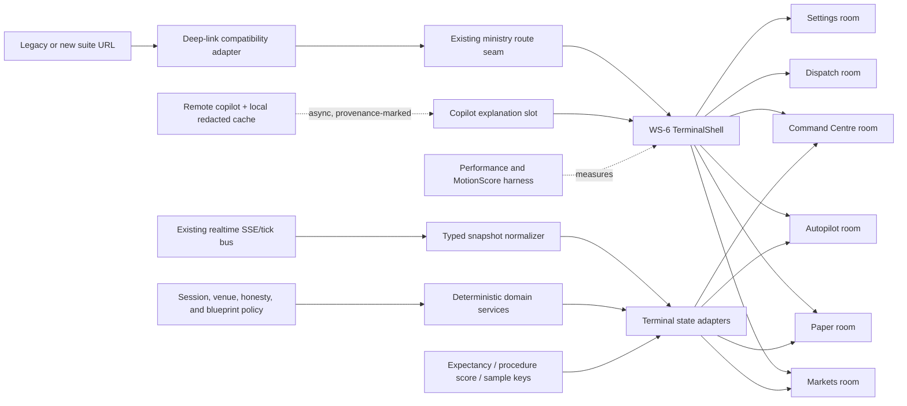

# PICC Trading Suite — WS-6 · Terminal UI Rebuild — spec v1

**Date:** 2026-09-25 · **Ratified:** 2026-09-25 owner decision set supplied for WS-6 · **Workstream:** WS-6 of `docs/specs/PICC_TRADING_SUITE_SEAL_ALL_GAPS_v1.md` · **Kind:** implementation-ready plan · **Status:** `ACTIVE-DRAFT` · **Implementation state:** not started

This specification turns the owner’s WS-6 terminal-UI decisions into a strangler migration plan. It does not authorize live-money execution, a venue enablement, an AI final decision, or a fabricated fallback. WS-6 may improve presentation, observability, and local decision-support ergonomics; it must preserve the deterministic risk and honesty seams already established by WS-1 through WS-5.

**Evidence convention:** repository claims below cite a `file:line` anchor read during this planning session. A claim that could not be anchored to a read file is marked `UNVERIFIED`. External package research is identified as a dated registry/bundle snapshot and is not treated as a measured application result. The owner’s normative decision set is recorded as a decision, not as evidence that its device or blueprint claims have already been verified.

---

## §0 Current state (verified file:line, 2026-09-25)

### 0.1 What exists now

1. **The trading suite is still a large surface with a flat markets stack.** `apps/dashboard/src/components/TradingSuite.tsx:203-270` renders the `MarketsSuite` panel stack; the current Read session measured the file at 1,610 lines. `apps/dashboard/src/pages/Suites.tsx:21-35` mounts that surface for the suite deep-link branch, and `Suites.tsx:58-60` redirects ordinary suite entry to the last room. WS-6 must not delete or silently reroute this contract before a compatibility adapter is green.
2. **The existing deep-link contract is data-driven.** `TradingSuite.tsx:100-199` reads the `asset`/`panel`/`venue` query state, focuses the selected chart, and drives the current panel/venue selection. `TradingSuite.deeplink.test.tsx` is an existing floor pin; its current import/mount anchors are listed in the WS-5 spec at `docs/specs/PICC_TRADING_SUITE_WS5_BREADTH_OPERABILITY_HARDENING_v1.md:18`.
3. **Ministry room routing already exists and is the migration seam.** `apps/dashboard/src/App.tsx:15-29,38-76` defines lazy ministry routes behind the existing auth/feature gates. `apps/dashboard/src/pages/MinistryShell.tsx:5-15` lists the trading rooms, and `:40-69` renders the shell. `apps/dashboard/src/pages/ministry/MinistryRoom.tsx:16-26` lazy-loads the room implementations. WS-6 should deepen these seams rather than create a second router.
4. **Autopilot was already extracted by WS-5.** `TradingSuite.tsx:275` re-exports `AutopilotSuite`, and the WS-5 design records the extraction seam at `docs/specs/PICC_TRADING_SUITE_WS5_BREADTH_OPERABILITY_HARDENING_v1.md:46-50`. WS-6 may harden this module but must not recreate the monolith or move its private helpers behind a new execution policy.
5. **There is one shared realtime seam.** `apps/dashboard/src/hooks/useRealtimeSuite.ts:5-13,22-37` documents the shared SSE/tick bus, and `:64-136` owns reconnect/subscription behavior. WS-6 must consume normalized snapshots and must not create a second competing socket per chart or panel.
6. **The chart adapter is not yet incremental-update-safe.** `apps/dashboard/src/components/CandlestickChart.tsx:437-444` currently calls `setData` for a series update. The existing package is `lightweight-charts@5.2.1`, verified in `apps/dashboard/package.json:18-27` and `package-lock.json:2665-2672`. WS-6 must replace the per-tick full replacement with a measured incremental adapter while retaining the current chart selection/focus behavior.
7. **The UI primitives are deliberately small.** `apps/dashboard/src/components/ui.tsx:10-135` contains the current wrappers. `apps/dashboard/src/index.css:1-17` defines the existing dark theme tokens, `:51-55` defines focus-visible treatment, and `:1720-1740` contains reduced-motion rules. WS-6 may add selective primitives, but it must preserve token names and the existing reduced-motion contract.
8. **Strict startup-health authentication is an existing security rail.** `apps/dashboard/server/handlers.mjs:1752-1757` guards the startup-health route with `requireAuthStrict`; `:5439-5448` documents the refusal to expose credential/venue metadata over an unauthenticated loopback path. WS-6 must not turn the terminal shell into a credential viewer.
9. **The current safety posture is paper/advisory.** `PICC.md:25-38` states the three non-negotiable guardrails: paper-only orders, no behavioral camouflage, and honest source/status labels. `PICC.md:35-38` positions the product as advisory-only decision support. These are stronger than any UI convenience and therefore override visual completeness.
10. **The test floor is a last-recorded observation, not a fresh run in this session.** The WS-5 spec records the latest floor at `docs/specs/PICC_TRADING_SUITE_WS5_BREADTH_OPERABILITY_HARDENING_v1.md:204-207`; the WS-5 registry row is at `PICC.md:472-476`. The implementation agent must re-run the serial test, typecheck, audit verification, and seam guard before claiming a WS-6 ship state.
11. **The project’s own registry is a living document and may be stale.** `PICC.md:3-13` says code is truth when the document disagrees, and `:60-61` says spec checkboxes are aspirations until tests are green. The registry header at `PICC.md:430-435` records its 2026-09-19 count; WS-6 must update that count only after the new spec and row are written and re-counted.

### 0.2 Gaps WS-6 must close

| Gap | Evidence | Consequence for WS-6 |
|---|---|---|
| Flat panel stack and mixed room ownership | `TradingSuite.tsx:203-270`; `Suites.tsx:21-35`; `MinistryRoom.tsx:16-26` | Build room seams and compatibility adapters; do not perform a one-shot rewrite. |
| Full series replacement on ticks | `CandlestickChart.tsx:437-444` | Add incremental updates and a render-budget guard. |
| No target-device evidence | No device artifact or measurement was read in this session; `UNVERIFIED` | Make target validation a release gate, not a workstation assumption. |
| Remote copilot provenance is not a first-class UI contract | No `copilot: remote` contract was found by scoped search; `UNVERIFIED` | Define a typed provenance/cache contract and reserved states. |
| Bar-only honesty can be violated | `apps/dashboard/server/services/orderFlow.mjs:1-29` derives order-flow values from candle structure | Remove/guard the approximation before any terminal surface presents it. |
| Procedure score and expectancy are not yet separate in the current type surface | `apps/dashboard/src/lib/trading.ts:325-352` exposes `expectancy`; no `procedureDrillScore` hit was found by scoped search; `UNVERIFIED` absence | Add distinct contracts and tests; never let UI combine them. |
| Blueprint v4.0 is not repository-grounded | `UNVERIFIED`: no matching blueprint file was found in the scoped repository search | Record it as owner-supplied and require a checked-in migration manifest before implementation acceptance. |
| Bundle/library choices are unapproved hypotheses | `apps/dashboard/package.json:18-27` only verifies `lightweight-charts`; external package snapshots are in D16 | Use a small, staged dependency decision; do not add a package merely because a gallery contains it. |
| Some cards are historical/unreachable candidates | `TradingSuite.tsx:1136` and `:1323` are the current read anchors for `PaperAnalyticsCard` and `WatchlistScannerCard`; WS-5 records the broader historical card inventory at `docs/specs/PICC_TRADING_SUITE_WS5_BREADTH_OPERABILITY_HARDENING_v1.md:16-17` | Archive/remove only through the ownership and test rules in §6. |

### 0.3 T0 baseline freeze (measured at `ddc4c91`, 2026-09-25)

Recorded per T0 acceptance. **Measured** values were observed on the pushed
tree; **unverified** values are explicitly not claims.

| Gate | Command | Observed result |
|---|---|---|
| Test floor | `npx vitest run --maxWorkers=1` (from `apps/dashboard`) | 282 files / 3145 passed, 1 skipped (283 total), exit 0, 228.60s |
| Typecheck | `npm run typecheck` (root) | exit 0 |
| Audit chain | `verifyAudit()` | `{"ok":true,"brokenAt":null,"reason":null}` |
| E2E | `npm run test:e2e --workspace @picc/dashboard` | 4 passed, 45.3s |
| Seam guards | ws3/ws4/ws5 + orderFlowHonesty | 51 passed |

The WS-5 baseline of 281 files / 3133 tests is superseded: the pre-WS-6
order-flow P0 hotfix (`ddc4c91`) added `orderFlowHonestySeamGuard.test.mjs` and
rewrote three test files, for a net +12 tests.

**Legacy deep-link contract (frozen — T2 must preserve, not redesign).**
`Suites.tsx:26-35`: if the query string has **any** of `asset`, `panel`, or
`venue`, render `<MarketsSuite />` inside the `stack stack-lg` + `<header>`
shell. This branch performs **no** redirect and **no** room-history read.
`Suites.tsx:37-40`: with a `suiteId` and no deep-link params, resume via
`getLastRoom(suiteId, INNER_NAV[suiteId].map(e => e.to))`, falling through to
the inner-nav card grid at `:42-55` when no valid history exists.
`Suites.tsx:58-60`: bare `/suites` redirects to `/suites/trading`, **preserving
the query string**.

**Room keys (frozen).** `MinistryShell.tsx:5-29` defines three suites and 18
room keys: `trading` → dashboard, markets, paper, autopilot, command-centre,
dispatch, simulator, studio, settings (9); `earnings` → dashboard, simulator,
studio, settings (4); `intelligence` → dashboard, governor, guidance, studio,
settings (5).

**Realtime subscription count (frozen — already correct).**
`useRealtimeSuite.ts:140-142` installs exactly one `SuiteStreamManager` on
`globalThis.__picc_suite_stream`, so the transport is a process-wide singleton.
`useRealtimeSuite()` (`:167-193`) only adds/removes a listener (`:180-190`) and
never opens its own transport; `subscribeTicks()` (`:150-152`) delegates to the
same manager. There are **12 call sites across 11 files**:
`useCandleData.ts:358`, `TradingSuite.tsx:122`, `TradingChart.tsx:115`,
`AutopilotSuite.tsx:80`, `DispatchStrip.tsx:13`, `LiveMarketBoard.tsx:115`,
`MarketIntelPanel.tsx:98` and `:124`, `SoakBay.tsx:12`,
`ministry/DashboardRoom.tsx:13`, `ministry/DispatchRoom.tsx:8`,
`ministry/DispatchBell.tsx:7`.
**Consequence for WS-6: N consumers already yield exactly one connection.**
T12 must therefore *pin* "one shared manager" and must not be written on the
false premise that a per-component socket leak needs fixing. This corrects the
framing in §0.1 item 5, which warned only against *creating* a second socket.

**File-touch whitelist.** WS-6 may create files under
`apps/dashboard/src/terminal/`, `apps/dashboard/src/terminal/**/__tests__/`,
`apps/dashboard/scripts/`, `docs/trading-logic/changelog/`, and may edit only
the paths named in the per-task file lists in §6. Any path outside that union
requires a dated spec amendment before it is touched. The bisect matrix's
"Must not touch" column is binding per slice. T0 added **no** runtime
dependency and changed **no** legacy contract line.

---

## §1 Locked decisions re-affirmed (not renegotiable by WS-6)

- **Decision 10 / additive safety contract:** an absent capability is a named unavailable/deny state, never a pass or zero. This extends the existing honest-data rules in `PICC.md:42-67` and the additive decision recorded in the WS-5 spec at `docs/specs/PICC_TRADING_SUITE_WS5_BREADTH_OPERABILITY_HARDENING_v1.md:31-38`.
- **Decision 11 / venue earns live status through an ADR:** WS-6 does not enable a venue, change an execution rail, or write a venue ADR. The master decision is at `docs/specs/PICC_TRADING_SUITE_SEAL_ALL_GAPS_v1.md:37`.
- **Sequential workstreams:** the master design says one workstream at a time at `docs/specs/PICC_TRADING_SUITE_SEAL_ALL_GAPS_v1.md:25-37`; WS-6 is downstream of WS-5 and does not rewrite the v3.2 engine.
- **No live-money order placement:** `PICC.md:25-38` is the governing product guardrail. The terminal may show paper proposals, consent states, and risk rails; it must not gain a hidden real-money path.
- **No AI final decision:** the mandatory human-review requirement is recorded at `PICC.md:734-737`. A remote LLM may explain, summarize, or propose a next question; it may not authorize a trade, release funds, or turn `unavailable` into a value.
- **The seam guard and test floor stay:** `apps/dashboard/server/__tests__/ws5SeamGuard.test.mjs:7-12,56-80,136-168` pins the existing seam and baseline. WS-6 must add rather than remove its protections.
- **Strict authentication remains:** `apps/dashboard/server/handlers.mjs:1752-1757,5439-5448` remains the authority. No new terminal route may expose raw credential metadata.
- **Deep links are compatibility surface, not optional decoration:** `TradingSuite.tsx:100-199` and `Suites.tsx:21-35` are the current behavior to preserve through an adapter.
- **Blueprint v4.0 is normative for WS-6 data semantics, but its repository representation is not yet verified.** The implementation must add a checked-in manifest or explicitly record the owner-supplied source; it must not pretend that a missing file was read.

---

## §2 Ratified decisions (owner-locked 2026-09-25 — D1..D20)

Each entry records **Context → Decision → Why → Consequence**. A consequence is not permission to implement beyond the task list; it is the boundary the implementation agent must preserve.

### D1 — Strangler migration, never a big-bang replacement
**Context:** The current suite is a 1,610-line surface with existing route, auth, realtime, and test seams (`TradingSuite.tsx:203-270`; `App.tsx:15-29`; `useRealtimeSuite.ts:22-37`).

**Decision:** Build the new terminal in independent room/contract/primitive slices behind the existing suite and ministry routes. Keep a compatibility adapter for `asset`, `panel`, and `venue` query parameters until the new route is proven.

**Why:** A rewrite would put the deep-link, realtime, and floor-test contracts at simultaneous risk. The existing WS-5 extraction is evidence that a single-seam cut is safer than a visual re-routing.

**Consequence:** Every migration task must have a rollback or legacy-adapter path. No route is removed in WS-6 merely because a new screen exists.

### D2 — Target hardware floor is Atom-class x86 through Snapdragon-400-class ARM64
**Context:** The owner supplied this as the target range. No physical Atom or Snapdragon device was available or measured in this session; that device claim is `UNVERIFIED`.

**Decision:** Treat the stated range as the minimum supported target, not a best-case desktop target. The terminal must degrade by reducing work, not by removing safety rails, provenance labels, or accessible controls.

**Why:** A workstation-only visual result is not evidence for a minimal local deployment.

**Consequence:** T10 and T11 are release gates. A missing target measurement produces `UNVERIFIED`, not a fabricated pass.

**AMENDED 2026-09-25 (owner).** Two changes to the context above:

1. **The supported range is broader than the two named processors.** Support is declared for any device **equivalent to or beyond** Snapdragon-400 / Intel Atom **by spec rating**. The two named parts are the *floor*, not the only supported SKUs; a device at or above that rating is in scope without a per-SKU exception.
2. **Unverifiable dimensions may be emulated.** Where physical target hardware is unavailable, the owner authorises a **CPU-throttled proxy environment** as evidence, provided the result is labelled as a proxy.

**What throttling can and cannot prove (honesty requirement).** A throttled run is real measured data about a *constrained compute envelope* and may be reported — but it must be labelled `throttled-proxy`, never as the device itself.

- **It CAN bound CPU-bound work:** route/chunk parse and execute time, pure-domain latency, table sort/filter over N rows, render-commit time, animation frame budget, re-render counts.
- **It CANNOT reproduce** memory bandwidth, cache-hierarchy behaviour, thermal/battery throttling, browser JIT tiering differences, or real compositor/rasterisation cost. These remain `UNVERIFIED`.
- **It CANNOT validate ARM64 at all.** An x86 host throttled to Snapdragon-400-equivalent spec rating still executes **x86**. It yields an x86 performance envelope only. ARM64 correctness — ABI/alignment rules, native-module availability, 64-bit-only issues — remains `UNVERIFIED` and cannot be closed by emulation. Any ARM64 claim requires physical ARM64 hardware.

Every proxy report must state: host CPU model, throttle mechanism and factor, route, sample count, p50/p95, and the label `throttled-proxy (x86, CPU-limited)`. A proxy result may satisfy the **performance-budget** gate; it may **not** satisfy the **architecture-correctness** gate, and it may never be reported as "Snapdragon 400 validated".

### D3 — Minimum viewport is 1280×800, dense terminal, no horizontal scroll
**Context:** This is an owner-supplied design constraint; no existing viewport acceptance was read in the repository.

**Decision:** All terminal rooms must be usable at a 1280×800 CSS viewport. Dense spacing is allowed; content must reflow, collapse into a secondary pane, or use a virtualized table. Horizontal page scrolling is a failure.

**Why:** The terminal is a local operator surface, not a marketing page.

**Consequence:** Room acceptance includes a 1280×800 screenshot/test. Mobile-specific redesign is not required for WS-6.

### D4 — Single-user/local deployment is the WS-6 scope
**Context:** The owner decision set defines WS-6 as a local single-user surface. No multi-user product requirement was read.

**Decision:** The shell may assume one local operator session, but it must still honor the existing server auth/session contract and strict startup-health route. Do not add tenant selection, multi-account collaboration, or remote multi-user permissions in WS-6.

**Why:** Local deployment simplifies ownership without weakening auth or secret isolation.

**Consequence:** Future multi-user work requires a new spec; the terminal must not bake in an account/tenant model that has not been specified.

### D5 — Deterministic core; async work is off the critical path
**Context:** The product guardrail makes the machine a calculation/decision copilot and requires human review (`PICC.md:19-38,734-737`). The current realtime seam is centralized (`useRealtimeSuite.ts:22-37`).

**Decision:** Signal derivation, risk checks, session routing, sample qualification, metric arithmetic, and state transitions are synchronous and deterministic. LLM calls, journal writes, analytics enrichment, and non-critical network requests may be asynchronous, cancellable, and visibly stale; they may not delay or alter the deterministic result.

**Why:** This gives the operator a stable answer even when the remote copilot or journal is unavailable.

**Consequence:** Every async result carries `pending`, `stale`, `unavailable`, or `ready` state. A timeout is not a fallback pass.

### D6 — Remote LLM inference is a provenance-marked copilot
**Context:** The owner decision set specifies remote inference plus local cache. No existing provenance contract was found by scoped search; `UNVERIFIED` absence.

**Decision:** Remote model output is labeled `provenance: "copilot: remote"` and stored only in a redacted, bounded local cache with source timestamp, model identifier, input provenance, and expiry. The cache may accelerate a displayed explanation; it may not be used as a signal, score, risk input, or execution authorization.

**Why:** A visual explanation must not masquerade as a deterministic engine output.

**Consequence:** A cache miss, provider failure, or stale cache produces an explicit unavailable state. Secrets, private keys, raw account credentials, and unrestricted account payloads are never sent to the remote provider.

### D7 — Preserve and formalize the deep-link contract
**Context:** `TradingSuite.tsx:100-199` and `Suites.tsx:21-35` implement the current `asset`/`panel`/`venue` behavior.

**Decision:** The terminal accepts the existing query keys, preserves their meaning, and adds new keys only through an explicit compatibility table. A room may receive a focused deep link without forcing a full reload or replacing the prior route contract.

**Why:** Browser-studio, ministry, and test consumers already depend on this surface.

**Consequence:** The old query parser remains available during the migration. Deprecation requires a separate owner decision and a migration test; WS-6 does not silently remove it.

### D8 — Sample identity is explicit and immutable
**Context:** The owner supplied the key `(setup, market, timeframe, dataFidelity, regimeClass)`. No matching sample-key type was found in the current read scope; `UNVERIFIED` absence.

**Decision:** Every resolved sample, metric, drill score, and expectancy display carries all five fields verbatim. Samples with different keys are never aggregated into a single expectancy or score bucket.

**Why:** Silent cross-regime aggregation would manufacture confidence and mis-size decisions.

**Consequence:** The UI must show the active sample key in metric detail views. A missing key field is a validation error, not a default bucket.

### D9 — Minimum sample sufficiency is 500 resolved samples per bucket
**Context:** This is an owner-supplied threshold; no current implementation was found by scoped search; `UNVERIFIED` absence.

**Decision:** A bucket is `insufficient` below 500 resolved samples. `insufficient` is displayed with the count and required threshold. It is not replaced with a provisional score, an extrapolated value, or a “neutral” weight that can influence sizing.

**Why:** The master design already treats sample-size gates as safety-relevant (`docs/specs/PICC_TRADING_SUITE_SEAL_ALL_GAPS_v1.md:33-36,80-84`).

**Consequence:** Only sufficiently sampled, cost-adjusted expectancy may be eligible for future sizing work. Procedure-drill score remains separate under D13.

### D10 — Session routing is deterministic and conservative
**Context:** The current session service detects London/NY overlap at `apps/dashboard/server/services/tradingSessions.mjs:4-37`, but the owner’s full routing map is not present there; `UNVERIFIED` extension.

**Decision:** Apply this precedence:
1. `20:00–00:00 GMT` → `no_trade` regardless of other conditions.
2. London/NY overlap → `trend_following`.
3. Tokyo or an ADX `< 20` lull → `mean_reversion`.
4. NY afternoon → `intermediary`.
5. Any unlisted combination → `reserved`, with no signal and no sizing.

**Why:** A deterministic precedence order prevents a UI card, model, or animation from changing the route.

**Consequence:** The route is displayed with the exact matched rule and timestamp. Unlisted combinations are an honest gap, not an invitation to infer a route.

### D11 — Venue integrity is a per-venue register
**Context:** The master design requires venue-agnostic adapters and ADR-gated live status (`docs/specs/PICC_TRADING_SUITE_SEAL_ALL_GAPS_v1.md:27-37`). The current venue-adapter contract is referenced by the WS-5 spec at `docs/specs/PICC_TRADING_SUITE_WS5_BREADTH_OPERABILITY_HARDENING_v1.md:34-38`.

**Decision:** Each venue has a typed integrity register with feed authority, counterparty/execution authority, settlement/data status, credential state, observed source, and blocker. No venue may simultaneously be treated as the sole counterparty, feed authority, and settlement authority without an explicit ADR-backed exception.

**Why:** A venue card must not imply that a feed is an independent source when it is the same party being traded.

**Consequence:** Conflict, missing provenance, or unverified settlement status is a named blocked/unavailable state. The register is read-only in WS-6.

### D12 — Paper-only terminal at WS-6 completion
**Context:** `PICC.md:25-38` prohibits live-money order placement. `CommandCentrePanel.tsx:17-42` describes payload-locked re-consent and calls the existing command-centre proposal/execution surface.

**Decision:** WS-6 completion is paper-only. The terminal may expose a paper proposal, a human confirmation, and a simulated result. It must not add a real-money toggle, venue credential prompt, or execution path.

**Why:** Live execution belongs to the separately gated venue workstream, not a visual rebuild.

**Consequence:** A real execution control is a release blocker, not a disabled decoration. Existing server rails remain authoritative even for paper actions.

### D13 — Procedure drill score and expectancy are separate metrics
**Context:** `apps/dashboard/src/lib/trading.ts:325-352` exposes `expectancy`; no `procedureDrillScore` hit was found in the read scope; `UNVERIFIED` absence.

**Decision:** Define and display two independent contracts:
- `expectancy`: cost-adjusted result statistics for the exact sample key, with sample count, fees/slippage basis, and confidence state.
- `procedureDrillScore`: procedure adherence/quality score for an observed run, with rubric/version and no financial sizing authority.

They may be shown side by side for review, but are never averaged, substituted, or passed into the same sizing input.

**Why:** Combining process quality and expected return would make a score look safer than its evidence.

**Consequence:** Each metric has its own test, empty state, and tooltip. A failure in one never fills the other with a derived proxy.

### D14 — Bar-only order-flow data is unavailable, never approximated
**Context:** `apps/dashboard/server/services/orderFlow.mjs:1-29` currently derives order-flow fields from candle structure. `apps/dashboard/server/services/v32Execution.mjs:137-193,243-257,280-315` already demonstrates honest `available:false` contracts for missing volume/indicator data.

**Decision:** If the source provides only OHLCV bars, CVD, absorption, and true order-flow delta must be returned as `unavailable` with a reason naming the missing feed/fidelity. The candle-derived approximation is removed, disabled, or clearly quarantined outside the terminal signal path.

**Why:** A visually plausible delta is still fabricated data under `PICC.md:25-38,42-67`.

**Consequence:** A test must fail if a bar-only fixture produces a numeric order-flow delta in the terminal contract. The chart may show the absence, but it may not draw a synthetic value.

### D15 — Blueprint v4.0 is normative and supersession is recorded
**Context:** Blueprint v4.0 is owner-supplied and not present as a verified repository file; `UNVERIFIED`.

**Decision:** The implementation must check in a source manifest or an owner-approved copy of the relevant Blueprint v4.0 fields before accepting the new data model. Any superseded rule is copied to `docs/trading-logic/changelog/<rule>-vNN.md` with `supersededBy`, `date`, and `historicalTradesAffected`, then linked from the active rule.

**Why:** Historical results must remain auditable when a rule changes.

**Consequence:** No silent in-place rule rewrite is allowed. The changelog directory is a new documentation surface, not an automatic archive dump.

### D16 — Small, evidence-backed component stack; no marketing-library sprawl
**Context:** The current runtime already contains `lightweight-charts` (`apps/dashboard/package.json:18-27`); no Motion, TanStack Table, TanStack Virtual, Zustand, shadcn, or Radix runtime dependency was found in that file. External snapshots below were researched 2026-09-25 and are not installed.

**Decision:** Use the following verdicts unless a task-level bundle check supersedes them:
- **Motion (`motion@13.4.3`)** — sole animation primitive; selective imports, reduced-motion handling, and a MotionScore-style audit.
- **TanStack Table (`@tanstack/react-table@9.2.4`)** — headless sorting/filtering/selection state for dense tables.
- **TanStack Virtual (`@tanstack/react-virtual@3.14.13`)** — row virtualization for large lists.
- **`lightweight-charts@5.2.1`** — chart rendering; incremental `.update()` path.
- **Observable Plot (`@observablehq/plot@0.6.17`)** — optional, lazy-loaded analytics only; not on the first shell route.
- **Zustand (`zustand@5.0.15`)** — only when cross-room terminal state cannot be expressed with existing hooks/context; no global store by default.
- **Existing `CommandPalette.tsx`** — keep and harden; reject `cmdk@1.1.1` because its snapshot showed lower maintenance freshness and the current custom surface avoids a new dependency.
- **shadcn (`shadcn@4.21.0`)** — source/reference workflow, not a runtime package; copy only the primitive actually needed.
- **Radix** — selective primitive imports, not the entire `radix-ui` meta-package.
- **Rejected:** WebGL/shaders, particles, aurora, 3D, animated marketing bento layouts, scroll choreography, and TradingView iframe widgets for the primary terminal.

**Why:** The library research is a stack shortlist, not evidence that every library belongs in the shell. Existing source and the smallest route graph are the primary constraints.

**Consequence:** Task T1 must produce a dependency manifest and T10 must measure route chunks. A package is not accepted solely because it appears in Aceternity, Componentry, or Refero; those sites are inspiration/marketing sources, not a terminal architecture authority.

### D17 — Visual language is dense, quiet, data-first
**Context:** The current shell and token system are dark and already define focus/reduced-motion rules (`index.css:1-17,51-55,1720-1740`).

**Decision:** Use the existing token vocabulary, compact rows, clear numeric alignment, explicit source/status badges, and restrained state transitions. Motion is an enhancement, not the information architecture. No decorative surface may obscure a blocker, unavailable state, or provenance.

**Why:** The terminal is an operator surface with safety-critical omissions; visual polish cannot compete with truthfulness.

**Consequence:** Every animation is subordinate to a stable data layout. A failed animation must not delay a risk or blocker label.

### D18 — Accessibility is a feature, not a post-pass
**Context:** Existing focus-visible and reduced-motion CSS are at `index.css:51-55,1720-1740`; the current primitive wrappers are at `ui.tsx:10-135`.

**Decision:** All rooms, table controls, chart summaries, dialogs, tabs, and navigation must be keyboard reachable, have visible focus, expose accessible names/roles, and announce chart/table state changes without relying on color or animation. Respect `prefers-reduced-motion` in both CSS and Motion.

**Why:** A dense terminal still needs a usable non-pointer and reduced-motion path.

**Consequence:** Automated axe/role checks are paired with a manual keyboard path. A chart has a text summary with timeframe, latest observed value, source, and availability; a table has headers and row/cell semantics.

### D19 — Security and privacy are preserved at the shell boundary
**Context:** Strict auth is at `handlers.mjs:1752-1757,5439-5448`; the product privacy/security posture is summarized at `PICC.md:35-38,42-67`.

**Decision:** The new shell may request only the existing normalized, non-secret snapshots needed by its panels. It may not render environment values, token material, private-key material, raw credential JSON, wallet addresses when not required, or unrestricted account payloads. Remote LLM requests are redacted, bounded, auditable, and opt-in through existing privacy controls.

**Why:** A richer terminal increases accidental data exposure even when execution remains paper-only.

**Consequence:** Secret scanning and route-response tests are part of the final guard. Any panel requiring raw credentials is a failed design and is not implemented as a workaround.

### D20 — Performance and honesty are release gates
**Context:** The target hardware range in D2 is owner-supplied and unmeasured; the current chart full replacement is at `CandlestickChart.tsx:437-444`.

**Decision:** Adopt the proposed budgets in §4.6, instrument them on the target devices, and fail the WS-6 verification gate when a budget is missed or when a target device is unavailable. A “fast enough” workstation screenshot is not sufficient evidence.

**Why:** The requested hardware floor and the visual rebuild only make sense if the terminal remains usable on the minimum target.

**Consequence:** T10/T11 produce a measurement manifest containing device class, viewport, route, sample size, percentile, and raw result. Missing data is reported as `UNVERIFIED`, never as zero or pass.

---

## §3 Requirements

Each requirement names its task(s). “Testable” means it has a criterion in §5.

### R1 — Compatibility and strangler seam (D1/D7) — T0, T2, T12
- R1.1 A legacy adapter preserves `asset`, `panel`, and `venue` deep-link semantics while a new room is active.
- R1.2 The existing `MarketsSuite` route remains reachable until the new room passes its route, focus, realtime, and floor tests.
- R1.3 The new shell consumes the existing lazy route boundary in `App.tsx:15-29`; it does not introduce a second top-level router.
- R1.4 The WS-5 seam guard remains byte-compatible where it protects existing rails, and WS-6 additions are additive.

### R2 — Room and terminal information architecture (D1/D3/D17) — T2
- R2.1 Each room has a stable route key, heading, owner, source/status summary, and a bounded main work area.
- R2.2 The 1280×800 layout has no horizontal page scroll, clipped controls, or inaccessible primary action.
- R2.3 Navigation preserves the existing ministry room keys and `data-room` hooks used by tests and Browser Studio.
- R2.4 A room can be rendered with a reserved capability without constructing a fake loading success or zero-filled metric.

### R3 — Normalized realtime data contract (D5/D6/D14) — T1, T3
- R3.1 The terminal consumes the existing shared realtime seam (`useRealtimeSuite.ts:22-37`) and receives a normalized snapshot with source, status, observed-at, and freshness fields.
- R3.2 A stale stream, disconnected socket, absent provider, or unverified venue state renders an explicit availability state; it does not render a numeric placeholder.
- R3.3 Remote LLM content is separate from deterministic values and carries `provenance: "copilot: remote"` plus cache metadata.
- R3.4 Data updates and visual animation are separate; an animation may lag a value but may not rewrite the value.

### R4 — Deterministic sample and session policy (D8/D9/D10) — T3, T4
- R4.1 Every resolved sample carries `(setup, market, timeframe, dataFidelity, regimeClass)`.
- R4.2 A metric query rejects cross-key aggregation and reports `insufficient` below 500 resolved samples.
- R4.3 Session route selection follows D10 precedence, with the matched rule and UTC timestamp visible.
- R4.4 Unlisted time/regime combinations produce `reserved` and no signal/sizing input.

### R5 — Separate metrics and procedure evidence (D9/D13) — T4
- R5.1 `expectancy` is cost-adjusted and exposes sample count, cost basis, and confidence/availability.
- R5.2 `procedureDrillScore` is an independent procedure-adherence score with rubric/version and no sizing authority.
- R5.3 The UI never averages, substitutes, or labels one metric as the other.
- R5.4 A missing rubric, cost basis, or sample key produces an unavailable state.

### R6 — Venue integrity and paper-only safety (D11/D12) — T3, T9
- R6.1 Each displayed venue renders feed, counterparty/execution, settlement, credential, and blocker status from the typed register.
- R6.2 The terminal cannot simultaneously mark a venue as independent feed, counterparty, and settlement authority without an explicit ADR-backed exception.
- R6.3 WS-6 exposes paper proposal/simulation only; no live-money toggle or venue enablement is introduced.
- R6.4 Existing consent/risk rails remain authoritative and are not replaced by client-only UI state.

### R7 — Bar-only honesty and Blueprint migration (D14/D15) — T3, T9
- R7.1 OHLCV-only fixtures cannot produce numeric order-flow delta, CVD, or absorption in the terminal contract.
- R7.2 Each unavailable field names the missing data/fidelity and does not fall back to candle-derived approximation.
- R7.3 Blueprint v4.0 source provenance is checked in or explicitly marked owner-supplied before a rule is accepted.
- R7.4 Every superseded rule has a changelog record with `supersededBy`, `date`, and `historicalTradesAffected`.

### R8 — Tables, virtual rows, and chart updates (D16/D17) — T5, T6
- R8.1 Dense tables expose sorted/filterable headers only when a deterministic data source exists; controls unavailable when their source is unavailable.
- R8.2 A 10,000-row fixture renders through row virtualization, with a bounded DOM row count and stable keyboard focus.
- R8.3 Chart series updates use incremental update calls for the latest observed bar and a bounded full refresh only for a structural range/data-fidelity change.
- R8.4 Chart summaries expose the latest observed value, timestamp, source, and availability in text.

### R9 — Motion, dialogs, and reduced motion (D16/D18) — T7, T8
- R9.1 Motion is the only animation primitive; no forbidden WebGL/particle/3D/marketing animation dependency is added.
- R9.2 The existing custom command palette is hardened or replaced by a minimal accessible dialog/focus primitive; `cmdk` is not required.
- R9.3 `prefers-reduced-motion` disables nonessential transitions and scroll effects while preserving state changes and focus.
- R9.4 No animation can delay a blocker, unavailable label, or deterministic result.

### R10 — Accessibility and security (D18/D19) — T8, T9
- R10.1 Keyboard-only navigation reaches room navigation, tables, chart summaries, dialogs, and primary paper actions.
- R10.2 Every interactive control has an accessible name, role, state, and visible focus indicator.
- R10.3 Automated accessibility checks and a manual keyboard matrix pass at 1280×800.
- R10.4 No shell response or component renders secret/token/private-key/credential-store contents; remote payloads are redacted and bounded.

### R11 — Performance budgets and evidence (D2/D20) — T10, T11
- R11.1 The proposed budgets in §4.6 are represented in a machine-readable measurement manifest.
- R11.2 Measurements include route, device class, viewport, cold/warm state, sample size, percentile, and raw values.
- R11.3 A missing target-device run is `UNVERIFIED`; no release claim is made from synthetic data alone.
- R11.4 A route that misses its budget must reduce work, virtualize, defer noncritical work, or remain `reserved`; it may not hide data or remove safety labels.

### R12 — Final seam and regression guard (D1/D12/D20) — T12
- R12.1 The final guard checks the compatibility adapter, route inventory, deep-link contract, realtime contract, secret boundary, bar-only honesty, and paper-only boundary.
- R12.2 Existing WS-1 through WS-5 deny/audit/risk seams remain present.
- R12.3 The serial test suite, root typecheck, audit verification, and WS-6 E2E/performance checks are green before a ship recommendation.
- R12.4 The final guard reports missing target hardware or missing blueprint provenance as an explicit unresolved release gate.

---

## §4 Design

### 4.1 Architectural seam



The seam is the normalized state boundary, not the chart component. Existing realtime input enters through `useRealtimeSuite`; new rooms consume typed selectors. Deterministic domain services own route/metrics/honesty decisions. The remote copilot is visually and technically a side channel. No animated component becomes a source of truth.

### 4.2 Proposed module layout

The following paths are **proposed new seams**; no claim is made that they already exist. The implementation agent must create them only through the ownership map in §6.

```text
apps/dashboard/src/terminal/
  contracts.ts                  # availability, provenance, sample, metric, venue types
  adapters/
    realtime.ts                 # useRealtimeSuite -> normalized snapshot
    deepLink.ts                 # legacy query contract
    venueIntegrity.ts           # per-venue read-only register
  domain/
    sampleKeys.ts               # immutable five-part key
    sessionRouting.ts           # deterministic D10 precedence
    metrics.ts                  # expectancy and procedure score separation
    availability.ts             # reserved/unavailable/stale contract
  hooks/
    useTerminalSnapshot.ts
    useTerminalMetric.ts
    useMotionPreference.ts
  components/
    TerminalShell.tsx
    RoomFrame.tsx
    StatusBoundary.tsx
    DenseTable.tsx
    VirtualRows.tsx
    IncrementalChart.tsx
    CommandPalette.tsx
    CopilotPanel.tsx
    UnavailableState.tsx
  routes/
    MarketsRoute.tsx
    PaperRoute.tsx
    AutopilotRoute.tsx
    CommandCentreRoute.tsx
    DispatchRoute.tsx
    SettingsRoute.tsx
  styles/
    terminal.css
  index.ts
```

Existing files remain the integration points: `TradingSuite.tsx`, `Suites.tsx`, `App.tsx`, `MinistryRoom.tsx`, `MinistryShell.tsx`, `CommandPalette.tsx`, `CandlestickChart.tsx`, `useRealtimeSuite.ts`, and the existing server services. New room files may lazy-load through the existing `App.tsx`/`MinistryRoom.tsx` seam; they may not create a second authentication or router boundary.

### 4.3 Core data shapes

```ts
type Availability =
  | { status: "live"; source: string; observedAt: number; freshnessMs: number }
  | { status: "stale"; source: string; observedAt: number; reason: string }
  | { status: "unavailable"; reason: string; owner: string; since: number }
  | { status: "reserved"; workstream: string; reason: string };

type SampleKey = {
  setup: string;
  market: string;
  timeframe: string;
  dataFidelity: string;
  regimeClass: string;
};

type ResolvedSample = {
  key: SampleKey;
  resolvedAt: number;
  netPnl: number;
  costBasis: { fees: number; slippage: number; currency: string };
  procedureEvidenceId: string;
};

type Expectancy = {
  status: "live" | "insufficient" | "unavailable";
  key: SampleKey;
  resolvedCount: number;
  requiredCount: 500;
  value: number | null;
  costBasis: string;
  confidence: string;
};

type ProcedureDrillScore = {
  status: "live" | "unavailable";
  runId: string;
  rubricVersion: string;
  value: number | null;
  sizingEligible: false;
};

type SessionRoute = {
  route: "trend_following" | "mean_reversion" | "intermediary" | "no_trade" | "reserved";
  matchedRule: string;
  evaluatedAt: number;
  timezone: "UTC";
};

type VenueIntegrity = {
  venueId: string;
  feedAuthority: string;
  counterpartyAuthority: string;
  settlementAuthority: string;
  credentialStatus: Availability;
  integrityStatus: "verified" | "conflict" | "unverified" | "blocked";
  blocker: string | null;
};

type CopilotExplanation = {
  status: "ready" | "pending" | "stale" | "unavailable";
  provenance: "copilot: remote";
  model: string | null;
  generatedAt: number | null;
  cacheExpiresAt: number | null;
  redacted: true;
};
```

The shapes are contracts, not permission to invent values. A field that cannot be observed is `null`/`unavailable`, never `0`, a candle approximation, or a silent default. The existing `TradingMetrics` surface at `trading.ts:325-352` is an integration input; it is not assumed to already implement the new split.

### 4.4 Routing and capability policy

The compatibility adapter accepts the existing query keys first, then maps them to the new room and focus state. New query keys must be documented in one table with a default and an invalid-input behavior. The route registry is read-only and is not inferred from a card’s existence.

The capability inventory below is a planning classification, not a claim that each file is currently mounted. It contains 16 named surfaces and must be rechecked against the live tree before each archive/remove task.

| Capability | Verdict | Evidence / acceptance boundary |
|---|---|---|
| Terminal app shell and route frame | REBUILD | Current `MinistryShell.tsx:5-15,40-69` is the seam; preserve `data-room` hooks. |
| Markets workspace | REBUILD | `TradingSuite.tsx:203-270` is a flat stack; preserve deep-link adapter. |
| Paper execution surface | KEEP+harden | Preserve paper-only and human-review rails; no live toggle. |
| Autopilot workspace | KEEP+harden | WS-5 extraction at `TradingSuite.tsx:275`; do not recreate private helpers. |
| Command Centre/consent | KEEP+harden | `CommandCentrePanel.tsx:17-42` remains auth/risk/consent integration; paper-only in WS-6. |
| Dispatch room | KEEP+harden | Existing room lazy seam in `MinistryRoom.tsx:16-26`; preserve source/status. |
| Settings/integration room | KEEP+harden | Keep strict credential boundaries from `handlers.mjs:1752-1757,5439-5448`. |
| News/macro surface | KEEP+harden | If retained, each item requires independent source/status; otherwise reserve. Historical location is `UNVERIFIED` after WS-5 line shifts. |
| Trade planner | KEEP+harden | Preserve human confirmation; no final AI decision. |
| Chart adapter | REBUILD | `CandlestickChart.tsx:437-444` full replacement is the measurable seam. |
| Status/risk rail | REBUILD | Surface existing named denies/unavailable states; do not duplicate server decisions. |
| Signals/notifications | REBUILD | Keep source/status and stale labels; exact current line anchors after WS-5 are `UNVERIFIED`. |
| Prediction/Pro analysis | ARCHIVE→REBUILD | Current historical anchors are in WS-5 `:16`; no live decision authority. |
| Assistant copilot | ARCHIVE→REBUILD | D6 provenance required; keep off critical path. |
| Paper analytics | REMOVE (verify first) | `TradingSuite.tsx:1136`; remove only after a duplicate/fixture test proves no unique user-visible contract. |
| Watchlist scanner | REMOVE (verify first) | `TradingSuite.tsx:1323`; remove only after feed ownership and user-visible acceptance are disproven or explicitly deferred. |

**Inventory count:** 5 REBUILD, 7 KEEP+harden, 2 ARCHIVE→REBUILD, 2 REMOVE (verification-gated). This is a spec-level classification, not a filesystem count.

### 4.5 Component-stack verdicts and maintenance evidence

The following is the 2026-09-25 research snapshot used for D16. Sizes are third-party estimates and must be replaced by route-chunk measurements.

| Candidate | Snapshot | Verdict | Constraint |
|---|---:|---|---|
| `motion` | 13.4.3; MIT; npm unpacked 756,782 B; Bundlephobia main 142,694 B / gzip 47,728 B; modified 2026-09-24 | ACTIVE | Sole animation primitive; selective imports and reduced-motion branch. |
| `@tanstack/react-table` | 9.2.4; MIT; main 120,827 B / gzip 31,751 B; modified 2026-08-28 | ACTIVE | Headless table state; no visual theme package. |
| `@tanstack/react-virtual` | 3.14.13; MIT; main 26,139 B / gzip 7,792 B; modified 2026-09-14 | ACTIVE | Virtualize final row model, not raw input rows. |
| `lightweight-charts` | 5.2.1; Apache-2.0; main 194,247 B / gzip 61,584 B; modified 2026-08-12 | ACTIVE | Use incremental `.update()`; no TradingView iframe. |
| `@observablehq/plot` | 0.6.17; ISC; main 384,511 B / gzip 127,958 B; modified 2026-04-06 | OPTIONAL | Lazy-load only for analytics that cannot use existing primitives. |
| `zustand` | 5.0.15; MIT; main 856 B / gzip 489 B; modified 2026-08-13 | CONDITIONAL | Use only for cross-room state that existing hooks/context cannot safely own. |
| `cmdk` | 1.1.1; MIT; main 46,012 B / gzip 14,922 B; snapshot freshness concern | REJECT | Harden current `CommandPalette.tsx`; no new dependency required. |
| `shadcn` | 4.21.0; MIT; CLI/source workflow; Node >=20.18.1 | ACTIVE REFERENCE | Copy selected source/primitives; do not add the CLI as a runtime dependency. |
| `radix-ui` | 1.6.7; MIT; meta-package estimate 249,484 B / gzip 71,742 B; modified 2026-07-31 | SELECTIVE | Import individual primitives only. |
| WebGL/particle/aurora/3D/scroll choreography | No maintained/approved package chosen | REJECT | No business-critical data may depend on an animation-only dependency. |

External registry/Bundlephobia URLs consulted on 2026-09-25:
`https://registry.npmjs.org/motion/latest`, `https://registry.npmjs.org/@tanstack/react-table/latest`, `https://registry.npmjs.org/@tanstack/react-virtual/latest`, `https://registry.npmjs.org/lightweight-charts/latest`, `https://registry.npmjs.org/@observablehq/plot/latest`, `https://registry.npmjs.org/zustand/latest`, `https://registry.npmjs.org/cmdk/latest`, `https://registry.npmjs.org/shadcn/latest`, `https://registry.npmjs.org/radix-ui/latest`, `https://registry.npmjs.org/tailwindcss/latest`, and the corresponding `https://bundlephobia.com/api/size?package=...` endpoints.

The design reference sites were used only to classify intent, not to justify dependencies: Aceternity describes a landing-page component library (`https://ui.aceternity.com/`), Componentry describes animated UI/marketing components (`https://componentry.dev/`), Refero is an inspiration gallery (`https://refero.design/`), and TradingView widgets are embeddable widgets (`https://www.tradingview.com/widgets/`).

### 4.6 Proposed performance budgets

These are **proposed release thresholds**, not measurements. They must be ratified in T10 and then measured on the target hardware named in D2. A missing device is a failed evidence gate, not a pass.

| Measurement | Proposed budget | Required report |
|---|---:|---|
| Terminal shell first interactive paint, warm target device | ≤ 2.0 s p95 | Device class, route, cold/warm flag, raw samples. |
| Terminal shell first contentful paint, cold target device | ≤ 3.0 s p95 | Bundle/route manifest and network-disabled/local cache condition. |
| Room transition after data is normalized | ≤ 250 ms p95 | Route pair and reduced-motion mode. |
| One realtime tick to visible chart/table update | ≤ 50 ms p95 | Update count, render duration, and no full-series replacement assertion. |
| 10,000-row virtual table initial render | ≤ 250 ms p95 | DOM row count, visible row count, viewport. |
| 10,000-row virtual table scroll frame | ≤ 16 ms p95 | Frame samples and dropped-frame count. |
| Chart pointer/highlight interaction | ≤ 50 ms p95 | Pointer event to highlight, with no remote dependency. |
| Deterministic signal/session/metric evaluation | ≤ 100 ms p95 excluding LLM/journal/analytics | Input fixture, pure function timing, and sample key. |
| Terminal memory after 30 minutes of bounded updates | ≤ 250 MB p95, or a documented lower target-device limit | Heap snapshot route and update count. |
| MotionScore/animation audit | No grade lower than the owner-ratified CI gate; `UNVERIFIED` until T10 sets it | Route, reduced-motion result, and audit command/version. |

The budget table is a design proposal because the owner supplied a hardware range but no measured baseline. It must not be represented in the final ship report until the raw measurement manifest exists.

### 4.7 Reserved/unavailable rendering

A reserved capability renders a stable component with:
- capability label and room/owner;
- workstream identifier such as `WS-7+` when no later owner name is verified;
- reason and timestamp;
- no fabricated number, chart point, score, source badge, or success animation;
- a non-destructive “what will be added” description only when that description is in the checked-in spec.

`UNVERIFIED` data is visibly different from a legitimate zero. A stale source is visibly different from a live source. A pending remote explanation is visibly different from a deterministic result. These states are the terminal’s first-class data, not loading placeholders.

### 4.8 T1 dependency manifest and install decision (2026-09-25)

Verified current state: `apps/dashboard/package.json:18-38` contains
`lightweight-charts@^5.2.1` and no `motion`, TanStack, Radix, zustand,
`@observablehq/plot`, or `cmdk`. `package.json` and `package-lock.json` were
**not modified** by T1.

| Candidate | Planned owner | Planned route | Verdict | Install at T1? |
|---|---|---|---|---|
| `lightweight-charts@5.2.1` | T6 chart surface | markets, paper, command-centre | ACTIVE — already a dependency | already present |
| `@tanstack/react-virtual@3.14.13` | T5 dense tables | markets, command-centre | ACTIVE, 26,139 B / 7,792 B gzip | **deferred to T5** |
| `@tanstack/react-table@9.2.4` | T5 dense tables | markets | ACTIVE, 120,827 B / 31,751 B gzip | **deferred to T5** |
| `motion@13.4.3` | T8 presentation | all rooms | ACTIVE, sole animation primitive | **deferred to T8** |
| `radix-ui@1.6.7` | T2/T7 primitives | all rooms | SELECTIVE, individual imports only | **deferred to first needing task** |
| `@observablehq/plot@0.6.17` | analytics | lazy only | OPTIONAL, 384,511 B / 127,958 B gzip | **deferred / may never install** |
| `zustand@5.0.15` | cross-room state | — | CONDITIONAL on existing hooks being insufficient | **deferred / may never install** |
| `shadcn` | — | — | ACTIVE REFERENCE: copy source, never a runtime dep | n/a |
| `cmdk` | — | — | **REJECT** | absent, and T12 pins absence |
| WebGL / particle / aurora / 3D / scroll choreography | — | — | **REJECT** | absent, and T12 pins absence |

**Install decision: T1 adds zero runtime dependencies.** Rationale:

1. T1's bisect requirement is that the slice "must not mount a room or change
   server behavior"; the contracts and manifest are fully deliverable without a
   package, so installing now would add risk for no acceptance value.
2. The owner-locked hardware floor is Atom-class x86 / Snapdragon-400 ARM64
   with **no degradation permitted** (D2), and T11 target-device validation is
   **UNVERIFIABLE in this environment**. Adding ~475 KB of unvalidated,
   third-party-estimated dependency weight now would be unverifiable against
   the only budget that matters.
3. Every §4.5 size figure is a dated third-party estimate (honesty note 5);
   T10 must replace them with route-chunk measurements. Installing against
   unverified numbers would invert that ordering.
4. WS-5 established that lockfile surgery in this repo is non-trivial
   (`npm ci` runs in CI at `.github/workflows/ci.yml`), so each install should
   be justified by a task that actually needs the package.

Each deferred package installs at the task that consumes it, with its
license/ARM64/maintenance re-verified at that moment and T10 recording the
measured delta. "Unused-test" for every row above: **none installed → none
unused**. Any package that ends the workstream unused is a T12 finding.

**Version/licence/ARM64 status: UNVERIFIED for every candidate except
`lightweight-charts@5.2.1`.** The §4.5 figures were research snapshots, not
measurements taken or confirmed by the implementation agent. Nothing in this
manifest asserts a package works on the target hardware.

---

## §5 Acceptance criteria

Every criterion contains **Scenario, Action, Expected observable result, Prohibited side effect, Verification, Priority**. Priorities are P0 for safety/contract, P1 for user-visible behavior, and P2 for optimization/documentation.

### AC-001 — Legacy deep link through the new shell
- **Scenario:** An existing `asset`, `panel`, and `venue` link is opened after the WS-6 shell is enabled.
- **Action:** Load the link through the compatibility adapter and select the requested room/focus.
- **Expected observable result:** The requested panel/venue is selected, the chart receives focus where the legacy contract did, and the URL remains intelligible.
- **Prohibited side effect:** The new shell must not discard unknown legacy keys, silently reset to a default room, or issue a second realtime subscription.
- **Verification:** Extend `TradingSuite.deeplink.test.tsx` and add a new adapter test; compare the legacy parser contract.
- **Priority:** P0.

### AC-002 — 1280×800 terminal layout
- **Scenario:** A user opens every WS-6 room at a 1280×800 CSS viewport.
- **Action:** Navigate through navigation, table controls, chart, and primary paper action.
- **Expected observable result:** All content and controls are reachable; no horizontal page scroll or clipped primary control appears.
- **Prohibited side effect:** The layout must not hide a blocker, reduce a numeric value to a fake summary, or remove keyboard focus to fit the viewport.
- **Verification:** Playwright viewport assertion plus manual screenshot review at 1280×800.
- **Priority:** P1.

### AC-003 — Realtime tick does not replace the full chart series
- **Scenario:** A stream emits 100 sequential latest-bar ticks.
- **Action:** Mount the WS-6 chart with the shared realtime adapter and record render/update calls.
- **Expected observable result:** The latest bar updates in place, source/timestamp remain correct, and the visible interaction remains responsive.
- **Prohibited side effect:** The adapter must not call `setData` for every tick or create a second socket per chart.
- **Verification:** Unit/integration spy on `lightweight-charts` series calls; assert `.update()` for latest-bar ticks and bounded full refresh only for structural changes.
- **Priority:** P0.

### AC-004 — Virtualized 10,000-row table
- **Scenario:** A valid 10,000-row terminal fixture is filtered and scrolled.
- **Action:** Open the table, change a deterministic filter, and scroll to the end.
- **Expected observable result:** Only a bounded visible row window exists in the DOM, headers and row semantics remain stable, and focus follows the active row.
- **Prohibited side effect:** The table must not create 10,000 DOM rows, duplicate the source array per row, or display fabricated rows during a source failure.
- **Verification:** DOM-count assertion, keyboard traversal, filter test, and §4.6 scroll samples.
- **Priority:** P1.

### AC-005 — Keyboard and accessible names
- **Scenario:** A keyboard-only operator navigates rooms, tables, chart summary, command palette, and paper proposal controls.
- **Action:** Use Tab/Shift+Tab, arrow keys where documented, Enter/Space, and Escape.
- **Expected observable result:** Every interactive target has a visible focus state, correct role/name/state, and a predictable order; the chart summary is available without pointer input.
- **Prohibited side effect:** No control may be reachable only by hover, animation, color, or a hidden DOM proxy.
- **Verification:** Automated accessibility test plus manual keyboard matrix recorded in the test artifact.
- **Priority:** P0.

### AC-006 — Reduced motion
- **Scenario:** The OS/browser requests `prefers-reduced-motion: reduce`.
- **Action:** Navigate and interact with the terminal under that preference.
- **Expected observable result:** Nonessential transitions, parallax, and scroll effects are disabled; state, focus, and blocker updates remain immediate and readable.
- **Prohibited side effect:** The system must not ignore the preference, delay safety information, or hide a state change behind an animation.
- **Verification:** CSS media-query test, Motion preference test, and manual browser check.
- **Priority:** P1.

### AC-007 — Honest unavailable state
- **Scenario:** A provider, venue, metric, or downstream capability is not available.
- **Action:** Open the affected room with a valid `unavailable` or `reserved` snapshot.
- **Expected observable result:** The UI shows the reason, owner/workstream, timestamp, and absence; it does not show zero, a stale success, or a generic spinner indefinitely.
- **Prohibited side effect:** The system must not synthesize a value, convert `null` to `0`, or mark the capability live.
- **Verification:** Fixture test for each state and a structural test that `unavailable` never renders a numeric placeholder.
- **Priority:** P0.

### AC-008 — Bar-only order-flow honesty
- **Scenario:** The input contains OHLCV bars but no true delta, CVD, or absorption feed.
- **Action:** Request the order-flow terminal contract.
- **Expected observable result:** Each missing field is `unavailable` with a fidelity/feed reason; the chart/table may show the gap.
- **Prohibited side effect:** `orderFlow.mjs:1-29` candle-derived values must not appear as a numeric terminal signal.
- **Verification:** Bar-only fixture test asserts null/unavailable; compare against `v32Execution.mjs:137-193,243-257,280-315` honesty shape.
- **Priority:** P0.

### AC-009 — Sample-key isolation and sufficiency
- **Scenario:** Two samples share a market/timeframe but differ in `dataFidelity` or `regimeClass`, and a third bucket has 499 resolved samples.
- **Action:** Request expectancy and procedure metrics for all three keys.
- **Expected observable result:** The first two remain separate; the 499-sample bucket reports `insufficient` with count 499 and required 500; no value is borrowed across keys.
- **Prohibited side effect:** No cross-key aggregation, extrapolation, or provisional score may appear.
- **Verification:** Pure domain tests with exact key/count fixtures.
- **Priority:** P0.

### AC-010 — Deterministic session routing
- **Scenario:** Evaluate each owner-specified time/regime combination, including an unlisted one.
- **Action:** Call the session router at a fixed UTC timestamp and market state.
- **Expected observable result:** The exact D10 route and matched rule are returned; 20:00–00:00 is `no_trade`; the unlisted case is `reserved`.
- **Prohibited side effect:** A UI animation, remote explanation, or convenience override must not change the route.
- **Verification:** Table-driven unit tests plus one integration test showing the displayed route matches the pure function.
- **Priority:** P0.

### AC-011 — Separate expectancy and procedure score
- **Scenario:** A completed paper run has a known procedure score but insufficient expectancy samples.
- **Action:** Open the review surface.
- **Expected observable result:** `procedureDrillScore` displays its rubric result; `expectancy` displays insufficient/its own count and cannot be used for sizing.
- **Prohibited side effect:** The UI must not average them, copy one into the other, or label procedure quality as expected profit.
- **Verification:** Component and domain tests; assert `sizingEligible:false` on procedure score.
- **Priority:** P0.

### AC-012 — Venue integrity conflict
- **Scenario:** A venue register marks the same entity as feed, counterparty, and settlement authority without an ADR-backed exception.
- **Action:** Open the venue/status surface.
- **Expected observable result:** The conflict is named, status is not `verified`, and the room shows the blocker/reserved state.
- **Prohibited side effect:** The terminal must not silently award independence or enable execution.
- **Verification:** Register fixture test and visual assertion for the named blocker.
- **Priority:** P0.

### AC-013 — Paper-only command surface
- **Scenario:** An operator reviews a paper proposal with a valid consent payload.
- **Action:** Use the command-centre/proposal flow and inspect the response.
- **Expected observable result:** The flow can propose/simulate and records the human confirmation; the surface identifies paper mode and any named refusal.
- **Prohibited side effect:** No live-money toggle, venue credential prompt, real order submission, or client-side bypass of server rails may appear.
- **Verification:** Existing command-centre tests plus a WS-6 route test that scans for/enforces the paper-only boundary.
- **Priority:** P0.

### AC-014 — Remote copilot provenance and cache
- **Scenario:** A remote explanation is available, pending, stale, or cached.
- **Action:** Render the copilot slot for each state.
- **Expected observable result:** It displays `copilot: remote`, model/timestamp when observed, cache age, and an explicit pending/stale/unavailable state.
- **Prohibited side effect:** Remote text must not become a signal, risk input, score, sizing value, or execution authorization; raw secrets must not be included.
- **Verification:** Contract test with provider failure/timeout, cache hit/miss, and a secret-redaction fixture.
- **Priority:** P0.

### AC-015 — Blueprint v4.0 supersession
- **Scenario:** A rule is changed by the owner-supplied Blueprint v4.0.
- **Action:** Migrate the active rule and link the prior version to the changelog.
- **Expected observable result:** The active rule identifies its source/version; the superseded record contains `supersededBy`, `date`, and `historicalTradesAffected`.
- **Prohibited side effect:** No in-place rule rewrite may erase the historical interpretation or silently change past results.
- **Verification:** Changelog schema test and repository check that the manifest/source provenance is present or explicitly marked `UNVERIFIED`.
- **Priority:** P0.

### AC-016 — Motion-only dependency boundary
- **Scenario:** The terminal animation layer is built and audited.
- **Action:** Inspect imports, package manifest, and reduced-motion behavior.
- **Expected observable result:** Motion is the only animation primitive; no WebGL/shader/particle/aurora/3D/marketing-animation dependency is present; the audit command is recorded.
- **Prohibited side effect:** An animation dependency must not control data, safety, or route state.
- **Verification:** Dependency diff/import guard and MotionScore-style audit artifact.
- **Priority:** P1.

### AC-017 — No secret exposure in the shell
- **Scenario:** Startup health, venue status, and remote-copilot payloads are rendered.
- **Action:** Inspect API responses and DOM output with fixture credentials/tokens.
- **Expected observable result:** Only masked/readiness metadata is visible; secret values, private keys, raw credential JSON, and unrestricted account payloads are absent.
- **Prohibited side effect:** The terminal must not add a “debug” route, client log, or cache entry containing the raw secret.
- **Verification:** Secret-scan fixture, response-shape test, DOM assertion, and existing strict-auth test at `handlers.mjs:1752-1757`.
- **Priority:** P0.

### AC-018 — Target-device performance evidence
- **Scenario:** A WS-6 room is measured on the owner’s minimum hardware range.
- **Action:** Run the cold/warm navigation, tick, table, chart, and memory scenarios from §4.6.
- **Expected observable result:** The measurement manifest contains raw samples, p95 values, device class, viewport, and pass/fail against the ratified budget.
- **Prohibited side effect:** A desktop-only result must not be labeled target-device evidence; missing hardware must be `UNVERIFIED`, not zero or pass.
- **Verification:** Reproducible performance script/E2E and checked-in result artifact from T10/T11.
- **Priority:** P0.

### AC-019 — Strangler compatibility and bisectability
- **Scenario:** One WS-6 room or primitive is reverted while the rest of the shell remains enabled.
- **Action:** Follow the rollback/compatibility path for that room.
- **Expected observable result:** The legacy route/adapter remains usable, safety rails remain active, and no other room’s deep link or realtime subscription breaks.
- **Prohibited side effect:** A partial migration must not route around server risk/consent controls or force a full-app rollback.
- **Verification:** Task-level bisect matrix and a guard test for every adapter boundary.
- **Priority:** P0.

### AC-020 — Final release gate
- **Scenario:** An agent proposes to mark WS-6 shipped.
- **Action:** Run the complete final guard.
- **Expected observable result:** Serial tests, root typecheck, audit verification, existing WS-5 seam guard, WS-6 seam guard, E2E, accessibility, honesty, and target-device evidence are all green; any missing target or blueprint evidence is listed as an explicit unresolved gate.
- **Prohibited side effect:** A partially verified room, stale baseline, fabricated device result, or live venue path must not be reported as shipped.
- **Verification:** T12 command/artifact and final registry update.
- **Priority:** P0.

---

## §6 Implementation tasks + bisect matrix

Owners are deliberately non-overlapping within a task. The same owner may own later tasks, but no task has two owners for the same file. “New” means a proposed path from §4.2; an implementation agent must verify the path before creating it.

### T0 — Capture the baseline and freeze the compatibility seam (Owner A: foundation)
**Files:** `apps/dashboard/src/components/TradingSuite.tsx`, `apps/dashboard/src/pages/Suites.tsx`, `apps/dashboard/src/App.tsx`, `apps/dashboard/src/components/__tests__/TradingSuite.deeplink.test.tsx`, `apps/dashboard/src/hooks/__tests__/useCandleData.render.test.tsx`, `apps/dashboard/src/pages/__tests__/ministryRooms.test.tsx`, `apps/dashboard/src/hooks/__tests__/sseCoalescing.test.ts` (amended 2026-09-25: this is the shared-transport seam's test home, and `freshBus()` there deliberately deletes the global singleton, so the process-wide singleton invariant is otherwise unpinned), `apps/dashboard/server/__tests__/ws5SeamGuard.test.mjs`, `docs/specs/PICC_TRADING_SUITE_WS6_TERMINAL_UI_REBUILD_v1.md`.

**Acceptance:** Record the current test/typecheck/audit results, exact legacy query behavior, room keys, realtime subscription count, and file-touch whitelist. Add no runtime dependency and do not modify the legacy contract.

**Bisect:** Must be first; if it fails, WS-6 does not start.

### T1 — Define typed terminal contracts and dependency manifest (Owner A: foundation)
**Files:** `apps/dashboard/src/terminal/contracts.ts`, `apps/dashboard/src/terminal/domain/availability.ts`, `apps/dashboard/src/terminal/domain/sampleKeys.ts`, `apps/dashboard/package.json`, `package-lock.json`, `docs/specs/PICC_TRADING_SUITE_WS6_TERMINAL_UI_REBUILD_v1.md` (manifest appendix if needed).

**Acceptance:** Contract types cover availability, provenance, sample key, metrics, session route, and venue integrity. The manifest records package/version/license/size/owner/route/unused-test for each proposed dependency. Only explicitly selected packages may be added; `cmdk` and forbidden animation libraries are absent.

**Bisect:** Contracts and manifest are pure; they must not mount a room or change server behavior.

### T2 — Build the shell and compatibility adapter (Owner B: frontend shell)
**Files:** `apps/dashboard/src/terminal/components/TerminalShell.tsx`, `apps/dashboard/src/terminal/components/RoomFrame.tsx`, `apps/dashboard/src/terminal/adapters/deepLink.ts`, `apps/dashboard/src/terminal/routes/*.tsx`, `apps/dashboard/src/pages/Suites.tsx`, `apps/dashboard/src/pages/ministry/MinistryRoom.tsx`, `apps/dashboard/src/pages/MinistryShell.tsx`, `apps/dashboard/src/App.tsx`.

**Acceptance:** AC-001/AC-002 pass; legacy deep links work; existing `data-room` hooks and auth/feature gates remain; each room can render a reserved state; no room directly opens a socket or accesses secrets.

**Bisect:** T2 can ship with all new room bodies as reserved placeholders; the legacy suite remains the fallback.

### T3 — Normalize realtime, venue, and remote-copilot data (Owner C: data boundary)
**Files:** `apps/dashboard/src/terminal/adapters/realtime.ts`, `apps/dashboard/src/terminal/adapters/venueIntegrity.ts`, `apps/dashboard/src/terminal/adapters/redaction.ts` (amended 2026-09-25: AC-017 secret redaction is cross-cutting across venue status, copilot, and startup health, so it is a shared adapter rather than being duplicated per surface), `apps/dashboard/src/terminal/domain/copilot.ts` (amended 2026-09-25: AC-014's state machine and its "never a signal" prohibition are pure logic and belong in `domain/` so they are testable with no React), `apps/dashboard/src/terminal/components/StatusBoundary.tsx`, `apps/dashboard/src/terminal/components/CopilotPanel.tsx`, `apps/dashboard/src/terminal/hooks/useTerminalSnapshot.ts`, `apps/dashboard/src/terminal/contracts.ts`, `apps/dashboard/src/hooks/useRealtimeSuite.ts` (only adapter-level integration), `apps/dashboard/server/handlers.mjs` (read-only route additions only if required).

**Acceptance:** AC-007/AC-008/AC-012/AC-014/AC-017 pass. The adapter uses the existing shared bus, remote output is redacted and async, venue conflicts are explicit, and no raw credentials are requested.

**Bisect:** Copilot can be disabled entirely while deterministic rooms remain usable; no room depends on the provider.

### T4 — Implement sample keys, session routing, and separated metrics (Owner D: deterministic domain)
**Files:** `apps/dashboard/src/terminal/domain/sampleKeys.ts`, `apps/dashboard/src/terminal/domain/sessionRouting.ts`, `apps/dashboard/src/terminal/domain/metrics.ts`, `apps/dashboard/src/terminal/hooks/useTerminalMetric.ts`, `apps/dashboard/src/lib/trading.ts` (adapter/type integration only), `apps/dashboard/server/services/tradingSessions.mjs` (only additive pure policy seam), `apps/dashboard/server/__tests__/ws6-domain.test.ts` (new).

**Acceptance:** AC-009/AC-010/AC-011 pass. No cross-key aggregation, no default bucket, no session override, and no metric aliasing. The server and client use the same pure policy or a versioned fixture proving parity.

**Bisect:** Domain logic can be tested without React, sockets, LLM, or venue credentials.

### T5 — Build dense virtualized tables and filters (Owner E: data surfaces)
**Files:** `apps/dashboard/src/terminal/components/DenseTable.tsx`, `apps/dashboard/src/terminal/components/VirtualRows.tsx`, `apps/dashboard/src/terminal/components/UnavailableState.tsx`, `apps/dashboard/src/terminal/routes/MarketsRoute.tsx`, new table tests under `apps/dashboard/src/terminal/components/__tests__/`.

**Acceptance:** AC-004 passes with 10,000 rows, bounded DOM, deterministic headers, keyboard focus, and unavailable behavior. No table creates a second data source or treats empty/unconfigured as zero.

**Bisect:** Tables can be rendered with fixtures while the realtime adapter is disabled.

### T6 — Replace chart full updates with an incremental adapter (Owner F: chart surface)
**Files:** `apps/dashboard/src/components/CandlestickChart.tsx`, `apps/dashboard/src/components/TradingChart.tsx`, `apps/dashboard/src/terminal/components/IncrementalChart.tsx`, chart tests under `apps/dashboard/src/components/__tests__/` and `apps/dashboard/src/terminal/components/__tests__/`.

**Acceptance:** AC-003 passes; latest-bar updates use the library’s incremental path; structural changes trigger a bounded refresh; existing chart focus/deep-link behavior remains. Bar-only missing fields are shown as unavailable.

**Bisect:** The old chart can remain behind the adapter until chart tests pass; no route rewrite is required.

### T7 — Harden the command palette and dialog primitives (Owner G: interaction)
**Files:** `apps/dashboard/src/components/CommandPalette.tsx`, `apps/dashboard/src/terminal/components/CommandPalette.tsx`, `apps/dashboard/src/terminal/components/RoomFrame.tsx`, `apps/dashboard/src/index.css`, command-palette tests.

**Acceptance:** Keyboard access, focus trap/restore, Escape, action confirmation, and unavailable-action behavior pass. No `cmdk` dependency is added. A command cannot bypass the server’s consent/risk rails.

**Bisect:** Palette may retain the current action set while the new shell is rolled back.

### T8 — Add motion, reduced-motion, and accessibility behavior (Owner H: presentation)
**Files:** `apps/dashboard/src/terminal/styles/terminal.css`, `apps/dashboard/src/terminal/hooks/useMotionPreference.tsx`, `apps/dashboard/src/terminal/components/*.tsx`, `apps/dashboard/src/index.css`, accessibility tests and `docs/specs/PICC_TRADING_SUITE_WS6_TERMINAL_UI_REBUILD_v1.md` audit notes.

**Acceptance:** AC-005/AC-006/AC-016 pass. Motion is isolated from state transitions, reduced motion is honored in CSS and JS, all controls have names/roles/states, and the chart/table have text summaries.

**Bisect:** Motion can be removed or disabled without removing data, routes, or safety states.

### T9 — Enforce honesty, venue, Blueprint, and paper-only boundaries (Owner I: safety/domain)
**Files:** `apps/dashboard/server/services/orderFlow.mjs`, `apps/dashboard/server/services/v32Execution.mjs` (only shared honesty contract if required), `apps/dashboard/src/terminal/domain/availability.ts`, `apps/dashboard/src/terminal/adapters/venueIntegrity.ts`, `apps/dashboard/src/components/CommandCentrePanel.tsx` (paper-only integration), `docs/trading-logic/changelog/*.md` (new), blueprint manifest, safety tests.

**Acceptance:** AC-007/AC-008/AC-012/AC-013/AC-015/AC-017 pass. The candle-derived order-flow approximation cannot reach the terminal; venue conflicts and blueprint supersession are auditable; no live execution control appears.

**Bisect:** Safety checks must land before a visually complete room is promoted. A room with unresolved honesty state stays reserved.

### T10 — Add reproducible performance and dependency-budget harness (Owner J: verification)
**Files:** proposed `apps/dashboard/scripts/measure-terminal-bundles.mjs`, `apps/dashboard/e2e/terminal-perf.spec.ts`, `apps/dashboard/scripts/motionscore-terminal.mjs`, `apps/dashboard/package.json`, `apps/dashboard/playwright.config.ts` only if WS-5’s harness needs additive config, and a checked-in measurement manifest.

**Acceptance:** The harness records route chunks, cold/warm paint, tick update, 10k table, chart interaction, deterministic-domain latency, memory, reduced-motion result, and dependency deltas. It fails when evidence is missing; it never substitutes synthetic numbers for target-device data.

**Bisect:** Harness runs against a reserved room and does not require a completed visual room; a failed budget blocks promotion, not unrelated domain tests.

### T11 — Validate on Atom/Snapdragon-class target devices (Owner J + owner sign-off: release)
**Files:** target-device measurement manifest, screenshots/trace artifacts, `docs/specs/PICC_TRADING_SUITE_WS6_TERMINAL_UI_REBUILD_v1.md` release note, `PICC.md` only after owner acceptance.

**Acceptance:** AC-018 passes on both available target classes or the owner explicitly records a narrower supported range. Raw evidence includes device class, OS/browser, viewport, route, samples, p95, and memory. If hardware is unavailable, the result remains `UNVERIFIED` and WS-6 is not ship-complete.

**AMENDED 2026-09-25 (owner).** Per the D2 amendment, the **performance-budget** gate (AC-018) may be satisfied by a CPU-throttled proxy environment, because the owner accepts a constrained-compute envelope as evidence. T11 must therefore produce, in order:

1. A **throttled-proxy performance report** — host CPU model, throttle mechanism and factor, route, viewport, sample count, p50/p95, memory, reduced-motion result. Labelled `throttled-proxy (x86, CPU-limited)`. This can close the AC-018 *performance-budget* gate.
2. An explicit **`architecture-correctness: UNVERIFIED`** line. Throttling an x86 host cannot validate ARM64, so the x86 half of D2's range closes on proxy data and the **ARM64 half remains `UNVERIFIED`** pending physical ARM64 hardware.

Consequence for the ship gate: with the owner's amended D2 range, WS-6 may reach **ship-complete on the performance-budget gate** once item 1 passes. It may **not** be described as ARM64-validated, and T12's registry row must carry the residual `ARM64: UNVERIFIED` note rather than a clean pass. If the owner later supplies physical ARM64 hardware, only the architecture-correctness line changes.

**Bisect:** A device failure reopens only the relevant performance task; it cannot be “fixed” by removing a safety or data contract.

### T12 — Final WS-6 seam and verification guard (Owner A + owner sign-off: release)
**Files:** proposed `apps/dashboard/server/__tests__/ws6TerminalSeamGuard.test.mjs`, `apps/dashboard/src/terminal/index.ts`, `PICC.md`, this spec, and existing test/typecheck/audit entry points.

**Acceptance:** AC-019/AC-020 pass. Guard checks deep links, room keys, single realtime subscription, incremental chart update, no forbidden dependencies, no candle-derived bar-only value, separate metrics, paper-only boundary, secret boundary, accessibility manifest, and target-device evidence. The final registry row changes from `ACTIVE-DRAFT` only after all gates are observed.

**Bisect:** T12 is always last. No implementation task may mark the registry shipped before T12.

### Bisect matrix

Each row is a reversible slice. “No” means the slice must not depend on a later row to be testable.

| Slice | Tasks | Independent checkpoint | Must not touch |
|---|---|---|---|
| Contract freeze | T0–T1 | Types/manifest and baseline are inspectable | Runtime execution, venue enablement |
| Shell compatibility | T2 | Legacy deep link works with reserved rooms | Real-time providers, new data values |
| Data boundary | T3 | unavailable/stale/provenance fixtures render | Secret values, execution rails |
| Deterministic policy | T4 | Sample/session/metric unit tests pass | React animation, LLM, venue calls |
| Dense surfaces | T5–T6 | Virtual table and incremental chart pass independently | Deep-link removal, server risk decisions |
| Interaction/accessibility | T7–T8 | Keyboard and reduced-motion matrix passes | New execution or hidden data |
| Safety/Blueprint | T9 | Honesty/venue/paper/blueprint guards pass | Dependency sprawl, marketing visuals |
| Measurement | T10–T11 | Evidence manifest and target results exist | Fabricated defaults, synthetic pass claims |
| Final guard | T12 | All floors and release evidence pass | Early `SHIPPED` registry status |

---

## §7 Risks

| Risk | Failure mode | Guard / mitigation | Test guarding it |
|---|---|---|---|
| Strangler seam breaks deep links | New room loses asset/panel/venue focus or subscription | Keep adapter until T12; compare legacy parser | AC-001, AC-019 |
| Realtime duplication | Each chart opens its own socket or duplicates subscriptions | Single `useRealtimeSuite` adapter; route-level selector | AC-003, T3 tests |
| Full chart reset | Tick updates call `setData` and consume target-device budget | Incremental adapter with structural-refresh boundary | AC-003, AC-018 |
| Fabricated order flow | Candle-derived delta looks numeric and enters a signal | Bar-only contract returns unavailable; remove approximation from terminal path | AC-008, T9 |
| Cross-sample aggregation | Different regime/fidelity data inflates expectancy | Immutable five-part key and pure domain validator | AC-009 |
| Insufficient samples treated as neutral | 499 samples silently influence size | Explicit insufficient state; procedure score never sizes | AC-009/011 |
| Metric conflation | Procedure score and expectancy are averaged | Separate types, labels, and sizing fields | AC-011 |
| Session-route drift | UI card or animation chooses a route different from the policy | Pure route function and matched-rule display | AC-010 |
| Venue self-confirmation | Same venue is presented as independent feed/settlement | Read-only integrity register and named conflict | AC-012 |
| Real-money path appears | Paper UI adds a live toggle or credential prompt | Paper-only boundary in T9/T12; existing guardrails unchanged | AC-013, AC-020 |
| Secret leakage | Rich status panel renders token/private-key metadata | Redacted DTOs, strict auth, DOM/response tests | AC-017 |
| Remote copilot becomes authority | Cached explanation is consumed as a signal or risk input | Separate provenance slot and no domain imports | AC-014 |
| Bundle bloat | Motion/table/chart packages all load on first shell | Dependency manifest, route lazy loading, bundle gate | AC-016, AC-018 |
| Dependency maintenance risk | `cmdk` snapshot becomes stale or unnecessary | Reject `cmdk`; harden existing palette | AC-016, T1/T7 |
| Marketing-library contamination | Landing-page animation primitives make data motion ambiguous | D16 import guard and visual/data separation | AC-016 |
| Accessibility regression | Dense layout or chart is pointer-only | Automated and manual keyboard matrix | AC-005/006 |
| Reduced-motion ignored | Motion continues for users requesting reduction | CSS and Motion preference branches | AC-006 |
| Target hardware unavailable | Desktop result is misrepresented as Atom/Snapdragon proof | T11 missing evidence is `UNVERIFIED`; release blocked | AC-018, AC-020 |
| Blueprint absent | Rule changes cannot be traced | Owner-supplied manifest and changelog schema | AC-015 |
| Registry count drift | Header says 33 files/38 rows after adding WS-6 | Re-count after write and update only verified counts | T12 |
| Premature ship status | A partial visual slice is called complete | Final guard last; ACTIVE-DRAFT remains until owner acceptance | AC-020 |
| Legacy monolith regrowth | New cards are appended to `TradingSuite.tsx` | Import boundary and file-size/architecture guard | AC-019, T12 |

---

## §8 Honesty notes

1. **This is an ACTIVE-DRAFT implementation plan.** No WS-6 application code, dependency, test, screenshot, device run, or ship claim was produced by this planning session. The only intended new artifact is this spec plus its `PICC.md` registry row.
2. **No live or demo gate is opened.** `PICC.md:25-38` remains the governing paper-only guardrail. A target-device measurement is not permission to enable a venue; the venue remains ADR-gated under `docs/specs/PICC_TRADING_SUITE_SEAL_ALL_GAPS_v1.md:37`.
3. **The hardware range is owner-supplied and unmeasured.** Atom-class x86 and Snapdragon-400-class ARM64 are not present as verified repository artifacts. The spec therefore creates a measurement task and an explicit unresolved release gate.
4. **Blueprint v4.0 is owner-supplied and unverified in the repository.** No implementation may claim the blueprint was migrated until its source/provenance manifest is checked in and its supersession records pass AC-015.
5. **The library verdicts are research, not app measurements.** Registry and Bundlephobia values in §4.5 are dated third-party estimates. T10 must replace them with route-level bundle and runtime measurements; the current application only verifies `lightweight-charts@5.2.1` in `package.json:18-27`.
6. **The current order-flow implementation conflicts with the new honesty contract, and the existing test suite actively pins the fabrication.** `orderFlow.mjs:1-29` derives buy/sell delta from candle body direction and then emits signals named `bullish-absorption`, `bearish-absorption`, and `divergence — hidden selling`/`hidden buying`. It is not dead code: it is served live over HTTP at `handlers.mjs:4044-4046` (`{ ok: true, ...analyzeOrderFlow(...) }`), registered in `commandCentre/agentRoster.mjs:43`, and asserted as correct by existing tests — `server/__tests__/orderFlow.test.mjs` (5 cases), `server/__tests__/decisionEngine.test.mjs:366,375,381,399,406`, and `server/__tests__/liveTestingPrep.test.mjs:194`. **LANDED AHEAD OF WS-6 (2026-09-25, pre-implementation hotfix).** The owner elected to fix this before green-lighting WS-6 rather than leave a fabricated-data surface open for the duration of the rebuild. `orderFlow.mjs` was rewritten to a genuine signed-trades implementation: bar-only input now returns `{available:false, cumulative:null, imbalance:"unavailable", dataFidelity:"ohlcv-bar-only", reason:<names the missing feed>}`; `buyPct`/`sellPct` are gone; the previously-unreachable `divergence` branch is now genuinely computable because delta is feed-derived and therefore independent of price. `/api/trading/orderflow` was re-pointed and deliberately does **not** accept a client-supplied `trades` array, so no authenticated caller can manufacture an `available:true` readout. The three test files were rewritten to assert the honest contract, and `server/__tests__/orderFlowHonestySeamGuard.test.mjs` (6 tests) pins the removal — its patterns were verified to match the old implementation. T9 therefore reduces to wiring a real signed-trades feed; it no longer owns the removal. Note also that `policyGraphCatalog.mjs:49` still declares an `order_flow → consensus` edge whose purpose string claims order-flow delta feeds the consensus vote; no code imports `analyzeOrderFlow` into the decision path, so that edge remains **declared topology, not verified runtime wiring** — WS-6 must either wire it or relabel it.
7. **The current route/test floor is a last-recorded observation.** The WS-5 floor is cited from the spec/registry; the implementation agent must re-run it. No test suite or typecheck result is claimed in this artifact’s header.
8. **The capability inventory is a review inventory, not an automatic deletion list.** `PaperAnalyticsCard` and `WatchlistScannerCard` are verification-gated REMOVE candidates at `TradingSuite.tsx:1136,1323`; no deletion occurs merely because a card is not visibly mounted.
9. **Remote LLM output is an explanation, never a hidden strategy.** Cache/provider failures must be visible. A remote response cannot fill a deterministic unavailable field, change a sample key, or authorize a paper proposal.
10. **No real credentials, tokens, private keys, or account numbers are included here.** Any future measurement or fixture must use synthetic values and the existing isolated test-data pattern.
11. **Unlisted session combinations are intentionally reserved.** The spec does not invent a strategy route for an owner-undefined time/regime combination.

---

## §9 Resolution

**Resolution: WS-6 is the implementation-ready specification for a terminal UI rebuild, but it is not shipped.** The owner decision set in D1–D20 is binding for implementation. The implementation agent may begin at T0 only after this artifact and the `PICC.md` registry row are present and the repository remains clean of unrelated changes.

The ship gate is all of the following: serial test suite at or above the latest verified floor; root typecheck; audit verification; existing WS-5 seam guard; new WS-6 seam guard; deep-link and ministry-room regressions; honesty/venue/Blueprint/paper-only tests; accessibility and reduced-motion checks; dependency audit; target-device measurements on the supported hardware range; and owner acceptance of the result. If any of these is missing, the status remains `ACTIVE-DRAFT` and the missing item is reported as `UNVERIFIED` or blocked with its evidence.

**Future ownership note:** The current repository has no verified `WS-7+` capability owner names for every reserved state. The implementation must use the literal `WS-7+` reservation until a later owner decision assigns a concrete workstream; it must not fabricate a roadmap assignment.

**Spec status:** `ACTIVE-DRAFT` · **Implementation:** not started · **Next executable task:** T0 baseline capture · **Release:** not authorized.
