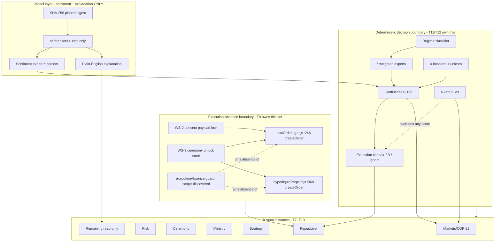

# PICC Trading Suite — WS-7 · Trading Suite Maturity — spec v1

**Date:** 2026-09-25 · **Ratified:** 2026-09-25 owner decision set (D1–D18) · **Amended:** 2026-09-26 owner decision set (D21–D27; D19 resolved as outcome B) · **Workstream:** WS-7 (sequential successor to WS-6; the master design `docs/specs/PICC_TRADING_SUITE_SEAL_ALL_GAPS_v1.md:39-69` enumerates WS-1…WS-5 only) · **Kind:** implementation-ready plan · **Status:** `ACTIVE-DRAFT` · **Implementation state:** not started

**Counts:** 27 decision records (D1–D20, D21–D27) · 49 acceptance criteria (AC-001…AC-049) · 22 tasks (T0–T21) · 16 requirements (R1–R16) · 12 performance budgets (B1–B12) · 4 bisect slices (BS-1…BS-4).

**Amendment round 2026-09-26:** the owner resolved every item this spec had left open. Nine resolutions were supplied and are recorded in place: D19 (amend the paper-only claim, keep the rails), B2 (re-baseline, ~1800 ms ARM tier, 250 ms retained as x86-only), browser camouflage (retained as an explicitly disclosed policy), ExpertOption removal (**APPROVED**), perps cancel gating, the lockfile source of truth (npm), the `interventions.mjs` typing invariant, the `streamCatalog.ts` licensing claims, and room-completeness reporting. D21–D27 are the new decision records those resolutions required. **§9 now carries zero open owner items.** Status remains `ACTIVE-DRAFT` until T0 completes.

This specification seals the gaps for trading-suite maturity. It does **not** authorize a new unverified venue, a fabricated data source, or a black-box model decision. It **does** authorize — as a deliberate, owner-ratified engagement with the status quo — amending the paper-only claim to the gated rails that actually exist and pinning it with a machine-discovered absence scope (T0, D19-B), removing an untrusted venue outright (T2, removal approved), and building a deterministic, inspectable Copilot decision path (T11–T13).

**Evidence convention:** repository claims below cite a `file:line` anchor read during this planning session against `master @ c407964` (clean tree). A claim that could not be anchored is marked `UNVERIFIED`. Owner-supplied evidence (the ARM device probe output, the Copilot blueprint v4.0, vendor benchmark claims) is recorded as a **decision or owner-supplied datum**, never as a measured application result. Where no capability owner is verified, this spec uses the literal reservation `WS-7+` and never a fabricated name.

**Reading order for the implementer:** T0 is not a formality. It is the first task because the repository currently **asserts a guarantee it does not enforce**, and every other WS-7 task inherits that gap until T0 lands.

---

## §0 Current state (verified file:line, 2026-09-25)

### 0.1 What exists now

1. **Real-money order execution EXISTS, is guarded, and is invisible to the guard test.** `apps/dashboard/server/services/ccxtOrdering.mjs:217` documents itself as "The ONLY createOrder caller in the process", and `:246` performs `await instance.createOrder(sym, "limit", orderSide, orderAmount, orderPrice, {...})` — LIMIT-only, per `:217`. A second, independent live rail exists at `apps/dashboard/server/services/venues/hyperliquidPerps.mjs:360` (`await inst.createOrder(symbol, "limit", side, amountN, priceN, params)`) behind `submitOrder` at `:301`.
2. **The paper-only pin is a fixed file list, and the live rails are not on it.** `apps/dashboard/server/__tests__/executionAbsence.test.mjs:27-38` enumerates exactly ten `SUITE_SOURCES`; `:58-62` enumerates exactly three `ALLOWED_CALL_SITES`. Neither list contains `ccxtOrdering.mjs`, `commandCentre/ccxtExecution.mjs`, `commandCentre/perpsExecution.mjs`, or `venues/hyperliquidPerps.mjs`. The `FORBIDDEN_CALLS` patterns at `:43-52` include `/\.createOrder\s*\(/g` — so the **assertion logic is correct and the scope is incomplete**. The test is green and the guarantee is unpinned.
3. **The perps adapter exposes no cancel member, and a test cancels anyway.** `hyperliquidPerps.mjs` exports `{ id, riskModel, markets, submitOrder, verifyFill, observeEquity, positionView, observeFunding }` at `:546-557`, and the file contains **zero** case-insensitive occurrences of `cancel`. `apps/dashboard/server/__tests__/hyperliquidPerps.sandboxE2E.test.mjs:7-8` states the situation in its own comment — "NO cancelOrder member, so the plan's cancel step runs `inst.cancelOrder(orderId, symbol)` on that seam instance" — and does exactly that at `:197`, `:268`, `:297` against the raw CCXT instance. The master adapter contract at `docs/specs/PICC_TRADING_SUITE_SEAL_ALL_GAPS_v1.md:42` lists no cancel member either, so the contract and the test agree with each other and **both disagree with what production exposes**.
4. **ExpertOption's execution paths are dead code that fails silently.** `ensureSession()` is called at `apps/dashboard/server/services/autopilot.mjs:1191`; `getDemoSession()` is called at `brokers.mjs:42`, `positionManager.mjs:61`, and `trading.mjs:991`. A scoped definition search across the entire `apps/dashboard/server/**/*.mjs` tree returned **zero** definitions of either symbol. The callers therefore throw, and the throw is swallowed.
5. **ExpertOption's data capture is live and browser-derived.** `apps/dashboard/server/services/expertoption.mjs:22` sets `DEFAULT_WS_URL = "wss://fr24g1eu.expertoption.com/ws/v45"` and `:36-47` lists twelve unofficial WebSocket endpoints across `expertoption.com` and `expertoption.finance` mirrors. The file is 1,405 lines. Token acquisition depends on a manually logged-in browser session.
6. **A large ExpertOption browser profile exists on this machine, and it is untracked.** `apps/dashboard/server/data/browser-profiles/expertoption/` contains 698 files totalling 106,107,414 bytes (~101 MB), including `Default/Service Worker/CacheStorage/…` blobs. `git ls-files` reports **0** tracked paths for it and `.gitignore:38` excludes `apps/dashboard/server/data/`. So it is a local artifact, not a repository ship risk — but it is direct evidence that data capture ran, and it may contain session material that must be destroyed, not merely ignored.
7. **The docs contradict the code in five ways, all of which OVERSTATE what ships.** The most load-bearing for WS-7 are the paper-only contradiction (item 2 above) and the extension contradiction — `apps/dashboard/extensions/picc-overlay` is absent (per the audit, pinned by `extensionAbsence.test.mjs`) while `PICC.md:3.3/5.4/12.1 F1`, `README.md`, `PRIVACY.md`, and `CHANGELOG.md` still describe it as shipped. The other three (Supabase, Serper, Gemini) are recorded in §0.2.
8. **Two lockfiles disagree, and the disagreement is load-bearing.** `apps/dashboard/pnpm-lock.yaml` contains **zero** references to `ccxt`, `playwright`, or `web-push` — the live-execution and browser dependencies. `package-lock.json` contains 21 `supabase` references and a `ccxt` entry. CI consumes the root lockfile. There is **no `.gitattributes`** in the repository.
9. **The security posture has one large and three moderate gaps.** `agents/picc_agents/server.py:106-107` installs `CORSMiddleware` with `allow_origins=["*"]`; `:70` reads `settings.json`; `:79-80` promotes `settings["api_key"]` into `OPENAI_API_KEY`; `:164` writes a caller-supplied `api_key` back into that settings object. `apps/dashboard/server/services/profile.mjs:20` stores the profile (including the GitHub OAuth material referenced at `:8-9`) in plain `profile.json`; `:5` shows the vault is used for *site* credentials, not for this token. Against that: `vault.mjs` exists and uses real AES-256-GCM, and the audit found no tracked `.env`/key/credential files with a correct `.gitignore`.
10. **Two catalog surfaces are 100% unconfigured.** `apps/dashboard/server/services/integrationRegistry.mjs` is 139 lines with exactly 9 `id:` entries and no clients wired. `apps/dashboard/server/services/copytrade/leaderFeedContract.mjs:26` exports `HIP_NOT_WIRED = "leader:deny:hip-not-wired - endpoint contract unverified"`, surfaced through `hipStub` at `:124` — a deny by design, not a stub pretending to be live.
11. **WS-6 left a real performance breach and several unmeasured budgets.** `apps/dashboard/perf/terminal-perf-manifest.json` uses the verdict vocabulary `pass` / `BREACH` / `UNMEASURED` (`:19-59`), and carries `BREACH` at the 250 ms room-transition budget (`:31-32`) and at the 250 ms scroll-frame budget (`:38-39`), with `UNMEASURED` at `:46-47`, `:52-53`, and `:58-59`. The WS-6 registry row at `PICC.md:477` reports the transition breach as 1230 ms p50 / 2139 ms p95 at 6× throttle.
12. **The ARM baseline probe is already committed and is explicitly WS-7's.** `scripts/arm-probe.mjs:2-5` reads "WS-7 ARM baseline probe — run this ON THE TARGET DEVICE (Snapdragon 680)… Purpose: close the `ARM64: UNVERIFIED` marker that WS-6 could not close from an x86 host." The script is 82 lines and emits `schema=picc-arm-probe/1`. **The device output is not checked in** — no artifact matching `*arm*probe*`/`*arm-baseline*` exists outside the script, and no document in the repo records the probe's numbers.
13. **The product guardrails still read paper-only, and that is now a documentation defect rather than a description.** `PICC.md:25-38` states the three non-negotiables: no live-money order placement anywhere ever (`:26-29`), no behavioral camouflage (`:30-31`), and honest `source`/`status` labels (`:32-33`). Items 1 and 2 of §0.1 show the first is contradicted by code the guard test cannot see.
14. **The master design's locked decision 3 names ExpertOption as a future live venue.** `docs/specs/PICC_TRADING_SUITE_SEAL_ALL_GAPS_v1.md:29` reads "**Third live venue**: ExpertOption, after re-engineering + ADR", and `:37` repeats "EO live blocked until re-engineered + ADR". WS-7's owner decision reverses this to outright removal (D2). The supersession must be recorded, not silently contradicted.

### 0.2 Gaps WS-7 must close

| Gap | Evidence | Consequence for WS-7 |
|---|---|---|
| Paper-only guarantee is unpinned on the real rails | `executionAbsence.test.mjs:27-38,43-52,58-62` vs `ccxtOrdering.mjs:246` and `hyperliquidPerps.mjs:360` | T0 is first and blocking. **RESOLVED 2026-09-26 (D19 → outcome B):** amend the claim to the gated rails that actually exist **and** make the guard's coverage machine-discovered — the hand-list pins no guarantee today. |
| Test exercises a cancel path production does not expose | `hyperliquidPerps.sandboxE2E.test.mjs:7-8,197,268,297` vs `hyperliquidPerps.mjs:546-557` (0 × `cancel`) | T3 adds a real adapter member. A test may not be the only implementation of a capability — here it is the *only* one, so an open position is un-exitable in production. **Correctness requirement (D23).** |
| Master adapter contract omits cancellation | `SEAL_ALL_GAPS_v1.md:42` | T3 amends the contract; a spec that disagrees with the adapter is not a contract. |
| Untrusted venue in the execution surface | `expertoption.mjs:22,36-47`; callers at `autopilot.mjs:1191`, `brokers.mjs:42`, `positionManager.mjs:61`, `trading.mjs:991`; 0 definitions | T2 removes code **and** the local profile. **Owner removal APPROVED 2026-09-26** — no longer blocked on owner input. |
| Master decision 3 conflicts with owner decision 2 | `SEAL_ALL_GAPS_v1.md:29,37` vs D2 | Record an explicit supersession entry; never leave two live docs disagreeing. |
| Extension documented as shipped, absent in tree | `PICC.md:3.3/5.4/12.1 F1`, `README.md`, `PRIVACY.md`, `CHANGELOG.md` vs absent `apps/dashboard/extensions/picc-overlay` | T5 corrects every claim; a doc that overstates shipping is a P1 defect. |
| Supabase documented as a runtime dependency, dead in code | 21 refs in `package-lock.json`, Supabase nodes in 3 n8n workflows, vs local-JSON replacement | T5 + T6. |
| Serper and Gemini described as removed, still live | `sentimentEngine.mjs`, `amazon.mjs`, handler research paths, `agents/.env.example`; `llm.mjs`, `llmSettings.mjs` | T5 reconciles; T13/T18 own the provider decision. |
| Two lockfiles, one CI consumer | `pnpm-lock.yaml` (0 × ccxt/playwright/web-push) vs `package-lock.json`; no `.gitattributes` | **RESOLVED 2026-09-26 (D24):** npm only — `pnpm-lock.yaml` is deleted. T6 no longer branches. |
| Wildcard CORS + plaintext LLM key | `agents/picc_agents/server.py:106-107,70,79-80,164` | T4. Largest single security gap in the repository. |
| GitHub token at rest in plain JSON | `profile.mjs:5,8-9,20` | T4 moves it behind the existing `vault.mjs` AES-256-GCM path. |
| Browser-camouflage tension unresolved | `browserBridge.mjs` strips automation signals vs `PICC.md:30-31`; `interventions.mjs` can click/type/submit | **RESOLVED 2026-09-26 (D22, D25):** the capability is retained as an *explicitly disclosed* policy and the typing invariant is amended to the real boundary. T4 implements the disclosure; the escape hatch for "undecided" is closed. |
| 2 GB ceiling unmeasured; ARM floor worsens the WS-6 breach | `terminal-perf-manifest.json:31-32,38-39`; owner ARM probe 7.18× slower than x86 baseline | **RESOLVED 2026-09-26 (D21):** the ARM tier is **ratified at ~1800 ms** and 250 ms is retained as the **x86-only** tier. T19 still owes the direct on-device sample, and **B1 remains a KNOWN BREACH** — 2139 ms p95 exceeds both tiers. |
| Registry counter drift | `PICC.md:430` claims 39 rows; the table holds 41 | Corrected in this change; the drift is recorded in honesty note 12. |
| 18 rooms incomplete or unverified | WS-6 row `PICC.md:477`: "no room promoted to full parity yet" | T7–T10, one room at a time, each COMPLETE before the next begins (D1). |

### 0.3 T0 baseline freeze (measured at `c407964`, 2026-09-25)

Recorded per T0/T1 acceptance. **Measured** values were observed during this planning session. **Unverified** values are explicitly not claims.

| Gate | Command | Observed result |
|---|---|---|
| Git state | `git rev-parse --short HEAD`; `git status --porcelain` | `c407964` on `master`; 0 changed paths |
| Recent history | `git log --oneline -4` | `c407964` ARM baseline probe; `bff0f6d` agents readiness race; `095f506` ws6 layout gaps; `445f871` ws6 T5–T8+T12 |
| Spec inventory | glob `docs/specs/` | 34 files (matches `PICC.md:430`) |
| Registry rows | parsed `PICC.md:439-479` | **41** rows present; `PICC.md:430` claims 39 → pre-existing drift, corrected here |
| Test-file scope | recursive scan of `apps/dashboard/server/__tests__` + `src/**/__tests__` | 215 test files; `cancelOrder` present in 3 of them |
| Lockfile divergence | `Select-String` counts | `pnpm-lock.yaml`: ccxt 0, playwright 0, web-push 0; `package-lock.json`: supabase 21, ccxt 1 |
| ExpertOption profile | file count / byte sum / `git ls-files` | 698 files / 106,107,414 B / **0 tracked** (`.gitignore:38`) |
| Test floor | `npx vitest run` | **NOT RUN in this session.** Last recorded: 302 files / 3383 tests (`PICC.md:477`). T1 must re-measure. |
| Typecheck / E2E / audit chain | `npm run typecheck`, `test:e2e`, `verifyAudit()` | **NOT RUN in this session.** Last recorded green at `PICC.md:477`. T1 must re-measure. |
| ARM device probe | `scripts/arm-probe.mjs` on device | Script committed (`:2`); **output artifact not committed**. Owner-supplied numbers are in §4.6 with an explicit provenance marker. |

**Freeze invariants.** (a) The 18-room key inventory is frozen: `MinistryShell.tsx` defines three suites and 18 route instances — `trading` → dashboard, markets, paper, autopilot, command-centre, dispatch, simulator, studio, settings (9); `earnings` → dashboard, simulator, studio, settings (4); `intelligence` → dashboard, governor, guidance, studio, settings (5) — i.e. **18 instances across 11 distinct room keys** (per WS-6 spec §0.3, carried forward). (b) The `executionAbsence` assertion logic at `:43-52` is frozen; only its **scope** changes in T0. (c) The perps amputation intent in `perpsSeamGuard.test.mjs:32-52` is frozen as a *policy input*, not as a reason to leave a cancel test unbacked. (d) File-touch whitelist for WS-7: `docs/specs/**`, `docs/trading-logic/changelog/**`, `apps/dashboard/server/__tests__/**`, `apps/dashboard/server/services/**`, `apps/dashboard/src/**`, `apps/dashboard/e2e/**`, `apps/dashboard/perf/**`, `scripts/**`, `agents/**`, `pi-node/**`, the workspace root `package.json`/`package-lock.json`, and the named n8n workflow files. Any path outside this union needs a dated spec amendment.

---

## §1 Locked decisions re-affirmed (not renegotiable by WS-7)

- **The honesty contract is the constitution.** `PICC.md:32-33` ("absent → null", "unconfigured ≠ zero-filled") and `PICC.md:58-61` (spec checkboxes are aspirations until a test is green) bind every task in this spec. WS-7 does not create a new category of "mostly honest" state.
- **WS-6's seams stay.** The terminal contracts, availability/provenance types, deep-link adapter, dense table, incremental chart planner, palette contract, reduced-motion handling, and the WS-6 seam guard are inputs to WS-7, not things to rebuild. WS-6's residual `ARM64: UNVERIFIED` and `Blueprint v4.0 provenance: UNVERIFIED` (`PICC.md:477`) are WS-7's to close, not WS-6's to have been quietly wrong about.
- **Sequential workstream discipline holds.** The master design at `SEAL_ALL_GAPS_v1.md:27` requires one workstream at a time. WS-7 does not begin room work until T0 is green, and does not push (D3) until the cross-room gate is green.
- **Venue earns live status through an ADR.** `SEAL_ALL_GAPS_v1.md:37` and WS-6 D11 remain authoritative. WS-7 adding a cancel member to a gated adapter is not a venue enablement; WS-7 does not enable ExpertOption or any new venue.
- **No AI final decision.** The human-review requirement stands (`PICC.md:35-38`). The Copilot's A+ tier is an owner-ratified, risk-capped, boundary-respecting auto-execute (D6, D7) and is the **first and only** time this repository's decision path may act without a per-action human click — which is exactly why D5, D6, D12, and D16 exist, and why AC-024 through AC-026 are P0.
- **No fabricated fallback, ever.** `orderFlow.mjs`'s unavailable branch is a positive precedent (WS-6 honesty note 6): the correct answer to missing data is a named unavailable state.

---

## §2 Ratified decisions (owner-locked 2026-09-25 — D1–D18; derived — D19–D20; owner-locked 2026-09-26 — D21–D27)

Each entry records **Context → Decision → Why → Consequence**. A consequence is not permission to implement beyond the task list; it is the boundary the implementation agent must preserve. D1–D18 and D21–D27 are the owner's; D19–D20 are derived decisions this spec is forced to make, and they are labelled as such.

**D19 is now RESOLVED** by the 2026-09-26 owner decision set (outcome **(B)**, amended claim — see D19). D21–D27 record the resolutions that had no existing home. No decision in this section is pending owner input as of 2026-09-26.

### D1 — All 18 rooms in WS-7, one at a time, in the owner's order
**Context:** 18 route instances across 11 room keys (§0.3) exist as lazy seams, and `PICC.md:477` records that no room has reached full parity.

**Decision:** Every one of the 18 room instances is completed in WS-7, in this order: Markets/COP-22 → Risk → Ceremony → Ministry → Strategy → Paper/Live → remaining read-only rooms. Each room is COMPLETE before work moves to the next.

**Why:** Breadth without a per-room completion bar produces eighteen "reserved" placeholders, which is the exact state WS-6 shipped.

**Consequence:** A room's definition of COMPLETE is the AC-020 checklist plus its own invariants. No room starts before its predecessor is COMPLETE.

### D2 — ExpertOption is REMOVED ENTIRELY, not disabled
**Context:** Independently verified by the owner: no recognized financial regulator; four conflicting claimed regulators (VFSC, FMRRC, SVGFSA, Financial Commission); the Financial Commission is a self-regulatory dispute body, not a regulator; FMRRC explicitly "is not a license"; entity offshore in St. Vincent & Grenadines; 500:1 leverage at a $10 minimum; heavy affiliate/clone network. In-tree: twelve unofficial WebSocket endpoints (`expertoption.mjs:22,36-47`), dead execution paths (zero definitions for four call sites), and a ~101 MB untracked browser profile with CacheStorage blobs.

**Decision:** ExpertOption is removed from the codebase, the execution surface, the data-capture surface, the venue catalog, the docs, and the local machine artifacts. Removal requires owner approval before any deletion begins.

**Why:** "Disabled" leaves a live unofficial WebSocket in a financial product. The compliance profile — offshore entity, four conflicting claimed regulators, 500:1 leverage — is disqualifying on its own terms, independent of code quality.

**Consequence:** `executionAbsence.test.mjs:35` lists `services/expertoption.mjs` in `SUITE_SOURCES`; deleting the file **breaks that test** unless the entry is removed in the same change. The `SEAL_ALL_GAPS_v1.md:29,37` decisions naming EO a future live venue are superseded (D20). Removal is a supersession, not an erasure of history.

### D3 — Commit one at a time; push all together at the end of WS-7
**Context:** The repo ships via `master`; the working tree was clean at `c407964`.

**Decision:** Every WS-7 task lands as its own commit. Nothing is pushed to `origin` until the cross-room invariant gate is green. The final push is a single batch.

**Why:** Pushing mid-workstream publishes a state in which the paper-only gap may be open and rooms are half-migrated.

**Consequence:** `git status` must be clean at each commit boundary; the final push is an explicit owner action, not a task side effect.

### D4 — Hard ceiling 2 GB total system RAM, enforced as a CI gate that fails on peak-RSS breach
**Context:** ARM Atom/Snapdragon-400-class devices max out at 2–3 GB. The owner device reports 7,618 MB total / 2,527 MB free.

**Decision:** Peak resident set size for the whole stack is capped at 2 GB. A CI job measures peak RSS and **fails the build** on breach. The cap is a hard gate, not a warning.

**Why:** On the minimum target, exceeding 2 GB is an out-of-memory condition, not a slow run.

**Consequence:** No measured peak-RSS verdict exists yet (B10, `UNMEASURED`). The gate must be built and then run; a gate that has never fired is not evidence. The 2 GB figure is the app budget and is independent of device total RAM.

### D5 — Autopilot/auto-execute only on brokers flagged `automationPermitted`
**Context:** The Copilot introduces an A+ auto-execute tier (D7). Brokers do not currently carry that flag.

**Decision:** Auto-execute is permitted **only** on brokers whose record carries `automationPermitted === true`. The flag defaults to **false**. Setting it true requires ministry-authority sign-off. On platforms not flagged, the Copilot degrades to scoring, decision support, and push notifications only.

**Why:** An A+ tier that can auto-execute anywhere is a live-money decision engine wearing a scoring badge.

**Consequence:** The flag is a first-class field on the broker record with an audit event on every change. Absent flag ≠ permitted. AC-024.

### D6 — paper → demo → live boundary is strict; auto-execute at A+ only within it
**Context:** The repository's guardrails are paper-only (`PICC.md:26-29`), and the Copilot introduces automation.

**Decision:** The escalation ladder is strict and one-directional. The Copilot may auto-execute **only** at the A+ tier and **only** within the current rung of that ladder. Crossing a rung is a human act with its own ceremony, exactly as WS-3 established. No tier, score, or booster auto-advances the ladder.

**Why:** An A+ auto-execute that can also promote itself from paper to live would make the ceremony WS-3 built advisory.

**Consequence:** The Copilot's write surface is parameterized by rung; the rung is an input it cannot mutate. AC-025, AC-026.

### D7 — Veto rules are first-class inspectable outcomes
**Context:** The six veto rules (below) override any confluence score. Nothing in the repository currently models an inspectable veto.

**Decision:** Every veto evaluation is a recorded, retrievable outcome — not a boolean folded into a score. A vetoed setup displays which rule fired, on what inputs, at what timestamp, and what it suppressed. Vetoes are never "absorbed" into a lower score.

**Why:** A veto that silently becomes a number is indistinguishable from ordinary scoring and cannot be audited.

**Consequence:** Veto records are subject to the retention policy in D8 and are readable from the Copilot room and the audit surface. AC-022.

### D8 — Retention: vetoes/permanent; raw market snapshots 90 days then aggregated; daily aggregates permanent
**Context:** The audit and WS-6's ordering discipline demand retention rules before data lands.

**Decision:** Veto decisions, score breakdowns, and execution receipts are **permanent append-only**. Raw market snapshots are retained 90 days and then replaced by aggregates. Daily aggregates are permanent.

**Why:** A veto record is the evidence that a safety rule worked; deleting it destroys the audit trail that justifies the rule.

**Consequence:** Append-only means no update or delete path exists for those three classes. The 90-day job is a one-way transform with a recorded cutover. AC-033, AC-034.

### D9 — CCXT full order lifecycle first: Kraken, Coinbase, Binance, Bybit only
**Context:** The venue-adapter contract at `SEAL_ALL_GAPS_v1.md:42` is the integration shape; WS-1 landed the Hyperliquid perps rail.

**Decision:** The CCXT full order lifecycle (submit → verify fill → position → close → realized P&L, with post-fill slippage analysis) is implemented for exactly four venues: Kraken, Coinbase, Binance, Bybit. Additional venues are explicitly later work.

**Why:** Four venues prove the contract is venue-agnostic — which `SEAL_ALL_GAPS_v1.md:28` requires — without spreading thinness across the catalog.

**Consequence:** Each of the four needs the same lifecycle coverage WS-1 gave the perps rail, including a real cancel/close member (the T3 precedent). A venue not in this list gets no lifecycle code. AC-036.

### D10 — Room owners are the literal reservation `WS-7+` until a real owner is assigned
**Context:** No verified owner name exists for WS-7 capabilities.

**Decision:** Every reserved capability, room, and blocked item displays the literal string `WS-7+` as its owner/reservation. No name is invented.

**Why:** Fabricating ownership produces a roadmap that looks assigned and is not.

**Consequence:** A grep for a fabricated owner name must find nothing. A real owner is substituted only by a dated owner decision. AC-042.

### D11 — Push notifications: Telegram bot AND WebPush, configured in the general Settings page
**Context:** The owner specifies both transports and, explicitly, that configuration is **not** ministry-specific.

**Decision:** Both transports are implemented. Configuration lives in the general Settings room, not in a ministry-specific surface. Neither transport may carry a secret in a client-side field.

**Why:** Notification configuration is a general operator setting; hiding it inside a ministry surface makes it undiscoverable and un-auditable.

**Consequence:** The Settings room gains a notifications section that is not ministry-gated. Delivery failures are explicit, not silent. AC-037.

### D12 — Authority model `{ id, title, scope[], canApprove[] }` with separation of duties
**Context:** D5 requires "ministry-authority sign-off". The repository has no authority model.

**Decision:** Authorities are records of exactly that shape. **Separation of duties is enforced mechanically: no authority may both build and approve the same room.**

**Why:** An authority that builds a room and then approves it is not a control.

**Consequence:** The separation rule is a test, not a convention. A build/approve collision is a hard failure with the offending pair named. AC-035.

### D13 — Design: dense professional trading aesthetic
**Context:** WS-6 established the token vocabulary, focus treatment, and reduced-motion contract.

**Decision:** Near-black background, a single accent, tabular numerals for all numeric columns, no decorative motion, WCAG AA. Conventional P&L green/red is retained.

**Why:** This is an operator surface; numeric alignment and contrast are functional, not aesthetic. A second accent competes with the P&L color that carries meaning.

**Consequence:** Adding an accent color requires a spec amendment. Numeric columns are not left to proportional fonts. WS-6's reduced-motion contract is inherited unchanged.

### D14 — Dependencies allowed as needed
**Context:** The owner authorizes TanStack Table/Virtual, `motion`, ONNX Runtime, llama.cpp bindings, a Telegram bot library, and DuckDB.

**Decision:** These are permitted when a task needs them. Authorization is not a mandate: each still requires license/ARM64/maintenance re-verification at its install task and a measured delta in T19.

**Why:** The list is a ceiling, not a shopping list. WS-6's zero-new-dependency T1 is the precedent for deferring an install to the task that consumes it.

**Consequence:** Each install is justified in §4.8 and pinned by T21. An unused package at T21 is a finding. Note that ONNX Runtime and llama.cpp bindings are native modules: ARM64 availability for both is `UNVERIFIED` in this environment and is a release gate (D4, T19).

### D15 — Model supply chain: SHA-256 verified, safetensors/.cact only, never pickle
**Context:** The Copilot's sentiment/explanation layer needs an on-device model (T13).

**Decision:** Every downloaded model MUST be SHA-256 verified against a pinned expected digest and loaded via **safetensors or `.cact` only**. Pickle-family formats (`.bin`, `.pt`, `.pkl`) are forbidden. This is enforced as a CI gate.

**Why:** Pickle deserialization executes arbitrary code at load time. For a financial product, that is a remote-code-execution surface by design.

**Consequence:** A model without a pinned digest cannot be loaded, and the gate fails the build. Format detection must cover renamed files, not just extensions. AC-032.

### D16 — Cloud routing: A+ setups and veto-boundary decisions to cloud; everything else local
**Context:** The owner authorizes cloud inference for a narrow, specific slice.

**Decision:** Only (a) A+ setups and (b) veto-boundary decisions route to a cloud provider (Groq/OpenRouter). Every other Copilot operation is local. A cloud response is never a deterministic input — it is an explanation, with provenance marking, and it can never change a score, a veto, or an execution.

**Why:** "Send it to the cloud" without a boundary turns a local decision system into a remote one whose behavior changes when a provider changes.

**Consequence:** Cloud calls are enumerated, budgeted, redacted, and marked `provenance: "copilot: remote"`. The routing predicate is a pure function with tests. AC-040.

### D17 — Data sources: trusted/verified only; PICC's own browser; no manual news input
**Context:** The audit found sentiment/news ingestion spread across `newsDigest.mjs`, `sentimentEngine.mjs`, and handler research paths, with Serper only partially replaced.

**Decision:** Data comes from (a) licensed/trusted APIs and feeds — NewsAPI, GDELT, CryptoPanic, RSS/Atom — over API/WebSocket, and (b) PICC's **own** headed/headless browser. Manual news entry is prohibited. Scraping Bloomberg, X, and ForexFactory is prohibited on ToS grounds.

**Why:** ToS-prohibited scraping is a legal exposure, not a technical preference; and manual entry destroys data provenance, which is the honesty contract's foundation.

**Consequence:** Every news/sentiment datum carries its source and retrieval mode. PICC's own browser is PICC's infrastructure and carries PICC's labeling obligations. AC-038, AC-039.

### D18 — Full test floor at every commit
**Context:** WS-6 recorded the floor discipline; D3 commits one task at a time.

**Decision:** At **every** commit: typecheck + full vitest + e2e + `auditTrail.verifyAudit()` + security-review + `git diff --check`. A commit that cannot run the full floor is not a commit.

**Why:** The paper-only gap in §0.1 exists partly because a narrow test could pass while the real rail went unpinned. A partial floor reproduces that failure at a larger scale.

**Consequence:** The floor is a pre-commit/CI condition, not a task-final condition. A red floor blocks the commit; it does not become a follow-up task. AC-046.

### D19 (derived) — RESOLVED 2026-09-26: outcome (B). Amend the paper-only claim; keep the rails; make the guard machine-discovered.
**Context:** `executionAbsence.test.mjs:27-38,58-62` omits the two live rails, and `PICC.md:26-29` claims no live-money placement exists. The two cannot both be right.

**Decision (as ratified):** **Outcome (B).** The product documentation is **amended** to describe the gated rails that actually exist, and the absence guard is rebuilt so that its *scope is machine-discovered* rather than hand-listed. T0 does both. Two elements are non-negotiable and survive this resolution:

1. **The guard's coverage must become machine-discovered.** The current guard is correct in its assertion logic (`:43-52`, including `/\.createOrder\s*\(/g`) and wrong only in its scope: a fixed ten-file `SUITE_SOURCES` and three-file `ALLOWED_CALL_SITES` that omit `ccxtOrdering.mjs`, `commandCentre/ccxtExecution.mjs`, `commandCentre/perpsExecution.mjs`, and `venues/hyperliquidPerps.mjs`. Because the real order-capable modules are not in scope, the green test **pins no guarantee at all**. T0 must close that, and AC-001 requires the mechanism itself to be proven (a synthetic order-calling module must fail the guard with no list edited).
2. **The rails stay.** Outcome (B) is an *amendment of the documentation*, not a deletion of working order-lifecycle code.

**Why:** A guard that tests what exists is preferable to a documentation claim that is false. The owner chose the truthful document over the flattering one: the code is ceremony-gated, consent-locked and hard-capped (`CCXT_HARD_NOTIONAL_CAP_USD`), so the rails are defensible **when described accurately**; a "paper-only, no live-money order form, ever" sentence that the guard cannot enforce is the same dishonesty class this spec exists to close. Note the asymmetry: a hand-listed guard that omits the real rails and a doc that denies the real rails are the *same* defect viewed from two ends, and only the discovered-guard + amended-claim combination fixes both.

**Consequence:** T0 must produce a written decision record naming the amended guarantee and the guard that enforces it. `PICC.md:25-38` is rewritten to state the true boundary — gated, capped, ceremony-locked CCXT spot and Hyperliquid perps rails, not a paper-only product. AC-001 through AC-004 pin it. The Paper/Live room (T9) surfaces exactly what the amended claim authorizes, and exposes no live toggle beyond it. **Residual:** the ceremony unlock has never been granted, so "gated" is not "live" — the amended claim must not imply a venue is trading today.

### D20 (derived) — Every contradiction this spec resolves gets a supersession record
**Context:** D2 reverses `SEAL_ALL_GAPS_v1.md:29,37`. T3 amends the adapter contract at `SEAL_ALL_GAPS_v1.md:42`. T5 corrects the extension/Supabase/Serper/Gemini claims. The registry counter at `PICC.md:430` was already wrong.

**Decision:** Each reversal or correction is recorded as an entry under `docs/trading-logic/changelog/` with `supersededBy`, `date`, `historicalTradesAffected`, and a pointer from the superseded document. A document is never left contradicting itself silently.

**Why:** WS-6 established the supersession pattern (honesty note 6, `blueprint-v4-provenance.md`). WS-7 has strictly more supersessions to record, and the audit's central finding was documentation overstating reality.

**Consequence:** No task may "fix" a doc by deleting the conflicting sentence without a supersession record. AC-006, AC-011, AC-016, AC-017.

### D21-SUPERSESSION (2026-09-26) - the ~1800 ms ARM ratification is WITHDRAWN as unsound

**Supersedes:** the original D21 (re-baseline to ~1800 ms). The original decision is recorded above and is
**withdrawn, not deleted** - a ratified budget that turns out to rest on an invalid derivation must be
withdrawn on the record rather than quietly edited away.

**Why the original was unsound, on two independent grounds:**

1. **Wrong kind of ratio.** The ~1800 ms came from scaling by the owner ARM probe's 7.18x **CPU-only**
   benchmark. The WS-7 T2 diagnostic then proved the transition is **RENDER-bound, not data-bound**:
   measured route 22 ms average against render 1823 ms average on the same 6x-throttled run. A CPU ratio
   cannot transfer to a path whose cost is dominated by rendering, so the derivation had no valid basis.
2. **Derived from a broken input.** The 250 ms it was scaled from was itself `max-of-5-warming-samples`,
   not a percentile. Scaling a non-percentile produces a non-percentile.

**What the corrected measurement actually shows** (12 steady samples, 4 warm-up discarded, 6x throttle):

| Throttle | p50 | p95 | vs 250 ms |
| --- | --- | --- | --- |
| 1x (unthrottled x86) | 113 ms | 173 ms | **PASS** |
| 4x | 1257 ms | 2293 ms | BREACH |
| 6x | 1986 ms | 3741 ms | BREACH |

**Correction to an earlier statement in this session:** the 2747 ms previously recorded was described as
"overstated ~3.3x by a broken percentile". That was **wrong**. The corrected steady-state p95 is 3741 ms -
*higher*, because five samples could not see the tail that twelve can. The warm-up correction and the
sample-count correction are independent, and fixing the second made the number worse, not better.

**Decision:** **WITHDRAW with no substitute.** B2 is left explicitly without a defensible figure rather than
back-filled with another derived number. ARM room-transition cost is genuinely unknown; the direct T19
on-device sample is the only thing that can close it. B1's 250 ms remains the x86 target and remains a
**BREACH at 4x and 6x throttle** - though it **passes unthrottled**, which is new and material information.
### D21 (owner, 2026-09-26) — The ARM room-transition budget is re-baselined to ~1800 ms; 250 ms is retained explicitly as an x86-only tier
**Context:** B1 carries `BREACH` at 1230 ms p50 / 2139 ms p95 at 6× throttle on the x86 proxy. The owner's ARM probe measured `bench_ms` 3012.39 on ARM against 419.48 on x86 — a 7.18× ratio — so the 250 ms figure does not transfer to the declared ARM floor. 250 ms × 7.18 ≈ 1795 ms.

**Decision:** **Re-baseline.** The ARM floor class gets a ratified room-transition budget of **approximately 1800 ms p95**, stated as an A53-honest figure. The **250 ms figure is retained, but relabelled x86-only** — it is not deleted, softened, or applied to ARM. B2 is no longer `UNRATIFIED`/`UNMEASURED`.

**Why:** A single x86-derived number applied to a 7.18×-slower class is a fabricated pass, and quietly lowering the budget to make a breach disappear is exactly the failure mode this spec forbids. Two honest tiers beat one dishonest number.

**Consequence:** B1 remains a **KNOWN BREACH** and is reported as one — see §4.6 for exactly which tier each measurement breaches, including the awkward fact that B1's own 2139 ms p95 also exceeds the new 1800 ms ARM figure. The ~1800 ms figure is **derived from the 7.18× ratio, not directly measured as an on-device room transition**; T19 still owes that direct sample, and AC-044's verdict vocabulary must accept the ratified-but-unmeasured state without reading as `pass`. AC-045.

### D22 (owner, 2026-09-26) — Automation-signal stripping is RETAINED as an explicitly disclosed policy
**Context:** `browserBridge.mjs:10-11` states the design intent outright — "we strip the automation signals we control (`navigator.webdriver`)" — and `:323` exposes it as an opt-out `stealth` flag defaulting to **true**; `:363-365` pushes `--enable-automation` into `ignoreDefaultArgs`; `:288` `importRealProfile` and `:329` `realProfilePath` allow importing a real, logged-in browser profile. This is in tension with `PICC.md:30-31` ("no behavioral camouflage").

**Decision:** **KEEP the capability, and make it an explicitly disclosed policy.** The capability is retained because browser-supercharged data sourcing (D17's "PICC's own browser") depends on it. The disclosure is now mandatory, not optional: the stripping and the real-profile import must be documented in the product documentation with their rationale and their boundary, and the policy must be discoverable by an operator reading the product's claims.

**Why:** An undisclosed capability that contradicts a stated non-negotiable is a documentation defect; a *disclosed, bounded, deliberately chosen* capability is a policy. The owner's resolution is to move this file from the second category to the first — it changes what `PICC.md:30-31` says, not what the code does.

**Consequence:** T4 produces the dated disclosure policy, links it from `PICC.md:30-31`, and pins the chosen behavior in a test. The disclosure must state what is stripped, that a real logged-in profile may be imported, and that every datum obtained this way still carries its retrieval mode per D17/AC-038 — provenance obligations are unchanged by the camouflage decision. AC-015.

### D23 (owner, 2026-09-26) — The perps adapter gains a real gated cancel member, and the seam guard is corrected to test the production path
**Context:** `hyperliquidPerps.mjs:546-557` exports no cancel member and the file contains zero occurrences of `cancel`, so **an open perps position cannot be exited through the production path** — only through the raw CCXT instance inside `hyperliquidPerps.sandboxE2E.test.mjs:197,268,297`. The related guard is `perpsSeamGuard.test.mjs:36-69`, whose `READ_ONLY_BLOCKED_TOKENS` list includes `"cancelOrder"` (`:44`).

**Decision:** **Add a real cancel member and correct the guard's focus.** Treated as a **correctness requirement, not a cleanup**: an un-exitable position is a defect in its own right. The guard is corrected so it **tests the production path** rather than resting on a method ban.

**Precisely what the correction is** (read this session, so it is not a guess): `perpsSeamGuard.test.mjs:107-116` asserts that `ccxtConnector.mjs`'s `READ_ONLY_BLOCKED` array **still contains** the quoted token `"cancelOrder"`. That is a pin that the **non-seam** read-only blocklist is not eroded — it is **not** a ban on the perps adapter having a cancel member, and the perps seam is already documented as a sanctioned carve-out (`:10-15`). So the correction is **additive, not subtractive**: keep `"cancelOrder"` in `READ_ONLY_BLOCKED` for every non-seam module, and add a **positive** assertion that the sanctioned perps seam exposes a gated cancel member. The spot read-only contract is untouched — `ccxtConnector.test.mjs:299` expects `ex.cancelOrder("123")` to throw `/PICC is read-only/` and must keep doing so.

**Why:** The guard's intent is already right — non-seam modules must stay read-only. What was wrong was that the *only* evidence the capability worked was a test reaching past the adapter. Correcting the focus (from "the method name is banned" to "the production seam is tested") closes the gap without eroding the read-only boundary WS-1 established.

**Consequence:** `hyperliquidPerps` exports a `cancelOrder` gated **identically** to `submitOrder` (`:301`) — same ceremony, same consent lock, same mode resolution (`:133-135`), never mainnet-reachable without the ceremony unlock. Adding the member does **not** trip `perpsSeamGuard.test.mjs:118-151` (those assertions count `.createOrder(`, `new ccxt`, and `placeCcxtOrder`, none of which a `cancelOrder` member introduces) — verified this session, so no guard weakening is required to land it. AC-009, AC-010, AC-011.

### D24 (owner, 2026-09-26) — npm is the single lockfile source of truth; the pnpm lockfile is deleted
**Context:** Two lockfiles disagree and the disagreement is load-bearing. `apps/dashboard/pnpm-lock.yaml` has **zero** references to `ccxt`, `playwright`, or `web-push` — the live-execution and browser dependencies. Root `package-lock.json` holds the real graph (21 `supabase` refs, a `ccxt` entry). **CI already consumes the root `package-lock.json`**, so the pnpm file is not merely stale but misleading: a reader who trusts it believes the live dependencies are absent.

**Decision:** **npm only.** The root `package-lock.json` is the one authoritative lockfile. `apps/dashboard/pnpm-lock.yaml` is **deleted** — not stubbed, not reduced, not left to rot. One source of truth, stated once.

**Why:** A second lockfile that claims authority is a correctness hazard, and a stub that still looks like a lockfile is a smaller version of the same lie. The consumer is already npm; the file is pure liability.

**Consequence:** R6.2's "removed or reduced to a non-claiming stub" is narrowed to **removed**. The T6 decision no longer branches. `package.json` must not carry a `packageManager`/workspace field that re-implies pnpm. AC-018.

### D25 (owner, 2026-09-26) — PICC may type, but only behind an explicit human approval step, and never holds broker credentials
**Context:** `interventions.mjs:52` defines `WRITE_STEPS = new Set(["fill", "click", "type", "key", "submit"])`, and `:277` gates each one — a write step runs only when `running.approved.has(running.stepIndex)`, i.e. after a per-mutating-action human approval. This contradicts a code comment at `browserStudio.mjs:1752` ("PICC never clicks buy/withdraw or submits anything"). It does **not** contradict the extension-eradication spec, whose own `:147` already reads "execution = human-approved only … Never auto-execute" — that sentence is consistent with keeping the capability.

**Decision:** **KEEP the human-gated capability; AMEND the invariant to the real boundary.** The invariant becomes: *PICC never types, clicks, or submits into a broker without an explicit human approval step for that specific action, and PICC never holds broker credentials.* The inaccurate comment is corrected; the approval gate is untouched.

**Why:** The old sentence was false, and a false "we never touch the page" claim is the same defect as the false paper-only claim (D19). The honest invariant is *stronger where it matters*: the real control is per-action human consent plus credential non-possession, not an absolute that the code does not honour.

**Consequence:** The credential half is a hard constraint — the typing path must never be given broker credentials, and no future task may route a credential into `interventions.mjs`. The approval half is already enforced at `interventions.mjs:277` and must stay enforced. The comment at `browserStudio.mjs:1752` is corrected in T4 under a D20 supersession record. AC-015.

### D26 (owner, 2026-09-26) — Unverifiable third-party regulatory claims in the stream catalog are DELETED, not verified
**Context:** `streamCatalog.ts` asserts Securities-Commission licensing and DAX registration for eight entries — Luno (`:42`), MX Global (`:43`), HATA Digital (`:44`), SINEGY DAX (`:45`), Kinetic DAX (`:46`), Funding Societies (`:63`), Selangor Kuasa (`:64`), Pitik (`:65`) — with **zero in-tree evidence**. A separate user-facing claim of the same class lives at `browserStudio.mjs:505`: OANDA fxTrade Practice described as "no payment info, no KYC for demo", asserted with no in-tree evidence. These are user-facing assertions **about third parties**.

**Decision:** **DELETE the claims.** They are not to be verified, footnoted, or softened. The catalog states what PICC can evidence; where a regulatory status is not evidenced, the row says nothing about it.

**Why:** An unverifiable regulatory claim in a user-facing surface is the same dishonesty class as the paper-only documentation gap: it asserts a fact the repository cannot support, in a context where a user may make a financial decision on it. The owner chose deletion over a verification effort, which is the correct cost trade for claims with no in-tree source.

**Consequence:** The eight `streamCatalog.ts` note strings and the `browserStudio.mjs:505` OANDA note lose their licensing/KYC assertions, and each removal carries a D20 supersession record naming what was removed and why. T5 owns this. AC-049 (new). **Scope note:** the entries themselves are **not** removed — only the unverifiable claims are. Whether these venues should be listed at all is a separate question this decision does not answer.

### D27 (owner, 2026-09-26) — All 18 rooms stay in scope, and WS-8 overlap is FLAGGED, never silently trimmed
**Context:** D1 commits all 18 room instances to WS-7, but room boundaries against a not-yet-written WS-8 are not derivable from this spec.

**Decision:** **Flag, never silently trim.** At each room, the implementer must explicitly state in that room's completion record whether the room is **genuinely complete** or whether **some scope logically belongs to WS-8**. All 18 rooms remain in WS-7 scope. **Silently trimming scope is prohibited.**

**Why:** The failure mode this guards against is the WS-6 outcome: eighteen rooms that look assigned and are partly placeholders. An implementer under delivery pressure will always be tempted to shave the hardest edge off a room and call it done; requiring the shavable edge to be *named* converts a silent scope reduction into a visible, reviewable statement. A flagged WS-8 handoff is a legitimate outcome; an unflagged one is a defect.

**Consequence:** Every room's AC-020 record carries an explicit completeness verdict naming any WS-8-boundary scope. A room may not be declared COMPLETE with an unstated boundary. D1 is unchanged in scope; this decision changes only how a boundary must be reported. AC-020, AC-041.

---

## §3 Requirements

Each requirement names its task(s). "Testable" means it has a criterion in §5.

### R1 — The paper-only guarantee becomes real and pinned (D18, D19) — T0
- R1.1 Every module capable of reaching an order call is inside the absence guard's scope, discovered by a mechanism that cannot silently miss a new file.
- R1.2 The guard asserts against the real files on disk, and the *coverage* of the assertion is machine-derived rather than hand-listed.
- R1.3 The product claim in `PICC.md` matches the enforced guarantee, with a decision record.
- R1.4 Ceremony/handshake unlock requirements on the real rails are asserted, not assumed.

### R2 — Untrusted venue removal (D2, D10, D20) — T2
- R2.1 No ExpertOption source, endpoint, or catalog entry remains after T2.
- R2.2 The four dead call sites either resolve to a real implementation or are removed with their callers.
- R2.3 The local ~101 MB profile artifact is destroyed, with a recorded destruction, not merely ignored.
- R2.4 The master design's EO decisions carry a supersession pointer.

### R3 — Adapter honesty (D9, D20) — T3
- R3.1 The production perps adapter exposes a real cancel/close member, gated identically to `submitOrder`.
- R3.2 The sandbox E2E test exercises the adapter member, not a raw CCXT instance.
- R3.3 The master adapter contract is amended to include cancellation.
- R3.4 A test may never be the sole implementation of a capability production lacks.

### R4 — Security posture (D17) — T4
- R4.1 No wildcard CORS remains in the agents service; origins are explicit.
- R4.2 No plaintext LLM key persists in `settings.json`.
- R4.3 The GitHub token is stored through the existing AES-256-GCM vault.
- R4.4 The browser-camouflage tension and the typing intervention are resolved by an explicit owner policy decision, recorded.

### R5 — Documentation truth (D20, D26) — T5
- R5.1 No document claims a shipped artifact that is absent from the tree.
- R5.2 No document claims a removed dependency that code still imports.
- R5.3 Every correction carries a supersession record.
- R5.4 (D26) No user-facing surface asserts a third party's regulatory status or KYC policy without in-tree evidence; the claim is deleted rather than made unverifiable-safe.

### R6 — One lockfile, one truth (D18) — T6
- R6.1 Exactly one lockfile is authoritative.
- R6.2 The non-authoritative lockfile is removed or reduced to a non-claiming stub.
- R6.3 The live dependencies (ccxt, playwright, web-push) are present in the authoritative lockfile.
- R6.4 The dead Supabase surface is removed from the authoritative lockfile.

### R7 — Room completion (D1, D13, D27) — T7–T10
- R7.1 Each room is COMPLETE per the AC-020 checklist before the next room starts.
- R7.2 Each room renders unavailable/reserved states rather than fabricated values.
- R7.3 Each room meets the 1280×800 layout and WCAG AA obligations inherited from WS-6.
- R7.4 Each room displays `WS-7+` for any unowned capability.
- R7.5 (D27) Each room's completion record explicitly flags whether the room is genuinely complete or whether scope logically belongs to WS-8. All 18 rooms stay in scope; silent trimming is prohibited.

### R8 — Deterministic Copilot decision path (D5, D6, D7) — T11
- R8.1 The decision path is a deterministic rule engine, not a model call.
- R8.2 Weighted confluence produces a 0–100 confidence with per-expert contributions.
- R8.3 Execution tiers map score to action exactly as specified, with no intermediate band.
- R8.4 Every veto is an inspectable recorded outcome.

### R9 — Conflict resolutions (D5, D6) — T12
- R9.1 C1 (ADX lag vs scoring) is implemented as a specified, testable rule with an expiry.
- R9.2 C2 (wick-vs-close vs ATR hard stop) is two-tier exactly as specified.
- R9.3 C3 (hypertrend vs macro bias) is a temporary weight reallocation with a stated window.

### R10 — Model supply chain and routing (D15, D16) — T13
- R10.1 Every model is SHA-256 verified and loaded via safetensors/.cact only.
- R10.2 Pickle-family formats are rejected, including when renamed.
- R10.3 The model serves only the sentiment expert and the explanation layer; it computes no indicator, regime, veto, or tier.
- R10.4 Cloud routing is limited to A+ setups and veto-boundary decisions and is never a deterministic input.

### R11 — Retention and veto inspectability (D7, D8) — T15
- R11.1 Veto decisions, score breakdowns, and execution receipts are append-only and permanent.
- R11.2 Raw market snapshots purge at 90 days via a one-way, recorded transform.
- R11.3 Daily aggregates are permanent.

### R12 — Authority and notifications (D11, D12) — T14, T16
- R12.1 Authorities are `{ id, title, scope[], canApprove[] }` records.
- R12.2 No authority both builds and approves the same room, enforced mechanically.
- R12.3 Both notification transports are configurable from the general Settings room.

### R13 — Venue lifecycle breadth (D9) — T17
- R13.1 Each of Kraken, Coinbase, Binance, Bybit has full lifecycle coverage.
- R13.2 Each honors the ceremony gate, the consent payload lock, and the risk rails.
- R13.3 No venue outside the four receives lifecycle code.

### R14 — Data source integrity (D17) — T18
- R14.1 Every news/sentiment datum carries source and retrieval mode.
- R14.2 ToS-prohibited scrapers are absent and pinned absent.
- R14.3 Manual news input is impossible in the UI.

### R15 — Performance and memory (D4, D14) — T19
- R15.1 Every budget in §4.6 carries a measured verdict or an explicit `UNMEASURED`.
- R15.2 The 2 GB peak-RSS gate exists, runs, and has been observed at least once in both branches.
- R15.3 The ARM class gets its own ratified budget tier rather than inheriting an x86 number. **Satisfied by decision D21 (2026-09-26):** the ARM floor tier is ratified at ~1800 ms p95 and 250 ms is relabelled x86-only. T19 still owes the direct on-device sample.

### R16 — Cross-room invariants and working-tree truth (D1, D3, D18) — T1, T20, T21
- R16.1 T1 records the floor, typecheck, audit chain, and E2E results with no result inherited as if freshly measured.
- R16.2 The invariant gate covers safety/correctness as a hard gate and performance/UX as best-effort.
- R16.3 The gate runs over all 18 room instances.

---

## §4 Design

### 4.1 Architectural seam

The seam for WS-7 is the **execution-absence boundary** — the set of modules from which an order call can originate — combined with the **deterministic decision boundary** for the Copilot. Everything else is a consumer of one or the other.



The Copilot's decision path is a **pure function of market state**. The model layer sits outside it: the model may contribute the 5% Sentiment expert's input and may write prose, and it may do nothing else. If the model is unavailable, the Sentiment expert reports unavailable and the remaining 95% still produces a score with an honest confidence penalty — never a fabricated sentiment and never a silent renormalization that hides the gap.

### 4.2 Proposed module layout

Proposed new seams; no claim is made that they already exist. An implementation agent must verify each path before creating it, and each is subject to the §0.3 whitelist.

```text
apps/dashboard/server/services/copilot/
  regime.mjs                # 5-class regime classifier (Tokyo/London/NY/Hypertrend/Dead Zone)
  experts/
    macroBias.mjs           # 20% - daily 400/200 EMA
    structural.mjs          # 20% - 4H S/R, VWAP, Fibonacci
    trendStrength.mjs       # 20% - 50 EMA slope, ADX
    momentumExhaustion.mjs  # 15% - StochRSI, divergence
    volatilityBoosters.mjs  # 20% - 4 boosters + unicorn
    sentiment.mjs           # 5%  - MODEL INPUT ONLY
  confluence.mjs            # weighted 0-100, per-expert contributions
  tiers.mjs                 # >85 A+, 70-84 B, <70 ignore
  vetoes/
    topDownHierarchy.mjs
    correlationTrap.mjs
    wickVsClose.mjs
    spreadVsTarget.mjs
    newsLockout.mjs
    sessionOpen.mjs
  vetoIndex.mjs             # inspectable veto record read/write
  conflicts/
    c1AdxLagging.mjs
    c2TwoTierStop.mjs
    c3HypertrendMacro.mjs
  routing.mjs               # D16 cloud-routing predicate (pure)
  retention.mjs             # D8 class routing + 90d one-way transform
  explain.mjs               # plain-English layer, provenance-marked
  __tests__/                # co-located pure tests

apps/dashboard/server/services/authority/
  authorityModel.mjs        # {id,title,scope[],canApprove[]}
  separationOfDuties.mjs    # build/approve collision detector

apps/dashboard/server/services/notifications/
  telegram.mjs
  webpush.mjs
  transport.mjs             # shared delivery + explicit failure states

apps/dashboard/server/scripts/
  absence-scope.mjs         # NEW - discovers order-capable modules
                             # AMENDED 2026-09-29: this path, not root
                             # scripts/. It lives INSIDE the server tree on
                             # purpose - see the T0 deviation record in
                             # changelog entry 0018.

scripts/
  arm-probe.mjs             # EXISTS (c407964) - device evidence collector
  ram-ceiling-gate.mjs      # NEW - peak-RSS gate, fails build
  model-digest-gate.mjs     # NEW - SHA-256 + safetensors/.cact only
```

### 4.3 Core data shapes

```ts
type VetoOutcome = {
  ruleId: "topDownHierarchy" | "correlationTrap" | "wickVsClose"
         | "spreadVsTarget" | "newsLockout" | "sessionOpen";
  fired: boolean;
  inputs: Record<string, number | string | boolean>;
  suppressed: string;              // what this veto blocked
  evaluatedAt: number;
  ruleVersion: string;
  // D7/D8: append-only, permanent. No update/delete path exists.
};

type ExpertContribution = {
  expert: "macroBias" | "structural" | "trendStrength"
        | "momentumExhaustion" | "volatilityBoosters" | "sentiment";
  weightPct: 20 | 20 | 20 | 15 | 20 | 5;   // sums to 100
  rawDelta: number;                          // within the expert's own band
  available: boolean;
  unavailableReason: string | null;          // required when available === false
};

type ConfluenceScore = {
  score: number | null;                      // 0-100, null when unscoreable
  contributions: ExpertContribution[];       // always all six, even unavailable
  confidence: "high" | "medium" | "low" | "unavailable";
  regime: "tokyoRange" | "londonTrend" | "nyVolatility" | "hypertrend" | "deadZone";
  activeBoosters: string[];
  conflictOverrides: Array<"C1" | "C2" | "C3">;
  computedAt: number;
  engineVersion: string;
};

type ExecutionTier = {
  tier: "A+" | "B" | "ignore";
  riskPct: 0.01 | 0.005 | 0;                 // 1% / 0.5% / stay in cash
  action: "autoExecute" | "notifyForApproval" | "hold";
  // D5: autoExecute is only reachable when broker.automationPermitted === true.
  automationPermitted: boolean;
  rung: "paper" | "demo" | "live";           // D6: read-only input to the Copilot
  vetoes: VetoOutcome[];                     // non-empty fired => action forced to "hold"
};

type BrokerRecord = {
  id: string;
  automationPermitted: boolean;              // D5: defaults FALSE
  permitChangedAt: number | null;
  permitChangedByAuthorityId: string | null;  // D12: ministry sign-off
  ceremonyUnlocked: boolean;
};

type Authority = {
  id: string;
  title: string;
  scope: string[];
  canApprove: string[];                      // room keys
  // D12: this authority must not appear in both its built rooms and canApprove.
};

type ModelArtifact = {
  name: string;
  expectedSha256: string;                    // D15: pinned, required
  observedSha256: string;
  format: "safetensors" | "cact";
  verified: boolean;                         // false => never loaded
  // D15: .bin/.pt/.pkl rejected even when renamed.
};

type CopilotExplanation = {
  provenance: "copilot: remote" | "copilot: local";
  model: string | null;
  generatedAt: number | null;
  // D16: never a score, veto, or execution input.
  role: "explanation" | "sentiment_input";
  redacted: true;
};

type RetentionClass =
  | "permanent_append_only"
  | "raw_90d_then_aggregated"
  | "daily_aggregate_permanent";
```

The shapes are contracts, not permission to invent values. A field that cannot be observed is `null`/`unavailable`, never `0`.

### 4.4 The Copilot rule engine (blueprint v4.0, owner-supplied)

**Experts and weights** (a test asserts the sum is exactly 100):

| Expert | Weight | Deterministic inputs | Band |
|---|---:|---|---|
| Macro Bias | 20% | Daily 400 EMA, Daily 200 EMA | +10 / −10 each |
| Structural | 20% | 4H S/R proximity, VWAP, Fibonacci | +10 / −10, +5 / −5, +5 |
| Trend & Strength | 20% | 50 EMA slope, ADX > 25 rising/falling | +10/+5/0, +10 / −10 |
| Momentum & Exhaustion | 15% | StochRSI cross, divergence | +10, +5 / −10 |
| Volatility & Boosters | 20% | Booster1 20/50 cross, Booster2 BBW expanding, Booster3 divergence (range-only), Booster4 MTF confluence | +10, +10, +10, +15 |
| Sentiment | 5% | news NLP | +5 / −5 |

**Execution tiers:** `>85 = A+` (risk 1%) · `70–84 = B` (notify for approval, risk 0.5%) · `<70 = ignore` (stay in cash). There is no fourth band and no interpolation between 84 and 85.

**Six vetoes, each overriding any score:** (1) Top-Down Hierarchy · (2) Correlation Trap · (3) Wick-vs-Close · (4) Spread-vs-Target · (5) News Lockout ±15 min around a Red Folder event · (6) Session Open (first 15 min of London/NY).

**Four boosters + Unicorn hypertrend logic.** **Regime classifier:** Tokyo Range · London Trend · NY Volatility · Hypertrend · Dead Zone (no trading).

**Risk layer:** ATR(14) stop at 1.5× · 2% daily drawdown disable · 3-strike rule locks keys for 24h.

**The three conflict resolutions are testable requirements, not prose** (T12; AC-027 through AC-029):

- **C1 — ADX lag vs scoring.** When Booster1 **and** Booster2 both fire, disable the ADX penalty and set `Trend_Score` to max for the next 5 candles. Rationale: ADX lags; BBW and the 20/50 cross lead.
- **C2 — Wick-vs-Close vs ATR hard stop.** Two-tier. The **soft** stop at 1.5× ATR alerts and *waits for candle close*. The **hard** stop fires only on a **close** beyond 1.5× ATR, or a close below the 50 EMA.
- **C3 — Hypertrend vs macro bias.** When `regime == hypertrend`, temporarily reduce Macro Bias weight from 20% to **0%**, because a 4H wall is irrelevant in a 1–3 minute high-velocity window. The reallocation has a stated window and expires; it is not sticky.

### 4.5 Venue disposition

| Venue / module | Verdict | Evidence / boundary |
|---|---|---|
| `ccxtOrdering.mjs` | **KEEP + COVER** | `:217,246` real LIMIT-only spot rail. Needs absence coverage, not deletion (D19 outcome B). |
| `venues/hyperliquidPerps.mjs` | **KEEP + AMEND** | Legitimate gated rail; **needs a cancel member** (`:546-557`, 0 × `cancel`) — an open position is currently un-exitable through the production path. T3, D23. |
| `vault.mjs` | **KEEP** | Real AES-256-GCM with atomic writes. Becomes the store for the GitHub token (T4). |
| `localstore.mjs` | **KEEP** | Named in the audit as do-not-remove. |
| `orderFlow.mjs` unavailable branch | **KEEP** | Correctly refuses to fabricate candle-derived delta. Positive precedent. |
| Kraken / Coinbase / Binance / Bybit | **ADD LIFECYCLE** | D9, T17. |
| `expertoption.mjs` | **REMOVE ENTIRELY — APPROVED** | D2. Untrusted venue. **Owner approved removal 2026-09-26**; the full inventory and blast radius were presented and accepted, and the execution paths are already dead code (0 definitions of `ensureSession`/`getDemoSession`; callers swallow the throw). T2 is no longer blocked on owner input. |
| `browser-profiles/expertoption/` | **DESTROY LOCAL ARTIFACT** | 698 files / ~101 MB / 0 tracked. May contain session material. |

### 4.6 Performance and memory budgets

Every row carries a **current verdict** that is either a measured number, an explicit `UNMEASURED`, or — for B2 — an explicitly labelled **ratified-but-not-directly-measured** budget. A silent pass is not permitted. Verdicts are as of `c407964`; "WS-6 recorded" cites `PICC.md:477` and `apps/dashboard/perf/terminal-perf-manifest.json`. See the verdict-vocabulary note at the end of this subsection for why B2's state must be representable without collapsing into `pass`.

| # | Measurement | Budget | **Current verdict** | Evidence |
|---|---|---:|---|---|
| B1 | Room transition, normalized data, **x86 throttled proxy** | ≤ 250 ms p95 (**x86-only tier**, D21) | **BREACH — KNOWN, NOT FIXED.** Measured 1230 ms p50 / 2139 ms p95 at 6× throttle. This breaches the x86 250 ms tier by **8.6× at p95**. It *also* breaches the newly ratified ARM tier of ~1800 ms, because 2139 ms p95 > 1800 ms — so re-baselining ARM does not rescue this measurement. Reported as a breach, never as a pass. | `PICC.md:477`; manifest `:31-32` |
| B2 | Room transition, **ARM floor class** (A53-honest) | **WITHDRAWN - NO DEFENSIBLE FIGURE** | **The ~1800 ms ratification is WITHDRAWN as unsound (D21 supersession, 2026-09-26).** It was derived as `250 ms x 7.18x`, a derivation now known to be invalid on two independent grounds: (1) the 7.18x ratio is a **CPU-only** benchmark, while the T2 diagnostic proved the transition is **RENDER-bound, not data-bound** (route 22 ms vs render 1823 ms avg), so a CPU ratio cannot transfer to a render-dominated path; (2) the 250 ms input it was scaled from was a max-of-5-warming-samples figure, not a percentile. **No replacement figure is substituted.** ARM room-transition cost is genuinely unknown and requires the direct T19 sample. This row does not read as `pass`. | T2 diagnostic `ws7-transition-diagnostic.spec.ts`; ARM probe `bench_ms` 3012.39 vs 419.48 (B12); honesty note 4. |
| B3 | 10k virtual-table scroll frame | ≤ 16 ms p95 | **BREACH** | manifest `:38-39` |
| B4 | Terminal first interactive paint (warm) | ≤ 2000 ms p95 | **`UNMEASURED`** | manifest `:46-47` |
| B5 | Copilot confluence evaluation (pure, deterministic) | ≤ 100 ms p95 excluding model/journal | **`UNMEASURED`** | New in WS-7 (T11) |
| B6 | Copilot veto evaluation (all six, pure) | ≤ 25 ms p95 | **`UNMEASURED`** | New in WS-7 (T11) |
| B7 | One realtime tick to visible update | ≤ 50 ms p95 | **`UNMEASURED`** | manifest `:52-53` |
| B8 | Chart pointer/highlight interaction | ≤ 50 ms p95 | **`UNMEASURED`** | manifest `:58-59` |
| B9 | ARM jitter p50 / p95 / max | informational | **MEASURED (owner-supplied)** — p50 0.84 ms, p95 4.47 ms, max 7.71 ms → realtime viable | owner probe; artifact not committed |
| B10 | **Peak RSS, whole stack** | **≤ 2 GB, hard CI gate** | **`UNMEASURED`** — gate does not exist yet | D4; `ram-ceiling-gate.mjs` proposed. Device total 7,618 MB / free 2,527 MB is *device* RAM, not app RSS. |
| B11 | Needle 3 in-process footprint | informational | **MEASURED (vendor-reported, `UNVERIFIED`)** — 8–29 MB, 29–121M params, CQ2 2-bit, android-arm64, peak_ram_mb 28.5 | Owner briefing; not independently verified |
| B12 | Deterministic bench parity across machines | checksum identity | **MEASURED (owner-supplied)** — `bench_checksum=2095.419` identical on ARM and x86; `bench_ms` 3012.39 vs 419.48 | Owner probe; artifact not committed |

**Why B2 was the load-bearing row, and what the 2026-09-26 decision changed.** The owner's 7.18× ARM/x86 ratio (B12) meant every x86 budget had to be re-derived for the ARM floor, and the old 250 ms figure could not simply be inherited there. The decision (D21) resolved this by **re-baselining rather than deferring**: ARM gets ~1800 ms p95, and 250 ms is retained explicitly as an x86-only tier. Two honest tiers replace one number that was wrong for one of the two machines it was being applied to.

**What the decision deliberately did not do.** It did not make B1 pass. B1's measured 1230 ms p50 / 2139 ms p95 still breaches the x86 tier by 8.6× at p95, and it *also* exceeds the new ~1800 ms ARM figure — re-baselining ARM changed the target, not the measurement. B1 remains a **KNOWN BREACH** in the manifest and in every downstream report, and WS-7 carries no task that fixes it: closing a ~2× gap on an A53 floor is room-scope work, and the honest disposition is to carry the breach visibly rather than absorb it. T19 records the verdicts; it does not soften them.

**Verdict vocabulary note.** AC-044 requires every row to carry `pass`, `BREACH`, or `UNMEASURED`. B2's ratified-but-not-directly-measured state is neither `pass` (there is no ARM room-transition sample) nor `UNMEASURED` (the budget is now set, which is no longer an open question). T19 must extend the manifest's accepted verdict vocabulary to represent it explicitly rather than forcing the row into a misleading token. Recording a ratified budget as `pass` would be a fabricated pass; recording it as `UNMEASURED` would re-open a decision the owner has now made.

**Provenance marker.** B9/B12 are real device numbers relayed by the owner from `scripts/arm-probe.mjs` (schema `picc-arm-probe/1`, committed at `c407964`). The **script** is in the repository; the **output artifact is not**. T19 must check in the raw output so these rows graduate from owner-supplied to checked-in evidence. Until then they carry this marker.

### 4.7 Reserved/unavailable rendering

Inherited from WS-6 §4.7 and extended: a reserved capability renders capability label, room, and the literal owner reservation `WS-7+`; workstream identifier; reason and timestamp; no fabricated number, chart point, score, source badge, or success animation. `UNVERIFIED` is visibly different from a legitimate zero. A stale source is visibly different from a live source. A pending remote explanation is visibly different from a deterministic result.

WS-7 additions: an **unavailable Sentiment expert** renders as one unavailable expert inside an otherwise valid confluence, with the confidence penalty stated — never as a neutral zero, and never by renormalizing the other five weights to hide the gap. An **unavailable model** renders as unavailable explanation plus unavailable sentiment, both explicitly. A **Dead Zone regime** renders as "no trading" rather than as a low score.

### 4.8 Dependency manifest (D14)

| Candidate | Task | Verdict | Install at |
|---|---|---|---|
| `@tanstack/react-virtual` | T7–T10 (dense tables) | ACTIVE if a room needs virtualization beyond the WS-6 `DenseTable` | the consuming room task |
| `@tanstack/react-table` | T7–T10 | ACTIVE if a room needs headless sort/filter state | the consuming room task |
| `motion` | T7–T10 | ACTIVE, sole animation primitive (WS-6 D16) | first room that animates |
| Telegram bot library | T14 | ACTIVE, required by D11 | T14 |
| `web-push` | T14 | ACTIVE, required by D11 | T14 |
| DuckDB | T15 (retention aggregation) | ACTIVE if the 90-day transform needs columnar SQL | T15 |
| ONNX Runtime | T13 | CONDITIONAL — **ARM64 availability `UNVERIFIED`** | T13, after an ARM check |
| llama.cpp bindings | T13 | CONDITIONAL — **ARM64 availability `UNVERIFIED`**; alternative to ONNX | T13, after an ARM check |

**Not authorized without a spec amendment:** anything from the WS-6 reject list — `cmdk`, WebGL/shader/particle/aurora/3D, scroll choreography, TradingView iframe widgets.

**License/ARM64/maintenance status is `UNVERIFIED` for every row** except those already in the tree. Nothing in this manifest asserts a package works on the target hardware; T19 measures the delta and T21 fails on an unused package.

---

## §5 Acceptance criteria

Every criterion contains **Scenario, Action, Expected observable result, Prohibited side effect, Verification, Priority**. Priorities are P0 for safety/contract, P1 for user-visible behavior, P2 for optimization/documentation.

### AC-001 — The absence guard's scope is discovered, not hand-listed (R1.1, D19)
- **Scenario:** A new module is added that imports a CCXT order method.
- **Action:** Run the absence guard.
- **Expected observable result:** The guard fails, naming the new module and the token.
- **Prohibited side effect:** The guard must not rely on a hand-maintained file list that can silently omit a new module; that omission is the defect this AC closes.
- **Verification:** A test adds a temporary synthetic order-calling module and asserts the guard fails without editing any list.
- **Priority:** P0.

### AC-002 — Real rails are inside the guard's scope (R1.2, D19)
- **Scenario:** The guard enumerates order-capable modules from the live tree.
- **Action:** Inspect the enumerated set.
- **Expected observable result:** `ccxtOrdering.mjs`, `commandCentre/ccxtExecution.mjs`, `commandCentre/perpsExecution.mjs`, and `venues/hyperliquidPerps.mjs` are all present, each with a recorded justification for any permitted token.
- **Prohibited side effect:** No real rail may be absent from the scope while the guard reports green.
- **Verification:** Assert the four paths appear in the guard's discovered set; assert the discovery mechanism, not a constant, produced them.
- **Priority:** P0.

### AC-003 — Ceremony gating on the real rails is asserted (R1.4, D6)
- **Scenario:** A real order call is attempted with no ceremony unlock.
- **Action:** Exercise the guarded path in a test.
- **Expected observable result:** The call is refused before reaching the venue, with a named reason; the perps sandbox/mainnet mode resolution (`hyperliquidPerps.mjs:133-135`) is honoured.
- **Prohibited side effect:** An unlocked or default-permissive path must never reach `createOrder` at `:246` or `:360`.
- **Verification:** Ceremony-refusal tests on both rails; assert the refusal precedes the venue call (spy on the CCXT instance).
- **Priority:** P0.

### AC-004 — The amended product claim matches the enforced guarantee (R1.3, D19 outcome B)
- **Scenario:** T0 completes and the owner reads `PICC.md:25-38`.
- **Action:** Compare the documented guarantee to the guard.
- **Expected observable result:** `PICC.md:25-38` states the **amended** guarantee — gated, consent-locked, hard-capped CCXT spot and Hyperliquid perps rails — and **no sentence in `PICC.md` still claims a paper-only, no-live-order-form product**. The guard enforces exactly the documented claim, and a dated decision record carries the ratified outcome (B) and its rationale.
- **Prohibited side effect:** T0 may not close with the contradiction still open; it may not resolve it by deleting the guard; and it may not amend the claim into something *more* permissive than the guard enforces (D19 outcome B is an honest description of gated rails, not a licence).
- **Additional prohibition:** the amended claim may not imply a venue is trading today — the ceremony unlock has never been granted, so "gated" must not be written as "live" (D19 consequence).
- **Verification:** Doc/guard consistency test asserting no surviving "paper-only / no live order form" sentence; the decision record is a checked-in artifact.
- **Priority:** P0.

### AC-005 — ExpertOption is gone from the execution surface (R2.1, D2)
- **Scenario:** A repo-wide search for the venue after T2.
- **Action:** Search code, catalog, docs, and tests.
- **Expected observable result:** No ExpertOption module, endpoint string, or catalog entry remains; the `executionAbsence.test.mjs:35` entry is removed in the same change so the suite stays green.
- **Prohibited side effect:** The venue may not be left present-but-disabled, and its test entry may not be left dangling.
- **Verification:** An absence-pattern guard (mirroring the role `extensionAbsence.test.mjs` plays) plus the full floor.
- **Priority:** P0.

### AC-006 — EO supersession is recorded (R2.4, D20)
- **Scenario:** A reader follows `SEAL_ALL_GAPS_v1.md:29,37`.
- **Action:** Read the EO decision.
- **Expected observable result:** A supersession record with `supersededBy`, `date`, and `historicalTradesAffected` is linked from the master design; the EO-future clause is annotated, not silently deleted.
- **Prohibited side effect:** Two documents must not continue to disagree about EO's future.
- **Verification:** Changelog schema test; link check from the master design.
- **Priority:** P0.

### AC-007 — Dead call sites are resolved, not left swallowing (R2.2, D2)
- **Scenario:** `autopilot.mjs:1191`, `brokers.mjs:42`, `positionManager.mjs:61`, and `trading.mjs:991` execute.
- **Action:** Run the paths after removal.
- **Expected observable result:** Each either calls a real implementation or is removed with its caller; no path depends on a symbol that is defined nowhere.
- **Prohibited side effect:** A `try/catch` that converts a missing implementation into a silent no-op must not survive.
- **Verification:** Grep for zero definitions and zero calls; a test exercising each of the four paths and asserting a non-silent outcome.
- **Priority:** P0.

### AC-008 — The local profile artifact is destroyed with a record (R2.3, D2)
- **Scenario:** `apps/dashboard/server/data/browser-profiles/expertoption/` (698 files, ~101 MB) exists on a developer machine.
- **Action:** Execute the documented destruction procedure.
- **Expected observable result:** The directory is gone, a destruction record exists (path, file count, byte total, timestamp, operator), and the record notes that session material may have been present.
- **Prohibited side effect:** The directory may not merely be added to `.gitignore` and called handled — it is already ignored at `.gitignore:38` and still present.
- **Verification:** Post-destruction existence check; the record is checked in as a template with the local run appended by the operator.
- **Priority:** P0.

### AC-009 — The perps adapter exposes a real cancel member (R3.1, R9, D23)
- **Scenario:** A position is open on the perps rail.
- **Action:** Cancel it through the adapter surface.
- **Expected observable result:** `hyperliquidPerps` exports a `cancelOrder` member (after `:546-557`) that performs the cancel through the same gated instance and the same ceremony/consent checks as `submitOrder` (`:301`), honouring the mode resolution at `:133-135`. **Owner-confirmed (D23): the gate matches `submitOrder` exactly.**
- **Prohibited side effect:** The member must not be a passthrough that bypasses the seam's guard, and must not be mainnet-reachable without the ceremony unlock.
- **Verification:** Unit test on the adapter plus a testnet sandbox E2E cancel.
- **Priority:** P0. **Correctness requirement:** without this member an open perps position cannot be exited through the production path at all.

### AC-010 — The cancel test no longer outruns production, and the guard tests the production path (R3.2, R3.4, D23)
- **Scenario:** `hyperliquidPerps.sandboxE2E.test.mjs:197,268,297` cancels, and the adapter gains its gated `cancelOrder` member.
- **Action:** Re-point the test at the adapter and run `perpsSeamGuard.test.mjs`.
- **Expected observable result:** (a) the E2E test calls the adapter's `cancelOrder`, and its `:7-8` comment no longer describes a capability the adapter lacks; (b) `READ_ONLY_BLOCKED` in `ccxtConnector.mjs` **still contains** `"cancelOrder"`, so every non-seam module stays read-only; (c) a **new positive** assertion proves the sanctioned perps seam exports the gated cancel member; (d) the spot read-only contract holds — `ccxtConnector.test.mjs:299` still expects `ex.cancelOrder("123")` to throw `/PICC is read-only/`.
- **Prohibited side effect:** A test must not remain the only implementation of a capability production does not expose. The guard correction must **not** be implemented by removing `"cancelOrder"` from `READ_ONLY_BLOCKED`, and must not weaken the read-only boundary WS-1 established. The guard's focus moves from "the method name is banned" to "the production seam is tested"; the ban on non-seam use is not the thing being lifted.
- **Verification:** Assert the E2E test contains no direct `inst.cancelOrder` call; assert all four sub-conditions (b)–(d); a negative test proving a non-seam module calling `cancelOrder` is still refused.
- **Priority:** P0.

### AC-011 — The adapter contract is amended (R3.3, D20)
- **Scenario:** A reader implements a new venue adapter.
- **Action:** Read `SEAL_ALL_GAPS_v1.md:42`.
- **Expected observable result:** The contract includes the cancellation member with its gating requirement, and a supersession record links the change.
- **Prohibited side effect:** The contract must not remain narrower than the adapters it governs.
- **Verification:** A contract-member assertion test comparing the spec's member list to each adapter's exports.
- **Priority:** P0.

### AC-012 — No wildcard CORS in the agents service (R4.1)
- **Scenario:** A browser on an untrusted origin calls the agents service.
- **Action:** Send a cross-origin request.
- **Expected observable result:** The request is refused; `agents/picc_agents/server.py:107` no longer sets `allow_origins=["*"]` and instead lists explicit origins.
- **Prohibited side effect:** The mitigation must not be a permissive regex that is functionally equivalent to `*`.
- **Verification:** An origin-matrix test asserting both allowed and refused origins.
- **Priority:** P0.

### AC-013 — No plaintext LLM key at rest (R4.2, D19)
- **Scenario:** The agents service starts and an operator sets a key.
- **Action:** Inspect `settings.json` (`:70`), the environment promotion at `:79-80`, and the write at `:164`.
- **Expected observable result:** The key is sourced from the environment or a secret store; nothing is written back in plaintext; a round-trip returns only `api_key_configured: bool` (as at `:96`).
- **Prohibited side effect:** The endpoint at `:149`/`:164` must not persist a caller-supplied key to disk in the clear.
- **Verification:** A test asserting the settings file contains no key material after a set/clear cycle; secret scan.
- **Priority:** P0.

### AC-014 — GitHub token at rest is vaulted (R4.3)
- **Scenario:** A GitHub OAuth link is stored.
- **Action:** Write and read the profile.
- **Expected observable result:** The token is stored via `vault.mjs`'s AES-256-GCM, and `profile.mjs:54`'s public projection still returns no secret.
- **Prohibited side effect:** The token may not remain in plain `profile.json` (`:20`).
- **Verification:** Assert the on-disk bytes contain no plaintext token; round-trip test.
- **Priority:** P0.

### AC-015 — Camouflage is a disclosed policy, and the typing invariant states the real boundary (R4.4, D22, D25)
- **Scenario:** `browserBridge.mjs` and `interventions.mjs` are reviewed.
- **Action:** Read the recorded policy decision and the product documentation it is linked from.
- **Expected observable result:** (a) **D22 — retained, disclosed.** A dated policy states that `browserBridge.mjs` strips automation-detection signals (`:10-11`, `:363-365`, opt-out `stealth` at `:323`) and may import a real logged-in browser profile (`:288`, `:329`), gives the rationale, and is linked from `PICC.md:30-31` — which is **rewritten to match** rather than left contradicting the code. (b) **D25 — invariant amended.** The "PICC never clicks buy/withdraw or submits anything" claim at `browserStudio.mjs:1752` is corrected, and the surviving invariant reads: *PICC never types, clicks, or submits into a broker without an explicit human approval step for that specific action, and PICC never holds broker credentials.*
- **Prohibited side effect:** The code may not continue to strip detection signals with **no** disclosure, and the tension may not be left implicit. Equally: the amended invariant may not be softened into vagueness, and the typing capability may not be removed (D25 keeps it). No credential may be routed into the typing path.
- **Verification:** The dated policy exists and is linked from `PICC.md:30-31`; a doc-vs-source checker asserts no surviving absolute "never clicks/submits" claim; a test pins the `WRITE_STEPS` approval gate at `interventions.mjs:277`; a test asserts no broker credential reaches `interventions.mjs`.
- **Priority:** P0.

### AC-016 — Docs do not claim the extension is shipped (R5.1, D20)
- **Scenario:** `README.md`, `PRIVACY.md`, `CHANGELOG.md`, and `PICC.md:3.3/5.4/12.1 F1` are read.
- **Action:** Compare each claim to the tree.
- **Expected observable result:** Every claim matches reality; the absent extension is described as absent, with a supersession record.
- **Prohibited side effect:** No doc may continue to describe a shipped artifact that is not in the tree.
- **Verification:** A claim-vs-tree checker over the named documents.
- **Priority:** P1.

### AC-017 — Docs do not claim removed dependencies are removed (R5.2, D17)
- **Scenario:** Serper and Gemini are described as removed.
- **Action:** Search the code.
- **Expected observable result:** Either the code no longer imports them, or the docs say what is actually true. `sentimentEngine.mjs`, `amazon.mjs`, handler research paths, `agents/.env.example`, `llm.mjs`, and `llmSettings.mjs` are each resolved, as are the 3 n8n Supabase nodes.
- **Prohibited side effect:** A doc may not claim removal while an import remains.
- **Verification:** Import scan vs doc claim.
- **Priority:** P1.

### AC-018 — One authoritative lockfile: npm only (R6.1, R6.2, R6.3, D24)
- **Scenario:** `npm ci` runs in CI.
- **Action:** Install from the authoritative lockfile.
- **Expected observable result:** The install reproduces the working tree, including `ccxt`, `playwright`, and `web-push`. **Exactly one lockfile exists in the tree:** the root `package-lock.json`, which is already what CI consumes. `apps/dashboard/pnpm-lock.yaml` is **deleted** — not stubbed, not reduced to a non-claiming placeholder.
- **Prohibited side effect:** A second lockfile may not claim authority. `package.json` may not carry a `packageManager` or workspace field that re-implies pnpm. A deleted-but-referenced lockfile may not remain in the tree.
- **Verification:** Clean-clone install test; assert `apps/dashboard/pnpm-lock.yaml` is absent and exactly one `*lock*` file is tracked.
- **Priority:** P0.

### AC-019 — The dead Supabase surface is removed from the lockfile (R6.4)
- **Scenario:** The 21 `supabase` references in `package-lock.json` are resolved.
- **Action:** Prune or justify each.
- **Expected observable result:** No orphaned Supabase entry remains without a runtime consumer; the 3 n8n workflow nodes are removed or justified.
- **Prohibited side effect:** A dependency may not be removed while a code path still imports it.
- **Verification:** Dependency-tree diff with an import check per removed package.
- **Priority:** P1.

### AC-020 — A room is COMPLETE, with any WS-8 boundary stated (R7.1, R7.5, D1, D27)
- **Scenario:** A room is reviewed at the end of its task.
- **Action:** Apply the room-completion checklist and read the room's completion record.
- **Expected observable result:** It renders real data with honest provenance, has no reserved placeholder that could be trivially filled later, meets 1280×800 and WCAG AA, shows `WS-7+` for any unowned capability, and its own invariants are green. The completion record **explicitly flags** whether the room is genuinely complete or whether scope logically belongs to WS-8, naming that scope.
- **Prohibited side effect:** It may not be declared COMPLETE with a reserved block a later task was expected to fill, and — per D27 — **scope may not be silently trimmed**: a room whose edge was shaved to reach "done" without the trim being named fails this criterion. All 18 rooms stay in WS-7 scope; a flagged WS-8 handoff is a legitimate outcome, an unflagged one is a defect.
- **Verification:** Room checklist artifact plus the room's own tests; assert the completion record contains an explicit completeness verdict.
- **Priority:** P1.

### AC-021 — The Copilot decision path is deterministic (R8.1)
- **Scenario:** The same market state is evaluated 100 times.
- **Action:** Run the confluence engine.
- **Expected observable result:** An identical `ConfluenceScore` every time, with an `engineVersion`; no model call occurs on the decision path.
- **Prohibited side effect:** The decision path may not depend on a network call, a model, or wall-clock nondeterminism beyond the supplied `computedAt`.
- **Verification:** A determinism test with the model layer mocked to throw.
- **Priority:** P0.

### AC-022 — Vetoes are inspectable outcomes (R8.4, D7)
- **Scenario:** The Wick-vs-Close veto fires.
- **Action:** Query the veto record.
- **Expected observable result:** The rule id, inputs, suppressed action, timestamp, and rule version are retrievable and displayed; the action is forced to `hold` regardless of score.
- **Prohibited side effect:** A veto may not be absorbed into a lower score or hidden behind a boolean.
- **Verification:** Record read/write test; display assertion; a tier test proving `hold` overrides a would-be A+.
- **Priority:** P0.

### AC-023 — Tier boundaries are exact (R8.3, D6)
- **Scenario:** Scores of 69, 70, 84, 85, and 86 are produced.
- **Action:** Map to tiers.
- **Expected observable result:** 85+ → A+ (1% risk); 70–84 → B (0.5%, notify for approval); <70 → ignore, stay in cash. No interpolation band exists.
- **Prohibited side effect:** A value between 84 and 85 may not be rounded or interpolated into A+.
- **Verification:** Table-driven boundary test.
- **Priority:** P0.

### AC-024 — Auto-execute requires `automationPermitted` (D5)
- **Scenario:** An A+ setup occurs on a broker without the flag.
- **Action:** Evaluate the execution tier.
- **Expected observable result:** `automationPermitted: false` → the action degrades to `notifyForApproval`; nothing auto-executes.
- **Prohibited side effect:** An absent flag must not mean permitted; the default is false.
- **Verification:** A table test over the flag matrix; assert the default at the record type and at persistence.
- **Priority:** P0.

### AC-025 — The Copilot cannot advance the paper→demo→live rung (D6)
- **Scenario:** An A+ setup occurs at the paper rung.
- **Action:** Evaluate the tier.
- **Expected observable result:** Auto-execute is bounded by the current rung; the rung is not mutated by the Copilot under any score, booster, or regime.
- **Prohibited side effect:** No tier may promote the ladder, and no fixture may set the rung from a Copilot output.
- **Verification:** Immutability test; a rung-mutation attempt asserts an error.
- **Priority:** P0.

### AC-026 — Ceremony is not bypassed by automation (D6, R1.4)
- **Scenario:** Auto-execute is attempted without a ceremony unlock.
- **Action:** Evaluate the tier.
- **Expected observable result:** Refusal with a named reason; the automation tier does not lower the ceremony requirement.
- **Prohibited side effect:** `automationPermitted: true` must not substitute for a ceremony unlock.
- **Verification:** A combined-guard test asserting both are required independently.
- **Priority:** P0.

### AC-027 — C1: ADX penalty disabled under dual boosters (R9.1)
- **Scenario:** Booster1 and Booster2 both fire on a candle.
- **Action:** Evaluate trend strength across seven candles.
- **Expected observable result:** The ADX penalty is disabled and `Trend_Score` is set to max for exactly the next 5 candles, then the override expires.
- **Prohibited side effect:** The override may not be permanent, and it may not fire when only one booster fires.
- **Verification:** A 7-candle fixture asserting override on candles 1–5 and expiry on 6.
- **Priority:** P0.

### AC-028 — C2: two-tier stop semantics (R9.2)
- **Scenario:** Price wicks beyond 1.5× ATR but closes inside.
- **Action:** Evaluate the stop.
- **Expected observable result:** The soft stop alerts and waits for the close; no hard stop fires.
- **Prohibited side effect:** A wick alone may not trigger the hard stop.
- **Verification:** Three cases, three verdicts — wick-inside → alert only; close beyond 1.5× ATR → hard stop; close below the 50 EMA → hard stop.
- **Priority:** P0.

### AC-029 — C3: hypertrend zeroes macro bias, temporarily (R9.3)
- **Scenario:** `regime == hypertrend`.
- **Action:** Evaluate the confluence before, during, and after the window.
- **Expected observable result:** Macro Bias weight is 0% for the window; the remaining weights are used as declared; on regime exit the 20% weight returns.
- **Prohibited side effect:** The reallocation may not be permanent, and it may not silently renormalize in a way that hides the change.
- **Verification:** A weight-snapshot assertion across the three states; the displayed weights must show the reallocation.
- **Priority:** P0.

### AC-030 — Expert weights sum to 100 and degrade honestly (R8.2)
- **Scenario:** The Sentiment expert is unavailable.
- **Action:** Evaluate the confluence.
- **Expected observable result:** All six contributions are still returned; Sentiment is `available: false` with a reason; the confidence reflects the gap; the score is either computed with a stated penalty or is `null` — never fabricated.
- **Prohibited side effect:** A missing expert may not be treated as a zero contribution, and weights may not be renormalized to hide the absence.
- **Verification:** A weight-sum test (exactly 100) and an unavailable-expert fixture asserting the displayed state.
- **Priority:** P0.

### AC-031 — The model computes no indicator (R10.3, D15)
- **Scenario:** The model layer is invoked.
- **Action:** Inspect its outputs and call sites.
- **Expected observable result:** It supplies only the 5% Sentiment expert input and the plain-English explanation. It computes no ADX, no BBW, no regime, no veto, and no tier.
- **Prohibited side effect:** No deterministic decision may import a model output other than the sentiment input.
- **Verification:** An import-boundary guard, plus a test asserting the deterministic engine's result is identical when the model is replaced by a stub returning garbage for indicator-shaped values.
- **Priority:** P0.

### AC-032 — Model artifacts are digest-pinned and pickle-free (R10.1, R10.2, D15)
- **Scenario:** A legitimate model is downloaded and a renamed pickle is placed in the model directory.
- **Action:** Run the supply-chain gate.
- **Expected observable result:** The legitimate model loads only when its SHA-256 matches the pinned digest; the renamed `.dat` pickle is rejected on content, not extension.
- **Prohibited side effect:** No `.bin`/`.pt`/`.pkl` may load, renamed or not; a missing digest must fail rather than warn.
- **Verification:** A gate test with a correct model, a tampered model, and a renamed-pickle model.
- **Priority:** P0.

### AC-033 — Retention classes behave as specified (R11, D8)
- **Scenario:** A veto record, a score breakdown, an execution receipt, a raw snapshot, and a daily aggregate are written.
- **Action:** Advance time past 90 days and run the purge.
- **Expected observable result:** The first three are untouched and have no update/delete path; the snapshot is replaced by its aggregate in a recorded one-way transform; the daily aggregate is untouched.
- **Prohibited side effect:** No purge may touch a permanent class, and the transform may not be reversible by re-deriving deleted raw data.
- **Verification:** A class-routing test plus a purge-run test asserting the cutover record.
- **Priority:** P0.

### AC-034 — Permanent records are append-only in practice (R11.1, D8)
- **Scenario:** An operator attempts to edit or delete a veto record.
- **Action:** Call the persistence API.
- **Expected observable result:** The operation is rejected; the record is immutable.
- **Prohibited side effect:** No admin or migration path may mutate a permanent class.
- **Verification:** A negative test per mutating method.
- **Priority:** P0.

### AC-035 — Authority separation of duties is enforced (R12.2, D12)
- **Scenario:** An authority whose `canApprove` includes a room also appears as that room's builder.
- **Action:** Evaluate the separation check.
- **Expected observable result:** A hard failure naming the authority and the room.
- **Prohibited side effect:** The rule may not be a convention or a UI-only warning.
- **Verification:** A collision test plus a positive test for a compliant pair.
- **Priority:** P0.

### AC-036 — Four venues, full lifecycle (R13, D9)
- **Scenario:** Kraken, Coinbase, Binance, and Bybit each run submit → fill → position → close → realized P&L.
- **Action:** Execute the lifecycle on each (sandbox/testnet).
- **Expected observable result:** Each completes the lifecycle with post-fill slippage analysis, honoring the ceremony gate, consent payload lock, and risk rails.
- **Prohibited side effect:** No venue outside the four may gain lifecycle code, and no step may be simulated by a stub in a test reported as real.
- **Verification:** A per-venue lifecycle test; assert the venue list equals exactly the four.
- **Priority:** P0.

### AC-037 — Push notifications work on both transports (R12.3, D11)
- **Scenario:** An alert fires and one transport is unreachable.
- **Action:** Deliver via Telegram and via WebPush.
- **Expected observable result:** The reachable transport delivers; configuration lives in the general Settings room and is not ministry-gated; the failure is explicit.
- **Prohibited side effect:** A secret may not sit in a client-side field; a delivery failure may not be silent.
- **Verification:** Per-transport delivery test; Settings-room routing assertion; failure-path test.
- **Priority:** P1.

### AC-038 — Data sources are licensed and labeled (R14.1, R14.3, D17)
- **Scenario:** A sentiment datum is produced and an operator looks for a way to type a headline.
- **Action:** Inspect its provenance and the UI.
- **Expected observable result:** Every datum carries source and retrieval mode (licensed API/WebSocket or PICC's own browser); no manual-news input affordance exists.
- **Prohibited side effect:** A datum may not appear without provenance, and manual entry may not be possible.
- **Verification:** A provenance-field assertion across the sentiment path; a UI test that no manual-news input exists.
- **Priority:** P0.

### AC-039 — Prohibited scrapers are absent and pinned absent (R14.2, D17)
- **Scenario:** A dependency or scraper targeting Bloomberg, X, or ForexFactory is added.
- **Action:** Run the import/dependency guard.
- **Expected observable result:** The guard fails and names the target.
- **Prohibited side effect:** ToS-prohibited scraping may not be introduced indirectly; a package that wraps it is still caught.
- **Verification:** A guard test with a synthetic offending dependency.
- **Priority:** P0.

### AC-040 — Cloud routing respects its boundary (R10.4, D16)
- **Scenario:** A non-A+, non-veto-boundary operation runs.
- **Action:** Evaluate the routing predicate.
- **Expected observable result:** It runs locally and no cloud call is made; A+ setups and veto-boundary decisions do route to cloud, with `provenance: "copilot: remote"`.
- **Prohibited side effect:** A cloud response may never be a score, veto, or execution input, and routing may not fail open to cloud.
- **Verification:** A pure-function test over the routing matrix; a provenance assertion on every cloud-derived value.
- **Priority:** P0.

### AC-041 — Room order is respected (R7.1, D1)
- **Scenario:** WS-7 room work is committed.
- **Action:** Inspect the commit sequence.
- **Expected observable result:** Rooms complete in the owner's order; each predecessor is COMPLETE (AC-020) before the successor starts.
- **Prohibited side effect:** Two rooms may not be in flight at once, and a room may not be skipped.
- **Verification:** A commit-order check against the declared order.
- **Priority:** P1.

### AC-042 — Reserved owners are literal reservations (R7.4, D10)
- **Scenario:** A room displays an unowned capability.
- **Action:** Read the owner field and search the UI and docs.
- **Expected observable result:** The literal string `WS-7+` is shown; no fabricated person or team name appears anywhere.
- **Prohibited side effect:** A placeholder must not be rendered as a real assignment.
- **Verification:** A grep guard for invented owner names; a UI assertion.
- **Priority:** P1.

### AC-043 — The 2 GB ceiling gate fires (R15.2, D4)
- **Scenario:** A build exceeds 2 GB peak RSS; and separately, a compliant build runs.
- **Action:** Run the RAM gate.
- **Expected observable result:** The breaching build **fails**; the compliant build passes and records its measured peak.
- **Prohibited side effect:** A gate that has never been observed failing is not accepted as working; a warning is not a gate.
- **Verification:** Both branches exercised in CI, with the measured peak recorded in the perf manifest.
- **Priority:** P0.

### AC-044 — Every budget has a verdict (R15.1, D4)
- **Scenario:** The perf manifest is read.
- **Action:** Enumerate B1–B12.
- **Expected observable result:** Each row carries `pass`, `BREACH`, or `UNMEASURED` with raw samples — never a silent pass and never a blank.
- **Prohibited side effect:** An unmeasured budget may not be reported as satisfied, and a breach may not be dropped from the manifest.
- **Verification:** A manifest schema test rejecting a missing verdict; the WS-6 breaches (B1, B3) must still appear.
- **Priority:** P0.

### AC-045 — The ARM budget tier is ratified and honestly labelled (R15.3, D4, D21)
- **Scenario:** The owner reviews B2.
- **Action:** Read the ratified ARM tier in the perf manifest.
- **Expected observable result:** The ARM room-transition budget is **ratified at ~1800 ms p95**, derived from the measured 7.18× ARM/x86 ratio (`bench_ms` 3012.39 vs 419.48), and **250 ms is explicitly labelled the x86-only tier** in B1's row. B2 carries a verdict that distinguishes "budget ratified" from "pass": no ARM room-transition sample exists yet.
- **Prohibited side effect:** The x86 250 ms figure may not be applied to the ARM floor; the ARM figure may not be presented as a measured pass; and **B1 may not be presented as passing** — its 1230 ms p50 / 2139 ms p95 remains a KNOWN BREACH of the x86 tier, and 2139 ms p95 also exceeds the ratified ~1800 ms ARM figure.
- **Verification:** Owner decision record (D21) is checked in; the manifest rows reflect the two tiers; a manifest test rejects a `pass` on B2 while no ARM sample is recorded, and rejects any removal or downgrade of B1's `BREACH`.
- **Priority:** P0.

### AC-046 — The full floor runs at every commit (R16.1, D18)
- **Scenario:** Any WS-7 commit is created.
- **Action:** Run the floor.
- **Expected observable result:** typecheck + full vitest + e2e + `verifyAudit()` + security-review + `git diff --check` all pass.
- **Prohibited side effect:** A red floor may not be deferred to a follow-up commit or task.
- **Verification:** CI is the enforcement; a commit with a red floor does not exist on the branch.
- **Priority:** P0.

### AC-047 — The cross-room invariant gate is a hard gate for safety (R16.2, R16.3)
- **Scenario:** The cross-room gate runs over all 18 room instances.
- **Action:** Evaluate.
- **Expected observable result:** Safety/correctness invariant failures **block**; performance/UX findings are recorded as best-effort and do not block.
- **Prohibited side effect:** A performance result may not be used to waive a safety invariant, or vice versa.
- **Verification:** A gate test proving a synthetic safety failure blocks and a synthetic performance miss does not.
- **Priority:** P0.

### AC-048 — Push happens once, at the end (R16.2, D3)
- **Scenario:** WS-7 work is complete.
- **Action:** Push.
- **Expected observable result:** A single batch push occurs after the cross-room gate is green; the branch was unpushed during the work.
- **Prohibited side effect:** No mid-workstream push may publish a state with the paper-only gap open.
- **Verification:** Reflog/remote-tracking inspection; owner confirmation.
- **Priority:** P0.

### AC-049 — Unverifiable third-party regulatory claims are deleted, not verified (R5.4, D26)
- **Scenario:** A user-facing surface asserts a third party's licensing or KYC status.
- **Action:** Audit `streamCatalog.ts` and `browserStudio.mjs` for regulatory/KYC assertions.
- **Expected observable result:** The Securities-Commission licensing and DAX-registration claims are gone from the `streamCatalog.ts` notes for Luno (`:42`), MX Global (`:43`), HATA Digital (`:44`), SINEGY DAX (`:45`), Kinetic DAX (`:46`), Funding Societies (`:63`), Selangor Kuasa (`:64`), and Pitik (`:65`); and the OANDA "no KYC for demo" claim is gone from `browserStudio.mjs:505`. Each removal carries a D20 supersession record naming what was deleted and why. **The catalog entries themselves remain** — only the unverifiable claims are removed.
- **Prohibited side effect:** A regulatory or KYC claim may not be kept "with a caveat", footnoted to an external source PICC does not control, or re-worded into an equally unevidenced assertion. Deleting the claim is the required outcome; verifying it is not in scope.
- **Verification:** A claim-scan test asserting no `SC-registered` / `SC-licensed` / `no KYC` assertion survives in the named files; the supersession records are checked in; the eight entries still exist in `CATALOG` (removal of the claim is not removal of the venue).
- **Priority:** P1.

---

## §6 Implementation tasks + bisect matrix

Owners are deliberately non-overlapping within a task. `WS-7+` is the literal owner reservation required by D10 wherever no verified owner exists; it is not a placeholder to be filled in later in this spec.

### T0 — **Amend the paper-only claim and make the absence scope machine-discovered** (Owner: WS-7+ · P0 · BLOCKS EVERYTHING)
**Scope:** Make the paper-only claim true by **amending it** (D19 outcome B), and pin the real guarantee with a **discovered** guard scope. This is first because every subsequent task inherits a documented guarantee that the current guard test does not enforce.

**Files:** `apps/dashboard/server/__tests__/executionAbsence.test.mjs` (scope mechanism, not assertion logic), new `apps/dashboard/server/__tests__/executionAbsenceScope.test.mjs`, new `apps/dashboard/server/scripts/absence-scope.mjs` (discovers order-capable modules; **path AMENDED 2026-09-29** from `scripts/absence-scope.mjs` — the module is built and consumed, and it is deliberately located inside the server tree so the perps seam guard's whole-tree walk also covers the scanner; see changelog entry 0018 for the full deviation record), `PICC.md:25-38` (**rewrite** the claim per D19 outcome B, not a light touch), `docs/trading-logic/changelog/` (D19 decision record), this spec.

**Acceptance:** AC-001, AC-002, AC-003, AC-004 pass. The four real rails are inside a **discovered** scope; ceremony gating is asserted on both rails; a written decision record carries the **ratified D19 outcome (B)** — `PICC.md:25-38` is amended to describe the gated, consent-locked, hard-capped rails and no "paper-only / no live order form" sentence survives — and the amended claim matches the enforced guarantee. The working order-lifecycle code stays. The `executionAbsence.test.mjs:43-52` assertion logic is unchanged.

**Bisect:** Must be first and must be green before any other task starts. It lands with no other WS-7 change present, so its failure is unambiguous.

### T1 — Baseline freeze and working-tree truth (Owner: WS-7+ · P0)
**Scope:** Record the real floor. T0 changed files, so the pre-WS-7 floor must be re-established.

**Files:** `docs/trading-logic/changelog/`, this spec. No application files.

**Acceptance:** AC-046's measurement is recorded — vitest files/tests, typecheck, `verifyAudit()`, E2E, security-review, `git diff --check` — each with an observed value or an explicit `UNMEASURED`. No result is inherited from `PICC.md:477` as if freshly measured.

**Bisect:** Documentation-only; cannot change behavior.

### T2 — Remove the untrusted venue (Owner: WS-7+ · P0 · **owner removal APPROVED 2026-09-26 — no longer blocked**)
**Scope:** D2, in full: code, endpoints, catalog, docs, dead call sites, and the local artifact.

**Approval basis (D2, 2026-09-26):** the owner approved removal after the full inventory and blast radius were presented. The removal is **not** blocked on further owner input. The presentation recorded that the execution paths are already dead code: `ensureSession` is called at `autopilot.mjs:1191` and `getDemoSession` at `brokers.mjs:42`, `positionManager.mjs:61`, and `trading.mjs:991`, with **zero definitions** of either symbol anywhere in the server tree (re-verified this session) — the callers throw and the throw is swallowed. Deleting the venue removes live capture and dead execution, not working order capability.

**Files:** `apps/dashboard/server/services/expertoption.mjs` (delete), `apps/dashboard/server/__tests__/executionAbsence.test.mjs:35` (remove the entry **in the same change**), the callers at `autopilot.mjs:1191`, `brokers.mjs:42`, `positionManager.mjs:61`, `trading.mjs:991`, the venue catalog (including `streamCatalog.ts:125`), `docs/specs/PICC_TRADING_SUITE_SEAL_ALL_GAPS_v1.md:29,37` (supersession annotation), `docs/trading-logic/changelog/`, the EO claims in `PICC.md`, plus the operator-run destruction of `apps/dashboard/server/data/browser-profiles/expertoption/`.

**Acceptance:** AC-005, AC-006, AC-007, AC-008 pass. The owner approval artifact is checked in and predates the first deletion. The suite is green after the `executionAbsence` entry removal.

**Bisect:** Deleting the file plus its test entry is one atomic change — a half-applied removal is worse than none, because the suite would fail for a reason unrelated to the venue.

**Seam-guard decision record (AC-7a amendment, owner decision 2026-09-29).** This is the only change T2 makes to guard *semantics*, and it is recorded here because `ws5SeamGuard.test.mjs`'s own comment requires "a new spec decision AND a deliberate edit there" for any change to the venue freeze.

The T2 removal touches **three** of the six frozen venue paths, not one: `services/expertoption.mjs` (deleted), `services/liveEO.mjs` (deleted), and `services/captureProfiles.mjs` (modified, −89/+54). The freeze therefore needed amending, but **not** by widening its value:

- **Rejected (option 2):** pin all touched paths into `WS7_T3_AUTHORIZED_VENUE_PATHS`. This permanently authorises *write* access to `captureProfiles.mjs` — a silent erosion of a WS-5 freeze, which is the failure mode this workstream exists to prevent. The owner rejected it.
- **Adopted (option 3):** amend the freeze's **semantics** to distinguish *deletion* from *capability addition*, since AC-7a freezes capability and a removal is its opposite.

Two rules, both in `ws5SeamGuard.test.mjs` at the `isUnauthorizedVenueChange` predicate:

1. **A deleted frozen path is exempt by existence.** Its presence in the authorisation set would grant permission to edit a file that no longer exists. Checked on disk, so re-creating either file re-freezes it immediately.
2. **A surviving frozen path may be edited only if its capability surface does not grow** relative to the WS-5 baseline (`d400c70`). The surface is the union of three comment-stripped signals — registry row `id`s, exported bindings, import specifiers — and **any** growth is a violation. It fails closed: no readable baseline, or an unreadable file, is a violation.

The authorisation set is pinned to its exact true two-entry value and asserted, so it cannot be widened to make the suite green. The other three frozen paths (`ccxtOrdering.mjs`, `commandCentre/policyGraphCatalog.mjs`, `venues/venueAdapterContract.mjs`) are unchanged and still frozen; the owner did **not** authorise ongoing edits to `captureProfiles.mjs`. Known limits of the discriminator are documented in the guard itself rather than left implicit: it does not compare function bodies, so a capability change hidden inside an existing export is allowed, and it does not detect an id reused under a new name or a capability reached by a computed specifier. A reviewer, not this guard, must catch those.

Approval artifact: `docs/trading-logic/changelog/entries/0016-EXPERTOPTION_VENUE_REMOVAL-v1-to-v2.md` (approval 2026-09-26, execution 2026-09-29, measured blast radius, destruction evidence).

### T3 — Make the perps cancel path real (Owner: WS-7+ · P0 · **correctness requirement**, owner-confirmed 2026-09-26)
**Scope:** Close the test-outruns-production gap and amend the contract. An open perps position is currently **un-exitable through the production path**; this task is a correctness fix, not a cleanup (D23).

**Files:** `apps/dashboard/server/services/venues/hyperliquidPerps.mjs` (add `cancelOrder` to the export at `:546-557`, gated like `submitOrder` at `:301`), `apps/dashboard/server/__tests__/hyperliquidPerps.sandboxE2E.test.mjs:7-8,197,268,297` (re-point), `apps/dashboard/server/__tests__/perpsSeamGuard.test.mjs:36-69,107-116` (**add** a positive assertion that the sanctioned seam exposes the gated member; **keep** `"cancelOrder"` in `READ_ONLY_BLOCKED`), `docs/specs/PICC_TRADING_SUITE_SEAL_ALL_GAPS_v1.md:42` (contract amendment + supersession), `docs/trading-logic/changelog/`.

**Acceptance:** AC-009, AC-010, AC-011 pass. The adapter exposes a real member; the E2E no longer calls the raw instance; the contract matches the adapter; the non-seam read-only blocklist is intact and the spot read-only contract still throws.

**Bisect:** The adapter member and the test re-point land together; a test pointing at a member that does not yet exist is a red suite, not a partial success. **Verified this session:** adding the member trips none of `perpsSeamGuard.test.mjs:118-151` (those count `.createOrder(`, `new ccxt`, and `placeCcxtOrder`), so no existing guard assertion has to be weakened to land it.

### T4 — Security posture (Owner: WS-7+ · P0 · **policy decisions TAKEN 2026-09-26**)
**Scope:** The four gaps. The camouflage/typing policy is **no longer pending** — D22 retains the capability as an explicitly disclosed policy and D25 keeps the human-gated typing capability with the invariant amended.

**Files:** `agents/picc_agents/server.py:70,79-80,106-107,149,164`, `apps/dashboard/server/services/profile.mjs:5,8-9,20`, `apps/dashboard/server/services/vault.mjs` (consume, do not modify), `apps/dashboard/server/services/browserBridge.mjs` (retain + disclose, D22), `apps/dashboard/server/services/interventions.mjs` (retain approval gate; verify no credential path, D25), `apps/dashboard/server/services/browserStudio.mjs:1752` (correct the false "never clicks or submits" comment, D25), `docs/trading-logic/changelog/`, `PICC.md:30-31` (**rewrite** to match the disclosed policy, D22).

**Acceptance:** AC-012, AC-013, AC-014, AC-015 pass. The dated disclosure policy exists and is linked from the rewritten `PICC.md:30-31`; the typing invariant states the real boundary (per-action human approval + no broker credentials); the `browserStudio.mjs:1752` comment no longer makes a claim the code does not honour.

**Bisect:** The CORS/key/vault fixes are independent of the policy and land first. The policy-dependent work is now **unblocked** — it was previously skippable with a `WS-7+` marker if undecided, and that escape hatch is closed.

### T5 — Documentation truth (Owner: WS-7+ · P1)
**Scope:** The five docs-vs-code contradictions that overstate what ships, **plus** the unverifiable third-party claims (D26).

**Files:** `PICC.md:3.3,5.4,12.1 F1`, `README.md`, `PRIVACY.md`, `CHANGELOG.md`, the two WS-6-referenced spec docs carrying extension claims, `apps/dashboard/src/lib/streamCatalog.ts:42-47,63-65` (delete the SC/DAX licensing claims — **entries stay, claims go**), `apps/dashboard/server/services/browserStudio.mjs:505` (delete the unevidenced OANDA "no KYC for demo" claim), `docs/trading-logic/changelog/`.

**Acceptance:** AC-016, AC-017, AC-049 pass. Every correction carries a supersession record (D20), including one per deleted regulatory claim naming what was removed and why. No sentence is deleted without a record. The eight catalog entries still exist — D26 removed the **claims**, not the venues.

**Bisect:** Documentation-only; cannot change runtime behavior. Correcting the extension claim must not remove the browser-studio capability that replaced it. Deleting a licensing string must not delete its catalog row.

### T6 — One lockfile: npm only (Owner: WS-7+ · P0 · **decision TAKEN 2026-09-26**)
**Scope:** D24 — resolve the two-lockfile split and the dead Supabase surface. The source-of-truth question is closed: the root `package-lock.json` wins and `apps/dashboard/pnpm-lock.yaml` is deleted.

**Files:** root `package.json`/`package-lock.json`, `apps/dashboard/pnpm-lock.yaml` (**delete**), the 3 n8n workflow files, CI workflow config, `docs/trading-logic/changelog/`.

**Acceptance:** AC-018, AC-019 pass. A clean-clone `npm ci` reproduces the tree including `ccxt`, `playwright`, and `web-push`. Exactly one lockfile is tracked. `package.json` carries no field re-implying pnpm. Decide whether to add `.gitattributes`.

**Bisect:** The lockfile decision precedes any new dependency install (T13/T14/T17); installing against an unresolved lockfile set compounds the split. With D24 the decision is no longer a branch point — it is a deletion plus a single-file truth.

### T7–T10 — Room work (Owner: WS-7+ · P1) — **all 18 rooms in scope; flag WS-8 overlap, never trim (D27)**
**Scope note applying to T7, T8, T9, and T10 alike:** every one of the 18 room instances stays in WS-7 scope. At each room the implementer must **explicitly flag** in the room's completion record whether the room is genuinely complete or whether scope logically belongs to WS-8, naming that scope. **Silently trimming scope is prohibited** (D27, R7.5, AC-020). A flagged WS-8 handoff is a legitimate outcome; an unflagged trim is a defect. The per-task acceptance lines below are unchanged; each gains the flagging obligation through AC-020.

### T7 — Rooms 1–2: Markets/COP-22, then Risk (Owner: WS-7+ · P1)
**Scope:** The first two rooms, in the owner's order, each COMPLETE before the next.

**Files:** room implementations under `apps/dashboard/src/terminal/routes/`, their tests, the Copilot score surface for Markets, the risk surface for Risk.

**Acceptance:** AC-020 passes for Markets/COP-22, then for Risk. AC-041's order holds. Markets surfaces the score, per-expert contributions, and fired vetoes; Risk surfaces ATR, the 2% drawdown disable, and the 3-strike state with honest unavailability.

**Bisect:** Markets alone can be reverted while Risk remains; each room's route and tests are self-contained.

### T8 — Rooms 3–4: Ceremony, then Ministry (Owner: WS-7+ · P1)
**Scope:** The Ceremony and Ministry rooms.

**Files:** the same room surface set; the authority model (T16) is consumed here, not built here.

**Acceptance:** AC-020 passes for both. Ceremony surfaces the WS-3 store's real state; Ministry surfaces authorities and separation-of-duties state, marking anything unassigned as `WS-7+`.

**Bisect:** Neither room may depend on the other to render; both degrade to reserved independently.

### T9 — Rooms 5–6: Strategy, then Paper/Live (Owner: WS-7+ · P1)
**Scope:** The Strategy room and the Paper/Live room — the room that surfaces the D6 ladder and the T0 decision.

**Files:** the room surface set; the Paper/Live room consumes the execution-absence boundary and the D19 decision record.

**Acceptance:** AC-020 passes for both. Paper/Live displays the ladder, the current rung, `automationPermitted` state, and the ceremony/consent rails. It exposes **no** live toggle beyond what the D19 outcome authorizes.

**Bisect:** The Paper/Live room is the highest-risk room; it must be revertible independently and must fail closed.

### T10 — Remaining read-only rooms (Owner: WS-7+ · P1)
**Scope:** The remaining read-only room instances, in the owner's residual order.

**Files:** the remaining room routes and their tests.

**Acceptance:** AC-020 passes per instance. Read-only rooms never acquire a write affordance; unavailable data is unavailable, not zero.

**Bisect:** Each instance is independently revertible.

### T11 — Deterministic Copilot engine (Owner: WS-7+ · P0)
**Scope:** The rule engine: regime classifier, six weighted experts, confluence, tiers, six vetoes, four boosters + Unicorn, and the risk layer. **No model on this path.**

**Files:** `apps/dashboard/server/services/copilot/` (new, §4.2), co-located `__tests__/`, `confluence.mjs`, `tiers.mjs`, `vetoes/`, `vetoIndex.mjs`, and the retention wiring for veto records.

**Acceptance:** AC-021, AC-022, AC-023, AC-030 pass. Determinism, tier boundaries, inspectable vetoes, and honest expert degradation are green. The weight sum is asserted at exactly 100.

**Bisect:** The engine is pure and testable with no model, no network, and no React. It can ship dark and be enabled per room.

### T12 — The three conflict resolutions (Owner: WS-7+ · P0)
**Scope:** C1, C2, and C3 exactly as specified in §4.4.

**Files:** `apps/dashboard/server/services/copilot/conflicts/c1AdxLagging.mjs`, `c2TwoTierStop.mjs`, `c3HypertrendMacro.mjs`, co-located tests, and the Risk room surface for C2's two-tier stop.

**Acceptance:** AC-027, AC-028, AC-029 pass. Each resolution is a named, versioned, individually testable rule with an expiry where specified.

**Bisect:** Each of C1/C2/C3 is independently testable and independently revertible; a conflict between them (for example C1's override and C2's stop) is resolved by an explicit precedence recorded in `conflictOverrides`, not by ordering luck.

### T13 — Model layer, supply chain, and routing (Owner: WS-7+ · P0)
**Scope:** Needle 3 (or an owner-approved alternative) for the 5% Sentiment expert and the explanation layer only; SHA-256 pinning; safetensors/.cact-only loading; the D16 cloud-routing predicate.

**Files:** new `scripts/model-digest-gate.mjs`, `apps/dashboard/server/services/copilot/experts/sentiment.mjs`, `routing.mjs`, `explain.mjs`, the model artifact directory and digest manifest, CI config.

**Acceptance:** AC-031, AC-032, AC-040 pass. The model computes no indicator, regime, veto, or tier. Renamed pickles are rejected on content. ARM64 availability for ONNX Runtime / llama.cpp is measured or explicitly `UNVERIFIED`. Vendor benchmark claims are recorded as `UNVERIFIED` (B11).

**Bisect:** The model layer is fully disableable — with it removed, the deterministic engine still scores, with Sentiment unavailable and an honest confidence penalty.

### T14 — Notifications (Owner: WS-7+ · P1)
**Scope:** Telegram and WebPush, configured in the general Settings room.

**Files:** `apps/dashboard/server/services/notifications/`, the Settings room and its tests, `apps/dashboard/package.json` (install at this task).

**Acceptance:** AC-037 passes. Configuration is not ministry-gated; failures are explicit.

**Bisect:** Either transport can be disabled without affecting the other or the trading path.

### T15 — Retention and veto storage (Owner: WS-7+ · P0)
**Scope:** Enforce D8's three retention classes, including the 90-day one-way transform.

**Files:** `apps/dashboard/server/services/copilot/retention.mjs`, the persistence layer for veto/score/receipt records, the purge job, `docs/trading-logic/changelog/`.

**Acceptance:** AC-033, AC-034 pass. Permanent classes have no mutating path; the snapshot purge is one-way and recorded.

**Bisect:** The purge job can be dry-run against a fixture without touching production data.

### T16 — Authority model and separation of duties (Owner: WS-7+ · P0)
**Scope:** `{ id, title, scope[], canApprove[] }` plus the mechanical build/approve collision detector.

**Files:** `apps/dashboard/server/services/authority/`, the Ministry room and its tests, and the `automationPermitted` change-event wiring from D5.

**Acceptance:** AC-035 passes. Every `automationPermitted` change records the approving authority.

**Bisect:** The detector is a pure function testable with fixtures; the Ministry room consumes it.

### T17 — CCXT full order lifecycle, four venues (Owner: WS-7+ · P0)
**Scope:** Kraken, Coinbase, Binance, and Bybit — the full lifecycle, using the amended adapter contract from T3.

**Files:** `apps/dashboard/server/services/ccxtOrdering.mjs` (extend, do not replace), new per-venue adapter configuration, the ceremony/consent/risk integration points, sandbox/testnet E2E, CI config.

**Acceptance:** AC-036 passes per venue. The ceremony gate, consent payload lock, and risk rails are honored on every leg. The venue list is exactly four.

**Bisect:** One venue at a time; each is independently enable-able and revertible behind its ceremony gate.

### T18 — Data sources (Owner: WS-7+ · P0)
**Scope:** Licensed/trusted sources plus PICC's own browser; no prohibited scrapers; no manual news input.

**Files:** the `copilot/experts/sentiment.mjs` inputs, `newsDigest.mjs`, `sentimentEngine.mjs`, the handler research paths, `agents/.env.example`, and the import/dependency guard.

**Acceptance:** AC-038, AC-039 pass. Serper's status is resolved per T5. Provenance is present on every datum.

**Bisect:** The sentiment expert degrades to `unavailable` with a reason when sources are absent; it never defaults to neutral.

### T19 — Performance, memory, and the ARM tier (Owner: WS-7+ · P0)
**Scope:** Close the ARM `UNVERIFIED` marker, add the 2 GB gate, ratify the ARM budget tier, and resolve B1–B12.

**Files:** new `scripts/ram-ceiling-gate.mjs`, `scripts/arm-probe.mjs` (consume + check in its output), the `apps/dashboard/perf/` manifests, `apps/dashboard/e2e/` perf specs, CI config, `docs/trading-logic/changelog/`.

**Acceptance:** AC-043, AC-044, AC-045 pass. B10 graduates from `UNMEASURED` to a measured peak RSS. The ARM probe output is checked in so B9/B12 lose their owner-supplied marker. **B2's budget is already ratified at ~1800 ms by D21** — T19's job is to take the *direct on-device room-transition sample* that the ratified figure is derived from, and to extend the manifest's verdict vocabulary so the ratified-but-unmeasured state is representable without reading as `pass`. **B1 and B3 remain visible as BREACH** unless actually fixed; B1 is a KNOWN breach of the x86-only 250 ms tier and is not rescued by the ARM re-baseline.

**Bisect:** The RAM gate is independent of any room and can be added to CI before the rooms are complete; it must not be softened to make a room pass.

### T20 — Cross-room invariant gate (Owner: WS-7+ · P0)
**Scope:** The hard gate across all 18 room instances.

**Files:** a new cross-room guard, the room surface, CI config.

**Acceptance:** AC-047 passes. Safety/correctness blocks; performance/UX is recorded as best-effort.

**Bisect:** It runs against rooms at any completion state; a reserved room fails its own invariants without blocking unrelated rooms.

### T21 — Final WS-7 seam guard, registry, and push (Owner: WS-7+ · P0 · last)
**Scope:** The final guard, the registry update, and the single batch push.

**Files:** a new WS-7 seam guard, `PICC.md:430` and the WS-7 registry row, this spec, `docs/trading-logic/changelog/`.

**Acceptance:** AC-046, AC-048 pass. The guard checks: absence-guard scope completeness, no ExpertOption residue, the cancel member's presence, no wildcard CORS, no plaintext key, no pickle load path, the weight sum, tier boundaries, veto inspectability, separation of duties, retention classes, the RAM gate's existence and last result, the ARM probe artifact, every budget's verdict, and no unused dependency. **Added by the 2026-09-26 round:** the disclosed camouflage policy is linked from `PICC.md:30-31` (D22); the typing invariant states per-action approval and no broker credentials reach `interventions.mjs` (D25); the unverifiable regulatory/KYC claims are absent while the catalog entries remain (D26); exactly one lockfile is tracked and no field re-implies pnpm (D24); `"cancelOrder"` is still in `READ_ONLY_BLOCKED` **and** the sanctioned seam exposes the gated member (D23); and every room's completion record carries an explicit completeness verdict (D27). The registry row leaves `ACTIVE-DRAFT` only after the owner accepts. Then one push.

**Bisect:** Always last. No task may mark the registry shipped before T21.

### Bisect matrix

Each row is a reversible slice. "No" means the slice must not depend on a later row to be testable.

| Slice | Tasks | Independent checkpoint | Must not touch |
|---|---|---|---|
| **BS-1 · Safety ground** | T0–T6 | Absence guarantee enforced, EO gone, cancel real, security gaps closed, docs true, one lockfile | Room completion, model layer, any venue enablement |
| **BS-2 · Copilot core** | T11–T13, T15–T16 | Deterministic engine + conflicts + retention + authority green with no model | Room visuals, venue lifecycle, cloud routing beyond the predicate |
| **BS-3 · Breadth** | T7–T10, T14, T17–T18 | Each room COMPLETE in order; notifications, venues, sources green | Safety seams, budget verdicts, the absence guard |
| **BS-4 · Evidence & release** | T19–T21 | RAM gate observed firing, budgets verdicted, cross-room gate green, single push | Fabricated defaults, silent passes, early `SHIPPED` status |

BS-1 is a hard prerequisite for BS-2 and BS-3. BS-4 may not begin until the slice it measures is complete.

---

## §7 Risks

| Risk | Failure mode | Guard / mitigation | Test guarding it |
|---|---|---|---|
| Paper-only gap reopens | A new order-calling module lands outside the guard | Scope **discovery** in T0, not a hand list | AC-001, AC-002 |
| T0 is deferred | Rooms start while the guarantee is still unenforced | T0 is blocking by construction; BS-1 gates BS-2/BS-3 | AC-004 |
| D19 is resolved by deletion | The contradiction is "fixed" by removing the guard **or** by deleting working order-lifecycle code | D19 is ratified as outcome (B): amend the claim, keep the rails, and the guard's *scope* is machine-discovered. The guard may not be deleted to pass, and the rails may not be removed to keep a false claim true | AC-001, AC-002, AC-004 |
| EO removal is half-applied | File deleted, test entry left → a red suite for the wrong reason | Atomic change; owner approval precedes deletion | AC-005, AC-007 |
| EO data survives | The ~101 MB profile stays on the machine | A recorded destruction procedure, not `.gitignore` | AC-008 |
| Cancel test outruns production again | A test calls a raw instance the adapter lacks | T3 adds a real member; T21 checks its presence | AC-009, AC-010 |
| Contract drifts from adapters | The adapter spec stays narrower than reality | A contract-member assertion test | AC-011 |
| Camouflage ships undisclosed | Signal-stripping or real-profile import continues with no policy in the product's own claims | D22 retains it **as a disclosed policy**; `PICC.md:30-31` is rewritten to match and linked to the dated policy | AC-015 |
| The typing invariant stays false | "PICC never clicks or submits" survives at `browserStudio.mjs:1752` while `interventions.mjs:52,277` does the opposite | D25 amends the invariant to the real boundary: per-action human approval, never broker credentials; a doc-vs-source check asserts no surviving absolute claim | AC-015 |
| A credential reaches the typing path | Broker credentials are routed into `interventions.mjs` | D25's credential prohibition is a hard constraint, independently tested | AC-015 |
| Secrets persist at rest | A key or token lands in plain JSON again | Negative tests; reuse of the existing vault | AC-013, AC-014 |
| Wildcard CORS returns | A convenience change re-opens the agents service | An origin-matrix test | AC-012 |
| Lockfile split widens | A pnpm lockfile is re-added, or a new install lands outside the npm lockfile | D24 deletes the pnpm lockfile; T6 precedes every install; T21 asserts exactly one lockfile is tracked and no field re-implies pnpm | AC-018 |
| Model becomes the decision maker | An indicator is computed by the model | Import-boundary guard; garbage-stub determinism test | AC-031 |
| Pickle loads | A renamed `.dat` pickle is deserialized | Content-based format detection in the gate | AC-032 |
| Unpinned model | A model without a digest is loaded | A digest is required; a missing digest fails | AC-032 |
| Auto-execute leaks to unflagged brokers | A+ acts without `automationPermitted` | A default-false flag plus a matrix test | AC-024 |
| Copilot advances the ladder | A score promotes paper→demo→live | The rung is an immutable input | AC-025 |
| Automation bypasses ceremony | `automationPermitted` substitutes for the unlock | Both are required independently | AC-026 |
| Vetoes become invisible | A veto folds into a score | An inspectable record plus a tier-override test | AC-022 |
| Tier boundary drift | A value between 84 and 85 becomes A+ | A table-driven boundary test | AC-023 |
| Unavailable expert read as neutral | A missing expert contributes 0 | An explicit unavailable state plus a weight snapshot | AC-030 |
| C1 override is sticky | Trend stays maxed past 5 candles | A 7-candle fixture | AC-027 |
| C2 wick triggers the hard stop | A wick alone stops the trade | A wick-inside fixture asserting alert-only | AC-028 |
| C3 reallocation is permanent | Macro bias stays 0 after the regime ends | A before/during/after weight snapshot | AC-029 |
| Permanent records are mutated | A veto record is edited or purged | No mutating path; negative tests | AC-034 |
| 90-day purge eats the wrong class | A permanent class is deleted | A class-routing test | AC-033 |
| Build/approve collision | One authority builds and approves a room | A mechanical detector | AC-035 |
| Venue sprawl | A fifth venue gains lifecycle code | A venue-list assertion equal to exactly four | AC-036 |
| Prohibited scraper returns | Bloomberg/X/ForexFactory scraping reappears | An import/dependency guard | AC-039 |
| Manual news input | A user pastes a headline | No such UI affordance exists | AC-038 |
| Cloud routing fails open | A non-A+ call goes to the cloud | A pure routing-predicate test | AC-040 |
| ARM budget is fudged | 250 ms is applied to a 7.18×-slower class, or the ratified ~1800 ms is presented as a measured pass | D21 ratifies two honest tiers; AC-045 rejects a `pass` on B2 while no ARM sample exists | AC-045 |
| B1's breach is quietly absorbed | The re-baseline is used to explain away the 2139 ms p95 measurement | B1 stays a KNOWN BREACH, and it is recorded as breaching **both** the x86 250 ms tier and the new ~1800 ms ARM figure; the manifest test rejects its removal or downgrade | AC-044, AC-045 |
| Guard "corrected" by weakening it | The cancel fix is implemented by removing `"cancelOrder"` from `READ_ONLY_BLOCKED` | D23's correction is additive: the non-seam blocklist stays, a positive seam assertion is added, and the spot read-only contract keeps throwing | AC-010 |
| A perps position is un-exitable | The adapter still exposes no cancel member after T3 | T21 checks the member's presence; an un-exitable position is a correctness defect, not a gap | AC-009, AC-010 |
| Unverifiable regulatory claims persist | A catalog keeps asserting SC/DAX licensing or OANDA KYC terms, perhaps re-worded | D26 deletes the claims; a claim-scan test rejects `SC-registered` / `SC-licensed` / `no KYC` survivors. Entries stay; claims go | AC-049 |
| Room scope is silently trimmed | An implementer shaves the hardest edge off a room and calls it done | D27 requires an explicit completeness verdict naming any WS-8-boundary scope in every room's completion record | AC-020, AC-041 |
| RAM gate never fires | A gate that has only ever passed | Both branches exercised in CI | AC-043 |
| Silent budget pass | An unmeasured budget reads as satisfied | A manifest schema that rejects a missing verdict | AC-044 |
| WS-6 breaches are quietly dropped | B1/B3 disappear from the manifest | The manifest must still list them | AC-044 |
| Rooms stall at "reserved" | 18 placeholders ship | A per-room completion gate plus an order check | AC-020, AC-041 |
| Docs re-diverge from code | Corrections are reverted by a later task | Supersession records are required for every change | AC-016, AC-017 |
| Mid-workstream push | A half-migrated state is published | A single batch push at T21 | AC-048 |
| Premature `SHIPPED` | The registry flips before the gate | T21 is last and owner-gated | §9 |

---

## §8 Honesty notes

1. **This is an ACTIVE-DRAFT implementation plan.** No WS-7 application code, deletion, dependency, test, commit, or push was produced by this planning session. The only artifacts are this spec and the `PICC.md` registry row + header counters.
2. **The paper-only contradiction is stated as found, not resolved.** §0.1 items 1–2 record that guarded real-money rails exist and that `executionAbsence.test.mjs:27-38,58-62` does not cover them. This spec does not decide whether WS-7 keeps or amends the product claim; T0 must, in writing (D19). Until T0 lands, the repository's stated guarantee is **not** enforced, and no downstream task may describe it as enforced.
3. **The ARM numbers are owner-supplied, and their artifact is not in the repo.** B9 and B12 carry real device values relayed by the owner from `scripts/arm-probe.mjs` (schema `picc-arm-probe/1`, committed at `c407964`). The **script** is present; the **output** is not — no `*arm*probe*`/`*arm-baseline*` artifact exists, and no document in the repo records these numbers. They are the most conservative evidence available (measured under contention after heavy gaming) and are retained on that basis, but they graduate to checked-in evidence only at T19.
4. **The 7.18× ARM/x86 ratio re-based the budget; it did not make anything pass.** 250 ms × 7.18 ≈ 1795 ms, rounded to a ratified ~1800 ms ARM tier (D21, 2026-09-26), with 250 ms retained as the **x86-only** tier. Two things this must not be read as saying: **(a) that B2 is measured** — the ~1800 ms is *derived from the ratio*, and no ARM room-transition sample exists; T19 still owes it. **(b) that B1 is fixed** — B1's 1230 ms p50 / 2139 ms p95 at 6× throttle remains a **KNOWN BREACH**, and 2139 ms p95 exceeds even the new ~1800 ms ARM figure. The re-baseline changed the target, not the measurement. Recording either as a pass would be a fabricated pass.
5. **The 2 GB ceiling has no measured verdict.** The owner's device reports 7,618 MB total / 2,527 MB free, which is **device** RAM, not application peak RSS. B10 is `UNMEASURED` and the gate does not yet exist. A gate that has never failed is not a gate (AC-043).
6. **Needle 3's vendor claims are `UNVERIFIED`.** B11's 8–29 MB, 29–121M params, CQ2 2-bit, android-arm64, and `peak_ram_mb 28.5` are vendor-reported. The comparative claim ("beats DeepSeek V4 Flash") is **not verified** and is recorded as a marketing claim, not evidence. ONNX Runtime and llama.cpp ARM64 availability is likewise `UNVERIFIED` in this environment and is a T13 release gate.
7. **The ExpertOption browser profile is untracked, not committed.** 698 files / 106,107,414 bytes under `apps/dashboard/server/data/browser-profiles/expertoption/`, `git ls-files` reports 0 tracked paths, and `.gitignore:38` excludes `apps/dashboard/server/data/`. It is a local artifact and therefore **not** a repository ship risk — but it is direct evidence that data capture ran, and it may hold session material. T2/AC-008 therefore treats it as a destruction task, not a documentation task.
8. **The perps cancel gap is worse than "a test outruns production" — an open position is un-exitable in production.** This corrects a plausible misreading. `hyperliquidPerps.mjs:546-557` exports no cancel member and the file has zero occurrences of `cancel`, so `hyperliquidPerps.sandboxE2E.test.mjs:197,268,297` cancels on the raw CCXT instance precisely because the adapter lacks one — its own comment at `:7-8` says so. **A one-line correction to the owner's framing, verified this session:** the related guard does **not** blanket-ban the string `cancelOrder`. `perpsSeamGuard.test.mjs:36-69` holds `READ_ONLY_BLOCKED_TOKENS` including `"cancelOrder"` (`:44`), and `:107-116` asserts that `ccxtConnector.mjs`'s `READ_ONLY_BLOCKED` array **still contains** that quoted token — a pin that the **non-seam** read-only blocklist is not eroded, with the perps seam already a documented carve-out (`:10-15`). So D23's "correct the guard" is **additive, not subtractive**: keep `"cancelOrder"` blocked for every non-seam module (the spot contract at `ccxtConnector.test.mjs:299` expects a throw and must keep throwing), and add a *positive* assertion that the sanctioned seam exposes the gated member. Adding the member trips none of `:118-151` (those count `.createOrder(`, `new ccxt`, `placeCcxtOrder`), so no existing assertion needs weakening.
9. **ExpertOption's dead-code claim is confirmed.** `ensureSession`/`getDemoSession` are called at `autopilot.mjs:1191`, `brokers.mjs:42`, `positionManager.mjs:61`, and `trading.mjs:991` and are defined **nowhere** in the server tree. Note that `executionAbsence.test.mjs:35` already includes `services/expertoption.mjs` in `SUITE_SOURCES` — so T2's deletion requires removing that entry in the same change or the suite goes red.
10. **The Supabase "dead runtime dependency" claim is confirmed only as far as this session checked.** 21 `supabase` references exist in `package-lock.json`; the audit additionally reports 24 in `pnpm-lock.yaml` and Supabase nodes in 3 n8n workflows. T6 owns the resolution; this spec does not pre-judge which references are load-bearing.
11. **`profile.mjs` is more careful than "plaintext token" suggests.** `:8-9` states the token stays server-side, and `:54` provides a public projection. The verified gap is narrower and specific: the profile is written to plain `profile.json` (`:20`), and the vault referenced at `:5` covers *site* credentials, not this token. AC-014 is scoped to at-rest encryption accordingly.
12. **The registry row counter was already wrong before this change.** `PICC.md:430` claimed 39 rows while the table held 41. This change corrects the header to the true post-change counts (35 files / 42 rows) and records the prior drift rather than silently overwriting it. The file count (34) was accurate beforehand.
13. **The master design does not enumerate WS-6 or WS-7.** `SEAL_ALL_GAPS_v1.md:39-69` lists WS-1…WS-5 only, and `:27` says "WS-1 → WS-5". WS-6 and WS-7 are sequential extensions. WS-7 additionally **reverses** master decision 3 (`:29`, `:37`), which names ExpertOption a future live venue; D20 requires that supersession be recorded rather than left to contradict itself.
14. **The `streamCatalog.ts` licensing claims are unverified user-facing claims, and the owner chose deletion over verification.** The audit flagged asserted licenses (Luno, MX Global, HATA, SINEGY, Kinetic, Funding Societies, Selangor Kuasa, Pitik) and an OANDA "no KYC for demo" claim with no in-tree evidence. **Confirmed by direct read this session:** all eight catalog claims exist at `apps/dashboard/src/lib/streamCatalog.ts:42-47,63-65` (e.g. `:42` "SC-registered DAX", `:63` "Malaysia SC-licensed", `:65` "SC-licensed agritech"). The OANDA claim is **not** in `streamCatalog.ts` — it lives at `apps/dashboard/server/services/browserStudio.mjs:505` ("no payment info, no KYC for demo"), so T5/D26 must touch a second file. What remains `UNVERIFIED` is whether each claim is *true*; no verification was attempted, and D26 does not require any — the claims are deleted because they are unevidenced in-tree, which is the same dishonesty class as the paper-only documentation gap (D19). **Scope limit:** the entries stay; only the claims go.
15. **The `browserBridge.mjs` / `interventions.mjs` question is now DECIDED, and one of the two constraints is stronger than the old wording.** Confirmed by direct read this session: `browserBridge.mjs:10-11` states the intent ("we strip the automation signals we control (`navigator.webdriver`)"), `:323` exposes `stealth` defaulting to **true**, `:363-365` pushes `--enable-automation` into `ignoreDefaultArgs`, and `:288`/`:329` allow importing a real logged-in browser profile. Separately, `interventions.mjs:52` defines `WRITE_STEPS = {fill, click, type, key, submit}` and `:277` gates each on `running.approved.has(running.stepIndex)` — a per-action human approval. **A correction to the owner's framing:** the contradicted sentence is *not* in the extension-eradication spec — that spec's `:147` already reads "execution = human-approved only … Never auto-execute", which is consistent with keeping the capability. The false claim is a **code comment** at `browserStudio.mjs:1752` ("PICC never clicks buy/withdraw or submits anything"). So D25 amends a code comment plus the surviving invariant, and the honest invariant is *stricter* than the false one where it counts: per-action human consent **and** never holding broker credentials, rather than an absolute the code never honoured. (Note: the HEADLESS capture spec cites `interventions.mjs:39` for `WRITE_STEPS`; the actual line is `:52` — a pre-existing doc drift, not introduced here.)
16. **`integrationRegistry.mjs` is a 9-row catalog with no clients** — confirmed at 139 lines with exactly 9 `id:` entries. It is a documented surface, not a working integration. T5 records it as reserved.
17. **The full test floor was NOT run in this session.** The 302 files / 3383 tests figure is quoted from `PICC.md:477` (WS-6's recorded observation). T1 re-measures; until then it is a prior observation, not a WS-7 result.
18. **No credentials, tokens, private keys, or account numbers appear in this spec.** All test values must be synthetic, following the repo's isolated-test-data pattern.
19. **Room ownership is `WS-7+` throughout.** No human or team name is assigned to any WS-7 room, decision, or task. This is D10 compliance, not an omission.
20. **`copytrade`'s `HIP_NOT_WIRED` is a deny by design.** `leaderFeedContract.mjs:26` exports an explicit deny string and `:124` stubs it. This is the correct honesty pattern and must not be "fixed" into a live feed without a verified source.
21. **The Copilot blueprint v4.0 is owner-supplied and is not a repository artifact.** The expert weights, bands, tiers, vetoes, boosters, regimes, and the three conflict resolutions in §4.4 are encoded verbatim from the owner briefing. No in-repo blueprint file was located, and no vendor benchmark behind it was verified. As with WS-6's Blueprint v4.0 residual (`PICC.md:477`), a source manifest or an explicit owner-supplied marker is required before the rules are treated as migrated.

22. **The 2026-09-26 amendment round resolved decisions; it did not resolve the underlying risks.** Every item in §9's former open list is now closed, which changes what the spec *asks for* — not what the repository *is*. D19 outcome (B) makes the paper-only claim true by amending it, not by removing the rails; D21 makes the ARM budget honest, not satisfied; D23 makes the cancel path real, not the read-only boundary weaker; D25 keeps a capability by correcting a claim, not by closing a gap. **No BREACH became a pass and no `UNMEASURED` became measured as a side effect of an owner decision.** An owner decision can change a target or a description; only a measurement can change a verdict.

23. **Two owner framings were corrected against the code, deliberately.** (a) The perps seam guard does not ban the string `cancelOrder` — it pins the non-seam read-only blocklist (see honesty note 8), so D23's correction is additive and no read-only guard is weakened. (b) The "PICC never types into the broker" sentence is a code comment at `browserStudio.mjs:1752`, not the extension-eradication spec, whose `:147` already says "human-approved only" (see honesty note 15). Both corrections make the recorded decision *narrower and more accurate* than the framing it arrived in; neither changes the owner's outcome. Recorded here because a spec that silently adopts an inaccurate premise is the defect this document exists to prevent.

24. **Nothing in this round was implemented.** The 2026-09-26 round edited this specification and the `PICC.md` registry row only. No application file, test, dependency, deletion, commit, or push was produced. Every acceptance criterion remains unexecuted; every budget verdict remains as recorded in §4.6.

25. **The ARM artifact is still not checked in.** D21 ratified an ARM budget on the strength of an owner-relayed ratio; the underlying `scripts/arm-probe.mjs` output is still absent from the repository (honesty note 3). The ratified figure is therefore traceable to a decision, not to a committed measurement — and the direct on-device room-transition sample is still owed at T19.

---

## §9 Resolution

**Resolution: WS-7 is the implementation-ready specification for trading-suite maturity, and it is not started.** The owner decision sets D1–D18 (2026-09-25) and D21–D27 (2026-09-26) are binding; D19–D20 are derived and labelled as such, and D19 is now **resolved** as outcome (B).

**The ship gate is all of the following, and nothing less:** the paper-only claim amended to the gated rails that actually exist, enforced by a **discovered** absence scope (T0, D19-B); ExpertOption absent from code, catalog, docs, and machine (T2, **removal approved**); a real gated perps cancel member with the contract amended and the non-seam read-only blocklist intact (T3, D23); the security gaps closed with camouflage as a **disclosed** policy and the typing invariant stating the real boundary (T4, D22, D25); docs and user-facing catalogs that overstate nothing, including unverifiable third-party claims (T5, D26); one authoritative lockfile, npm only (T6, D24); all 18 room instances COMPLETE in the owner's order, each flagging any WS-8 boundary rather than trimming it (T7–T10, D27); a deterministic, veto-inspecting Copilot with all three conflict resolutions as tests (T11–T12); a digest-pinned, pickle-free, boundary-limited model layer (T13); both notification transports configured from the general Settings room (T14); the three retention classes enforced (T15); authorities with mechanical separation of duties (T16); the four-venue CCXT lifecycle behind existing rails (T17); licensed, labeled, provenance-carrying data sources (T18); every budget in §4.6 carrying a measured verdict or an explicit `UNMEASURED`, the ARM tier ratified at ~1800 ms with 250 ms retained as x86-only, and the 2 GB gate observed firing (T19, D21); the cross-room invariant gate green (T20); the full floor green at every commit (D18); and one batch push at the end (D3, T21).

If any of these is missing, the status remains `ACTIVE-DRAFT`, the missing item is reported as `UNMEASURED`, `UNVERIFIED`, or blocked with its evidence, and **no budget is reported as passed without a measurement**.

### Owner resolutions of record (2026-09-26) — **zero open items remain**

The six items this spec previously listed as open are all closed, and three further owner resolutions were supplied with them. Each is recorded in place: the decision it produced, the sections it changed, and — where the framing did not survive contact with the code — the correction.

| # | Was open as | **RESOLVED outcome** | Recorded in |
|---|---|---|---|
| 1 | D19 outcome (A) or (B) | **(B) — amend the claim, keep the rails.** T0 still must make the absence guard's coverage machine-discovered, because the current hand-list omits the real order-capable modules and therefore pins **no** guarantee. Working order-lifecycle code is **not** deleted. A guard that tests what exists beats a documentation claim that is false. | D19, AC-001–AC-004, T0, R1 |
| 2 | B2's ARM budget — ratify or leave unapplied | **RE-BASELINE.** ARM floor tier ratified at **~1800 ms p95** (A53-honest), derived from the measured 7.18× ratio (`bench_ms` 3012.39 vs 419.48; 250 × 7.18 ≈ 1795). **250 ms retained explicitly as an x86-only tier.** B2 is no longer `UNMEASURED`/`UNRATIFIED`. **B1 is recorded as a KNOWN BREACH, not a pass** — 2139 ms p95 breaches the x86 tier by 8.6× *and* exceeds the new ~1800 ms ARM figure. The direct on-device sample is still owed at T19. | D21, §4.6 B1/B2, AC-045, T19, R15.3 |
| 3 | Camouflage / typing policy | **KEEP, as an explicitly disclosed policy.** `browserBridge.mjs` signal-stripping and real-profile import are retained (browser-supercharged sourcing depends on them) and must be disclosed in the product documentation; `PICC.md:30-31` is rewritten to match. The typing capability is kept with the invariant amended to the real boundary: **never without an explicit per-action human approval, and never holding broker credentials.** | D22, D25, AC-015, T4, R4.4 |
| 4 | D2 deletion approval | **APPROVED.** The full inventory and blast radius were presented and accepted; the execution paths are already dead code (`ensureSession`/`getDemoSession` referenced at four call sites, **0 definitions**, callers swallow the throw). T2 is no longer blocked on owner input. | D2 consequence, §4.5, T2 |
| 5 | Perps `cancelOrder` gating | **ADD the member and correct the guard's focus** — a correctness requirement, since an open position is currently un-exitable in production. The correction is **additive**: `"cancelOrder"` stays in `READ_ONLY_BLOCKED` for non-seam modules, and a *positive* assertion is added that the sanctioned seam exposes the gated member. | D23, AC-009, AC-010, T3, R3 |
| 6 | Lockfile source of truth | **npm only.** CI already consumes the root `package-lock.json`; the stale `apps/dashboard/pnpm-lock.yaml` (0 × ccxt/playwright/web-push) is **deleted**, not stubbed. One source of truth. | D24, AC-018, T6, R6.2 |
| 7 | *(new)* `interventions.mjs` typing into the broker | **KEEP the capability, AMEND the invariant.** The honest boundary is per-action human approval plus credential non-possession — stronger where it counts than the absolute it replaces. | D25, AC-015, T4 |
| 8 | *(new)* `streamCatalog.ts` licensing claims | **DELETE the unverifiable claims** rather than attempt verification: SC/DAX licensing for eight entries (`streamCatalog.ts:42-47,63-65`) and the OANDA "no KYC for demo" claim (`browserStudio.mjs:505`). Unverifiable regulatory claims in a user-facing catalog are the same dishonesty class as the paper-only gap. **Entries stay; claims go.** | D26, AC-049, T5, R5.4 |
| 9 | *(new)* Room completeness reporting | **FLAG, never silently trim.** All 18 rooms stay in scope; each room's completion record must explicitly state whether it is genuinely complete or whether scope logically belongs to WS-8. | D27, AC-020, R7.5, T7–T10 |

**Nothing was implemented in this round** (honesty note 24). Two owner framings did not survive contact with the code and were corrected rather than transcribed — the perps guard's `"cancelOrder"` entry and the location of the "never types into the broker" sentence (honesty notes 8, 15, and 23). Neither correction changes the owner's outcome; both make the recorded decision more accurate.

**Ownership note:** the literal reservation `WS-7+` is used for every room, decision, and task owner in this spec because no verified owner name exists (D10). It is not a placeholder awaiting a name invented by an implementer; it is replaced only by a dated owner decision.

**Spec status:** `ACTIVE-DRAFT` · **Implementation:** not started · **Next executable task:** T0 — amend the paper-only claim and make the absence scope machine-discovered · **Release:** not authorized.


